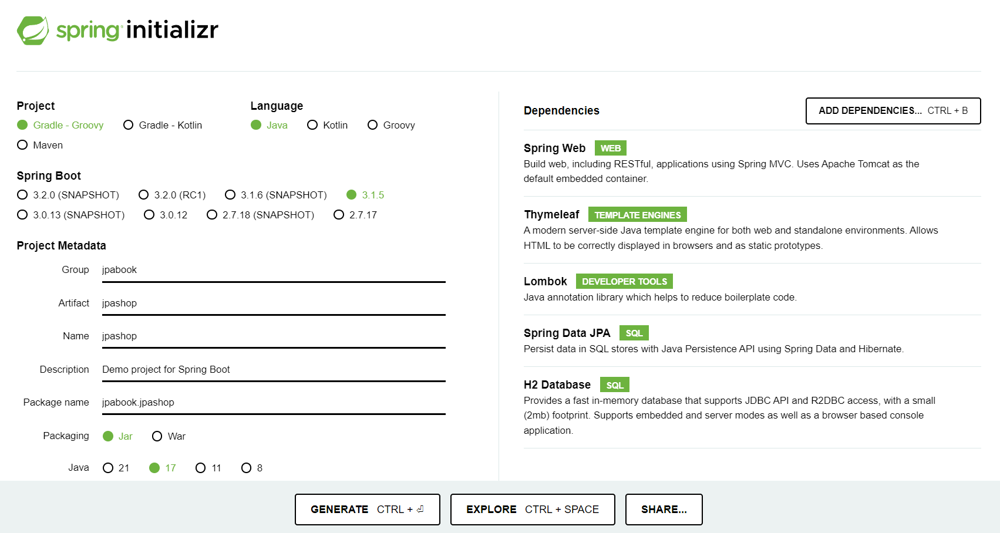
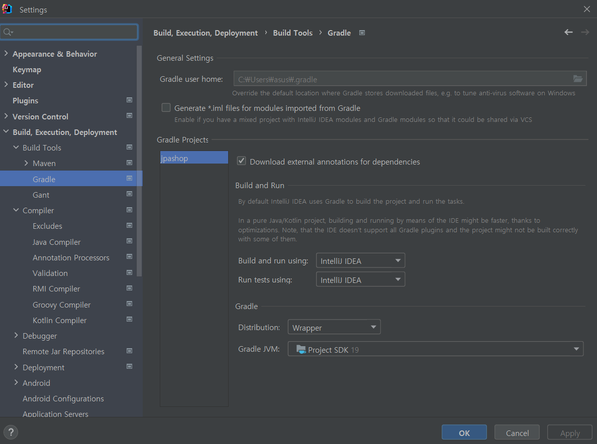

# 프로젝트 세팅

### 프로젝트 생성

https://start.spring.io/




### lombok 적용

Preferences -> Annotation Processors 검색 -> Enable annotation processing 체크 (재시작)


### IntelliJ Gradle 대신에 자바 직접 실행

최근 IntelliJ 버전은 Gradle로 실행을 하는 것이 기본 설정이다. 이렇게 하면 실행속도가 느리다.

다음과 같이 변경하면 자바로 바로 실행해서 실행속도가 더 빠르다.



Preferences -> Build, Execution, Deployment -> Build Tools -> Gradle
Build and run using: Gradle -> IntelliJ IDEA
Run tests using: Gradle -> IntelliJ IDEA


### 테스트환경 Juit4로 설정

2023.10.22기준 Junit5가 기본값이지만, 강의영상에선 Junit4로 맞추어져 있어서 설정해주자.

```
plugins {
	id 'java'
	id 'org.springframework.boot' version '3.1.5'
	id 'io.spring.dependency-management' version '1.1.3'
}

group = 'jpabook'
version = '0.0.1-SNAPSHOT'

java {
	sourceCompatibility = '17'
}
// lombok으로 생긴거
configurations {
	compileOnly {
		extendsFrom annotationProcessor
	}
}
// 여기서 라이브러리를 다운 받겠다
repositories {
	mavenCentral()
}

dependencies {
	implementation 'org.springframework.boot:spring-boot-starter-data-jpa'
	implementation 'org.springframework.boot:spring-boot-starter-thymeleaf'
	implementation 'org.springframework.boot:spring-boot-starter-web'
	compileOnly 'org.projectlombok:lombok'
	runtimeOnly 'com.h2database:h2'
	annotationProcessor 'org.projectlombok:lombok'
	testImplementation 'org.springframework.boot:spring-boot-starter-test'
	
	//JUnit4 추가
	testImplementation("org.junit.vintage:junit-vintage-engine") {
		exclude group: "org.hamcrest", module: "hamcrest-core"
	}
}

tasks.named('test') {
	useJUnitPlatform()
}
```

