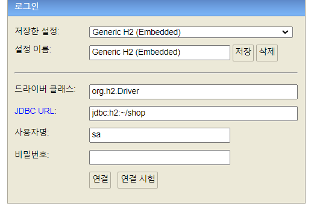
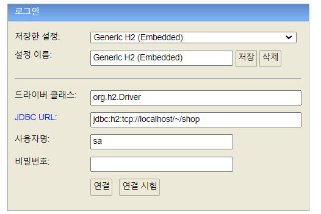

# H2 데이터베이스 설정

### H2 데이터베이스 다운

설명 생략

### H2 데이터베이스 생성

다음과 같이 H2 console에서 내장모드로 연결하여 로컬내부에 DB가 생성되도록 한다.

이후 동시접속을 허용하기 위해 서버모드로 url을 변경하여 연결한다.

[H2 서버모드 설정](https://github.com/et2468/Note-CustomSettings/blob/master/%EC%9D%B8%ED%85%94%EB%A6%AC%EC%A0%9C%EC%9D%B4%20H2%20%EC%84%9C%EB%B2%84%EB%AA%A8%EB%93%9C%20%EB%8F%99%EC%8B%9C%EC%97%B0%EA%B2%B0.md) 참고

