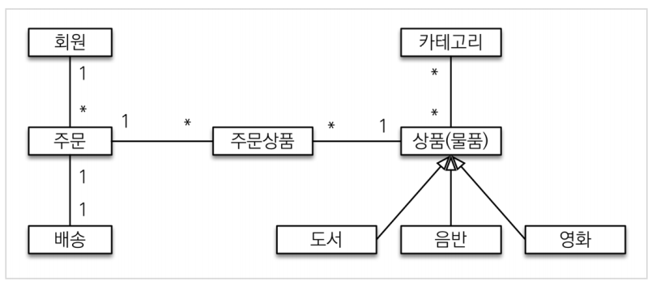
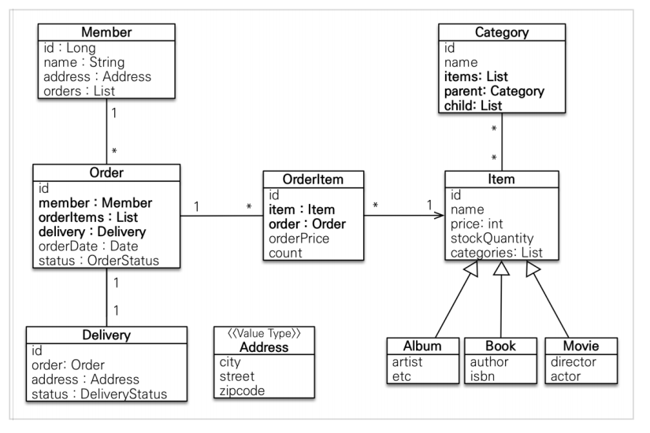
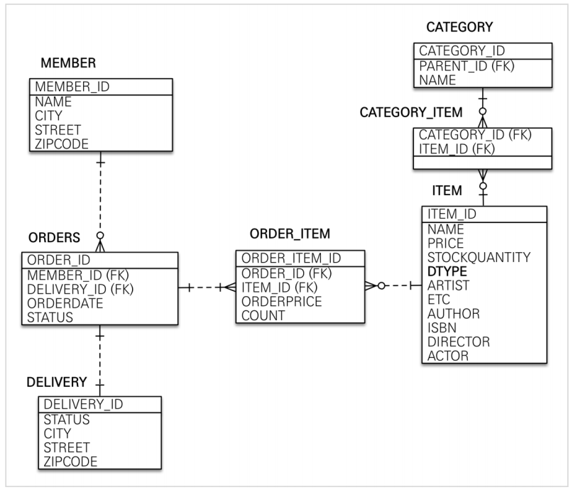

# 도메인 분석 설계

요구사항을 정리한 문서를 확인하며 도메인 설계, 엔티티 설계, 테이블 설계를 수행할 수 있다.

이 과정은 매우 중요하지만, 지금은 설계도를 바탕으로 JPA로 비지니스 로직을 처리하는 방법을 공부하는 중이므로,

해당 과정은 데이터모델링, 정규화 등 다른 자료를 참고하며 이후에 프로세스를 알아볼 것.

필자는 테이블 설계, 정규화 이후 엔티티 매핑으로 프로세스를 진행했었음.

### 도메인 설계

### 엔티티 설계

### 테이블 설계

자세한 설명들은 이후에 풀어서 하나하나 설명할 것.