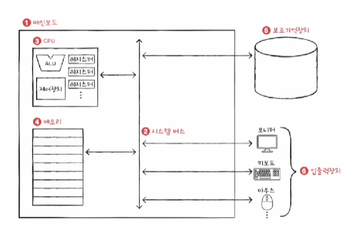

### 컴퓨터 구조

#### 컴퓨터가 이해하는 정보

데이터

- 숫자, 문자, 이미지, 동영상같은 정적인 정보
- 0과 1로 숫자,문자를 표현하는 방법

명령어

- 컴퓨터를 움직이는 정보
- 데이터는 명령어의 재료

#### 컴퓨터의 네 가지 핵심 부품

cpu, 메모리, 보조기억장치, 입출력장치, (+메인보드)

#### 메모리

현재 실행되고있는 데이터와 명령어를 저장하는 부품

- 프로그램이 실행되기 위해선 메모리에 저장되어있어야한다
- 메모리는 실행되는 프로그램의 명령어와 데이터를 저장한다
- 메모리에 저장된 값의 위치는 주소로 알 수 있다

#### CPU

메모리에 저장된 명령어를 읽기, 해석, 실행하는 부품

- ALU(산술논리연산장치): 계산기

- 레지스터: CPU내부 작은 저장장치
- 제어장치: 제어신호를 내보내고, 명령어를 해석
  - 제어신호 : 컴퓨터 부품들을 관리하는전기신호
  - ex) 메모리 읽기 신호, 메모리 쓰기 신호

CPU동작 예시

- 제어장치, 메모리 읽기 신호
- 레지스터 데이터 저장
- ALU 연산
- 레지스터 데이터 저장
- 제어장치, 메모리 쓰기 신호
- 메모리 저장

#### 보조기억장치

보관할 정보를 저장

#### 입출력장치

컴퓨터와 사용자 사이 정보를 교환할 수 있는 장치

#### 메인보드

부품들은 버스를 통해 정보를 주고받는다

시스템 버스: 다양한 버스 중 컴퓨터의 핵심부품을 연결하는 버스

#### 시스템 버스

주소 버스, 데이터 버스, 제어 버스

ex)메모리 값 읽어들이기