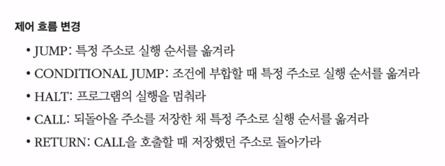

# 명령어

### 1️⃣ 소스코드와 명령어

고급 저급변환

- 컴파일 언어
  - 
- 인터프리트 언어
  - 한줄씩 변환
  - 

- CPU와 변환기 종류에 따라 저급언어 형태가 바뀔수 있음

### 2️⃣ 명령어의 구조

들어가며

- 

- 

- 기계어, 어셈블리어는 명령어의 모음

명령어의 구조

- 

- 오퍼랜드 (데이터)

- 연산코드

  - 데이터 저장, 산술/논리 연산, 제어흐름변경, 입출력제어연산

  - 대표적인 연산코드
    - 
    - 
    - 

오퍼랜드 명령어 주소 지정 방식

- 연산에 사용될 데이터가 저장된 위치를 찾는 방법

1. 즉시 주소 지정방식

   - 

   - 데이터 직접 명시

   - 메모리에 접근안해서 빠름, 범위제한

2. 직접 주소 지정방식

   - 

   - 유효주소 직접 명시

   - 유효주소공간이 연산코드만큼 줄어듬

3. 간접 주소 지정방식

   - 

   - 유효주소의 주소를 명시

   - 유효주소의 공간을 충분히 확보할 수 있음, 느림

4. 레지스터 주소 지정 방식

   - 

   - 데이터가 저장된 레지스터 명시

   - 메모리에 접근하는 속도보다 빠름

5. 레지스터 간접 주소 지정 방식

   - 

   - 데이터는 메모리에 저장

   - 메모리 주소를 저장한 레지스터를 오퍼랜드 필드에 명시

### 3️⃣ C언어 컴파일 과정

- 참고만

1. 전처리기
   - 컴파일을 위한 준비
   - EX) #include stdio.h (소스코드를 가져옴)
2. 컴파일러
   - 전처리가 완료된 소스코드
   - 저급언어(어셈블리어)로 변환
3. 어셈블러
   - 어셈블리어를 기계어로 변환
   - 목적코드를 가진 목적파일 생성

4. 링커
   - 목적파일들을 묶어주는 링킹작업

