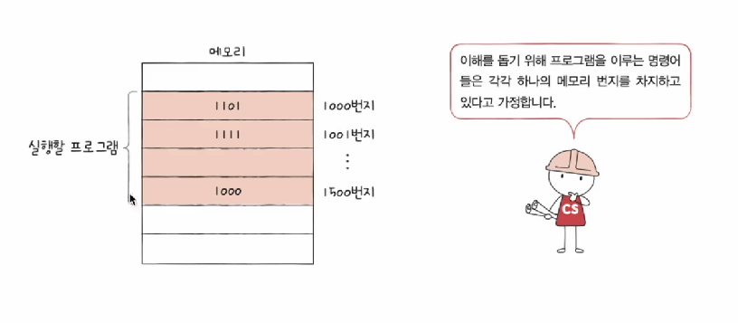
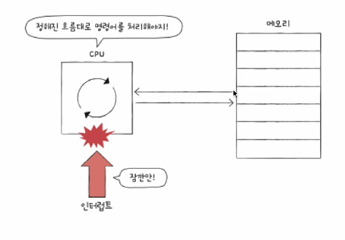
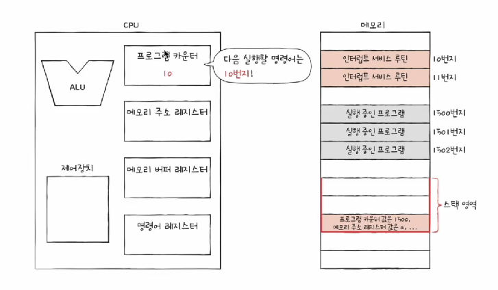

# CPU의 작동원리

### 0️⃣ CPU기본 구조

### 1️⃣ ALU

동작

1. 피연산자 + 제어신호 -> ALU

2. ALU 연산
3. 결과값 저장, 플래그 저장

플래그의 종류

- 부호 , 제로, 캐리, 오버플로우
- 나중에 이해할거: 인터럽트, 슈퍼바이저

### 2️⃣ 제어장치

#### 동작

1. 명령어 + 플래그 + 제어신호(클럭)
2. 제어신호, CPU 내부(레지스터, ALU) or CPU 외부(메모리, 입출력장치)

*클럭: 시간단위

### 3️⃣ 레지스터

반드시 알아야 할 레지스터1

- 프로그램 카운터: 메모리에서 가져올 명령어의 주소
- 명령어 레지스터: 해석할 명령어
- 메모리 주소 레지스터: 메모리의 주소
- 메모리 버퍼 레지스터: 데이터와 명령어 (메모리와 주고 받을 값)

> #### 그림 설명
>
> 
>
> 
>
> 1. 프로그램카운터에 메모리에서 가져올 명령어의 주소가 저장
> 2. 프로그램 카운터의 값을 메모리 주소 레지스터에 전달
> 3. 제어버스로 해당주소 메모리에 제어신호 전달 (메모리 접근) 
> 4. 데이터버스를 통해 메모리 값을 메모리 버퍼 레지스터로 전달
> 5. 메모리 버퍼 레지터의 데이터를 명령어 레지스터로 전달

#### 순차적인 실행 흐름이 끊기는 경우도 있다

- 특정 메모리 주소로 실행 흐름을 이동하는 명령어 실행시
  - EX) JUMP, CONDITIONAL JUMP, CALL, RET
- 인터럽트 발생시

#### 반드시 알아야 할 레지스터2

- 플래그 레지스터: 연산 결과 or CPU상태에 대한 부가정보
- 범용 레지스터: 다양하고 일반적인 상황에서 자유롭게 사용
- 스택 포인터
  - 
  - 스택주소지정방식에 사용
  - 메모리 안의 스택영역이 얼마나 차있는지 알려줌

- 베이스 레지스터
  - 
  - 변위주소지정방식 중 하나
  - 오퍼랜드의 값과 베이스 레지스터의 값을 더하여 유효주소를 얻는다

#### 변위 주소 지정 방식

- 특정 레지스터를 이용한 주소 지정 방식

- 오퍼랜드 필드 값과 특정 레지스터의 값을 더하여 유호주소를 얻는 방식

1. 상대 주소 지정 방식

   - 

   - 오퍼랜드의 필드값 + 프로그램 카운터 값  = 유효주소

2. 베이스 레지스터 주소 지정 방식

   - 

   - 오퍼랜드 필드값 + 베이스 레지스터 값 = 유효주소

### 5️⃣ 명령어 사이클과 인터럽트

#### 명령어 사이클

- 프로그램 명령어들은 일정한 주기가 반복되며 실행된다

1. 인출사이클: 명령어를 CPU로 가져옴
2. 실행사이클: 명령어를 CPU에서 실행

3. 반복

#### 인출사이클 이후 메모리 접근이 더 필요한 경우

#### 인터럽트

- CPU의 명령어 사이클을 중단
- CPU가 꼭 처리해야할 작업이 생겼을 때 발생

1. 동기 인터럽트 (예외)

   - CPU가 예기치 못한 상황

   - 폴트, 트랩, 중단, 소프트웨어 인터럽트가 있고 이후 운영체제에서 자세히 다룰 예정

2. 비동기 인터럽트 (하드웨어 인터럽트)
   - 주로 입출력장치에 의해 발생

#### 하드웨어 인터럽트

- 알림과 같은 인터럽트

1. 입출력장치는 CPU에 인터럽트 요청신호
2. CPU 실행사이클이 끝나고 명령어 인출하기전 인터럽트 여부를 항상 확인

3. CPU는 인터럽트 요청을 확인하고 인터럽트 플래그를 통해 현재 인터럽트를 받아들일 수 있는지 확인
4. 가능하다면 CPU는 지금까지의 작업을 백업
5. CPU는 인터럽트 백터를 참조하여 인터럽트 서비스 루틴을 실행
6. 인터럽트 서비스 루틴 실행이 끝나면 4에서 백업해준 작업을 복구하여 실행 재개

인터럽트 처리 순서

1. 인터럽트 요청신호

   - 

   - 
   - CPU의 작업을 방해하는 인터럽트에 대한 요청
   - CPU는 이를 받고 인터럽트 플래그를 통해 현재 인터럽트를 받아 들일 수 있는지 여부 확인

2. 인터럽트 서비스 루틴

   - 

   - 메모리 안에 저장되어 실행되는 프로그램

   - 인터럽트가 발생했을때 처리하기 위한 메뉴얼, 프로그램

   

3. 인터럽트 백터

   - 

   - 인터럽트 서비스 루틴의 시작주소를 포함하는 인럽서루의 식별정보

   - 입출력장치에서 보내는 정보인듯 함

4. 스택영역
   - 인터럽트 서비스 루틴으로 가기전 진행중인 프로그램 정보를 백업해두는 공간
   - 

#### 인터럽트까지 추가한 명령어 사이클

