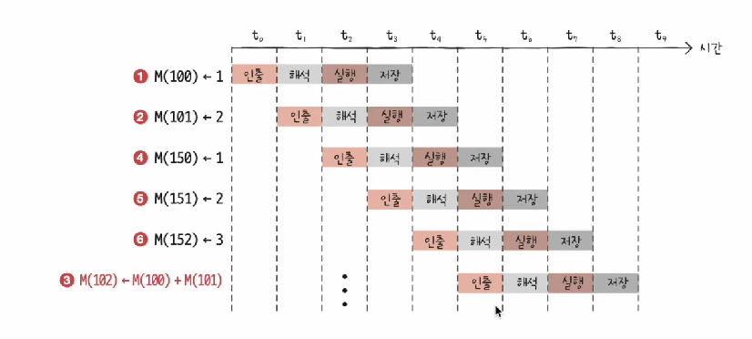
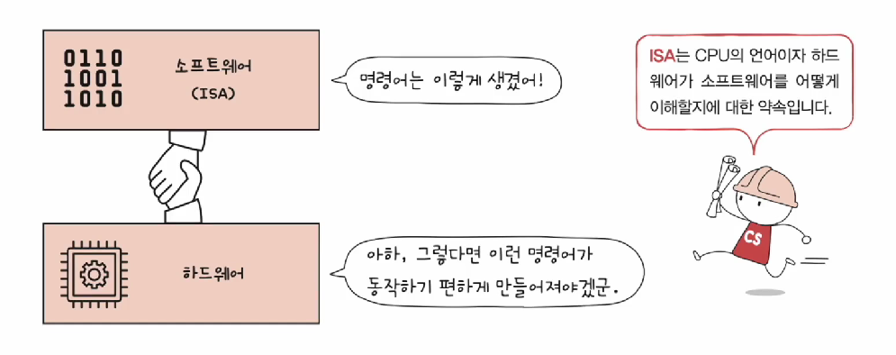

# CPU의 성능 향상 기법

### 1️⃣ 빠른 CPU를 위한 설계 기법

#### 코어란

- 명령어를 실행하는 부품 (CPU의 단위)

#### 스레드란

1. 하드웨어 스레드

   - 

   - 
   - 하나의 코어가 동시에 처리하는 명령어

   - 하나의 코어가 여러 명령어를 처리하는 것을 [멀티 스레드 프로세서], [멀티 스레드 CPU] 라 명칭

2. 소프트웨어 스레드

   - 

   - 

   - 하나의 프로그램에서 독립적으로 실행되는 단위

멀티스레드 프로세서 설계

- 

- 핵심은 레지스터
- 예를들어 프로그램 카운터가 2개, 스택포인터가 2개면 다음 실행할 메모리 위치를 2개 가질 수 있음

#### 하드웨어 스레드의 특징

- 

- 프로그램이 느끼기에 몇개의 CPU가 있는가 = 하드웨어 스레드 개수만큼
- 때문에 논리 프로세서라고 불린다

#### 컴퓨터 속도를 향상시키는 방법

1. 클럭수 늘리기

- 컴퓨터가 움직이는 시간 단위

- 헤르츠(Hz)로 측정

- 100Hz, 1초에 100번 반복

2. 코어와 멀티코어 수 늘리기

- 코어 수
- 스레드 수

### 2️⃣ 명령어 병렬 처리 기법

명령어 파이프 라인

- 

- 한 명령어 처리를 [명령어 인출, 명령어 해석, 명령어 실행, 결과 저장] 의 과정으로 나누면
- 각 단계가 겹치지만 않는다면 CPU는 '각 단계를 동시에 실행할 수 있다'

파이프라인 위험

- 명령어 파이프라인이 성능향상에 실패하는 경우

1. 데이터 위험

   - 

   - 명령어 간의 의존성에 의해 야기

2. 제어위험
   - 
   - 프로그램 카운터의 갑작스러운 변화 (EX. JUMP)

3. 구조위험
   - 서로 다른 명령어가 같은 CPU부품(ALU, 레지스터)를 쓰려고 할 때

#### 슈퍼 스칼라

- 
-  CPU 내부에 여러 개의 명령어 파이프라인을 포함한 구조
- 오늘날의 멀티 프로세서
- 파이프라인 위험도 증가로 파이프라인 개수에 비례해서 처리속도가 증가하진 않음

#### 비순차적 명령어 처리

- 

- 

- 합법적인 새치기
- 의존성이 없는 경우에만 순서를 바꿀 수 있고, 그 판단은 CPU에서 알아서 해준다

### 3️⃣ 명령어 집합 구조, CISC, RISC

#### 서론

- CPU는 명령어를 실행한다

- 명령어의 생김새, 연산, 주소지정방식 등은 CPU종류마다 다르다

- 명령어가 잘생겨야 파이프라인 효율이 좋아진다

#### 명령어 집합 (ISA)

- 

- 
- CPU가 이해할 수 있는 명령어 집합

- 같은 소스코드를 컴파일 하더라도 CPU의 종류에 따라 어셈블리어 형태가 달라질 수 있었다

- 이런 관점에서 명령어 집합은 CPU의 언어인 셈
  - 명령어가 달라지면 나비효과가 일어남
  - 명령어 해석방식, 레지스터의 종류와 개수, 파이프라인의 용이성 등

#### 명령어 집합의 두 축: CISC & RISC

1. CISC(Complex Instruction Set Computer)

- 

- 복잡한 명령어 집합을 활용하는 컴퓨터(CPU)
- 명령어의 형태와 크기가 다양한 가변길이 명령어를 활용한다

- 명령어 하나하나가 강력한 기능을 제공하여 적은 수의 명령어로도 프로그램을 실행할 수 있다

장단점

- 

- 메모리를 아낄 수 있으나 명령어 파이프라이닝이 불리하다

- 명령어의 크기와 실행되기까지의 시간이 일정하지 않다

- 명령어 하나를 실행하는데 여러 클럭 주기가 필요

2. RISC(Reduced Instruction Set Computer)

- 명령어의 종류가 적고 규격화된 명령어를 사용한다
- 메모리 접근 최소화(load, store), 레지스터를 십분 활용
- 명령어의 종류가 적기 때문에 더 많은 명령어의 수을 가짐

3. CISC와 RISC 비교

