# 메모리와 캐시메모리

### 1️⃣ RAM의 특징과 종류

#### 들어가며

- 주기억장치에는 크게 RAM과 ROM 두가지 종류가 있고

- '메모리'는 보통 그 중 RAM을 지칭한다

- 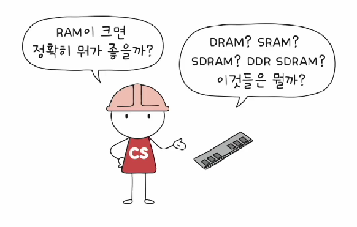

#### RAM의 특징

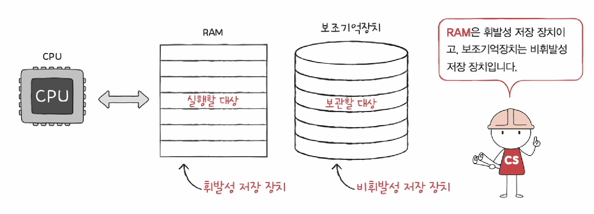

- 전원이 꺼지면 정보가 날라간다

#### RAM의 용량과 성능

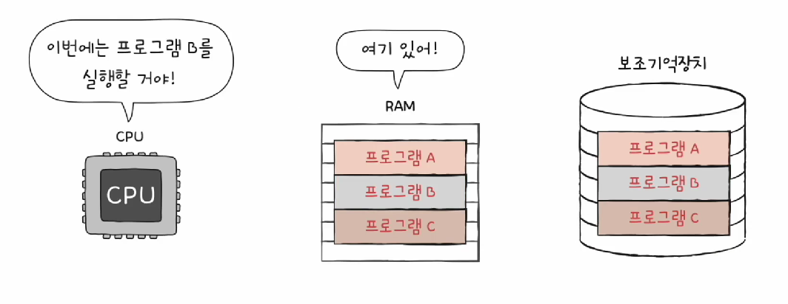

- RAM이 클수록 많은 프로그램들을 동시에 실행하는 데에 유리하다

#### RAM의 종류

- DRAM, SRAM, SDRAM, DDR

1. DRAM(Dynamic RAM)

   - 저장된 데이터가 동적으로 사라지는 RAM
   - 데이터 소멸을 막기 위해 주기적으로 재활성화 해야
   - 일반적으로 메모리로 사용되는 RAM
     - 상대적으로 소비전력이 낮고 저렴하고 집적도가 높음
     - 대용량으로 설계하기 용의하다

2. SRAM(Stactic RAM)

   - 저장된 데이터가 정적인 RAM
   - DRAM보다 일반적으로 더 빠름

   - 일반적으로 캐시 메모리에서 사용되는 RAM
     - 상대적으로 소비전력이 높고 비싸고 집적도가 낮아
     - 대용량으로 설계할 필요는 없으나 빨라야 하는 장치에 사용

DRAM과 SRAM 비교

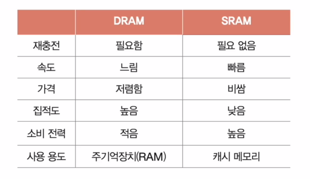

3. SDR SDRAM (Single Data Rate Synchronous DRAM)

   - DRAM 발전형태

   - 클럭신호와 동기화된 DRAM

   - 클럭신호와 박자를 맞춰서 동작할 수 있다

4. DDR SDRAM (Double Data Rate SDRAM)

   - SDRAM 발전형태

   - 최근 가장 대중적으로 사용하는 RAM

   - 대역폭을 넓혀 속도를 빠르게 만든 SDRAM

     - 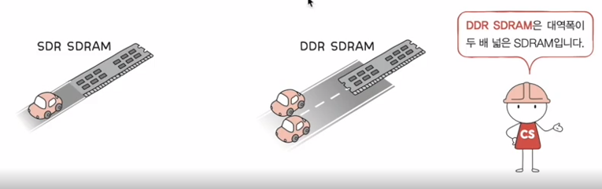

     - 대역폭은 데이터를 주고받는 길의 너비

5. DDR SDRAM2

- 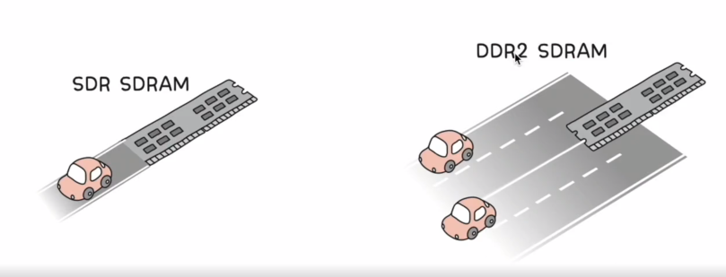

6. DDR SDRAM3, DDR SDRAM4.....

### 2️⃣ 메모리의 주소공간

#### 들어가며

- 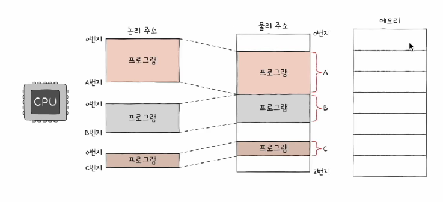

- 논리 주소와 물리주소란 무엇인가
- 둘을 나눈 이뉴는 무엇인가
- 논리주소를 물리주소로 변환하는 방법

#### 물리주소와 논리주소

1. 물리주소란

   - 메모리 입장에서 바라본 주소

   - 정보가 실제로 저장된 하드웨어상의 주소

2. 논리주소란

   - CPU와 실행중인 프로그랩 입장에서 바라본 주소

   - 실행중인 프로그램 각각에게 부여된 0번지부터 시작하는 주소

3. 그림표현

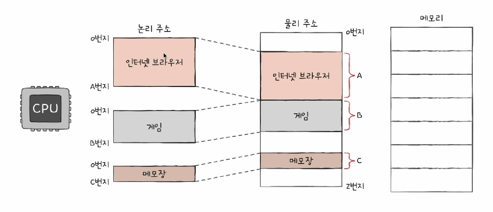

#### 물리주소와 논리주소의 변환

- 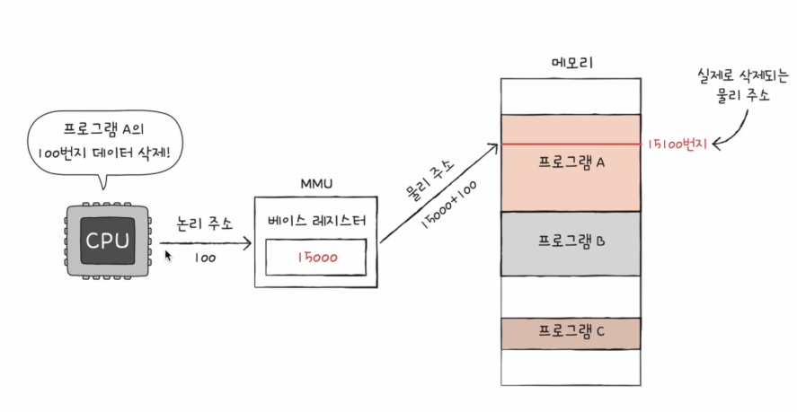

- MMU(메모리관리장치)라는 하드웨어에 의해 변환

  - 논리 주소와 베이스 레지스터 값을 더하여 물리주소로 변환

  - 베이스 레지스터에는 프로그램의 기준주소(시작주소)가 담긴다

메모리 보호

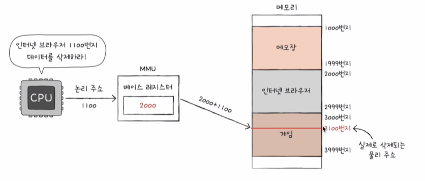

- 프로그램 영역을 침범할 수 있는 명령어의 실행은 막아야 한다

1. 한계 레지스터

   - 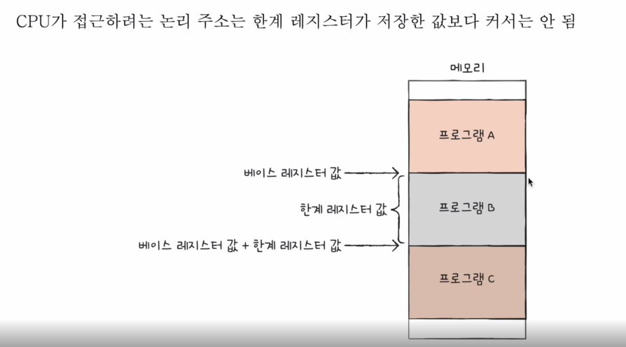

   - 논리 주소의 최대 크기를 저장
   - 베이스 레지스터: 실행중인 프로그램의 시작점 주소를 저장
   - 베이스 레지스터 값 <= [프로그램의 물리 주소 범위] < 베이스 레지스터+한계 레지스터 값

   - 물리주소범위가 이를 넘어가면 실행 X

2. 메모리 보호 과정

   - 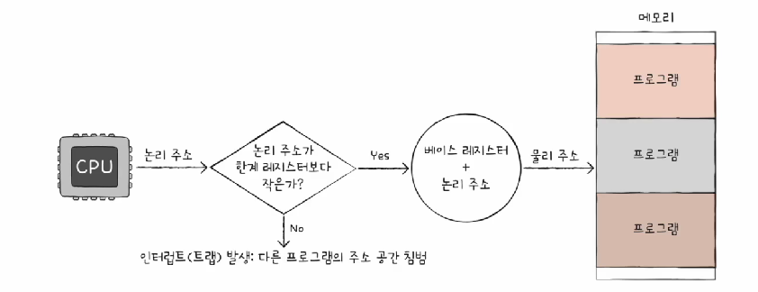

   - 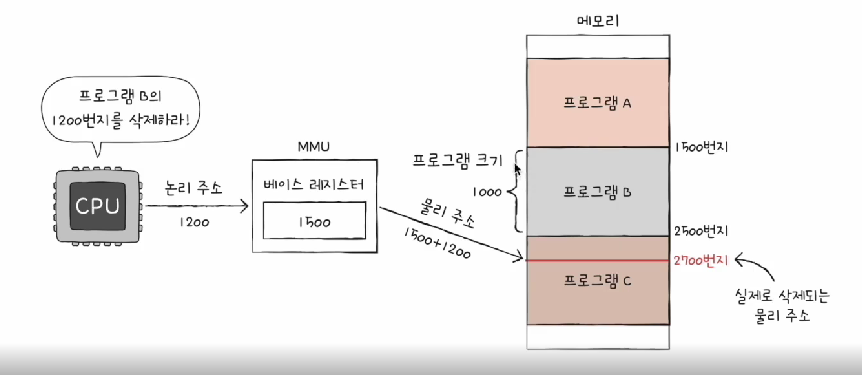

   - CPU는 메모리에 접근하기 전에 논리주소가 한계 레지스터보다 작은지 항상 검사

   

3. 메모리 보호 기능의 효과

   - 실행중인 프로그램의 독립적인 실행 공간을 확보

   - 하나의 프로그램이 다른 프로그램을 침범하지 못하게 보호

### 3️⃣ 캐시메모리

#### 저장장치계층구조 (memory hierarchy)

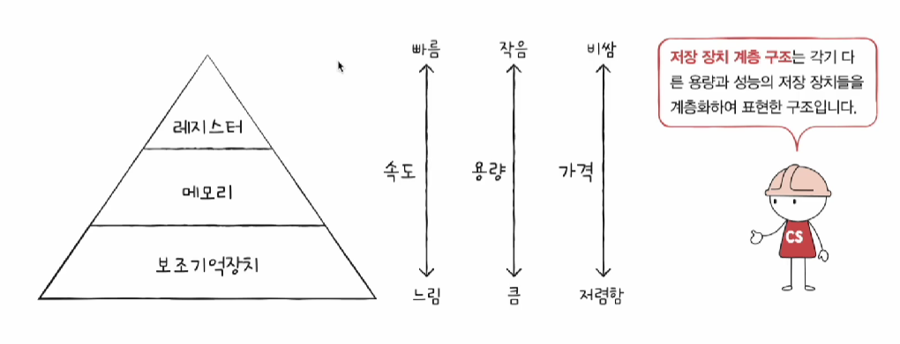

- CPU와 가까운 저장장치는 빠르고 멀리 있는 저장장치는 느리다
- 속도가 빠른 저장장치는 저장용량이 적고 가격이 비싸다

- 레지스터 / 메모리(RAM) / USB 비교

#### 캐시메모리

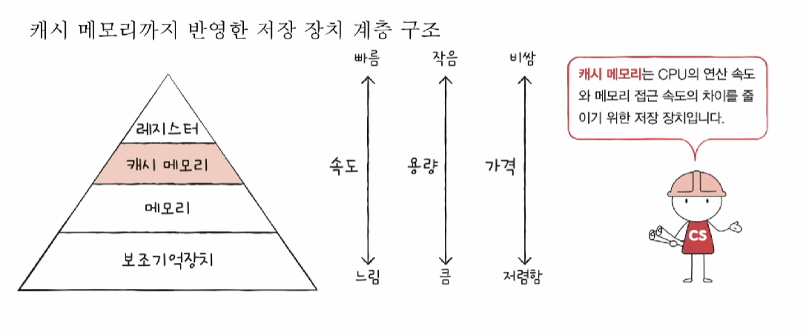

- CPU와 메모리 사이에 위치한 SRAM기반의 저장장치

- CPU의 연산속도와 메모리 접근속도 차이를 줄이기 위한 저장장치

#### 계층적 캐시메모리

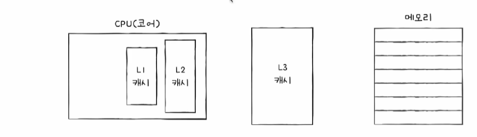

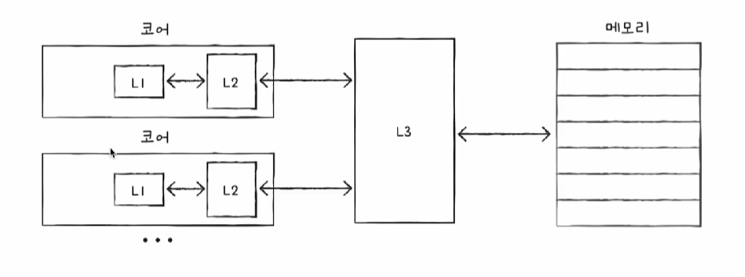

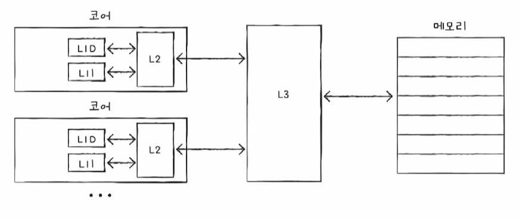

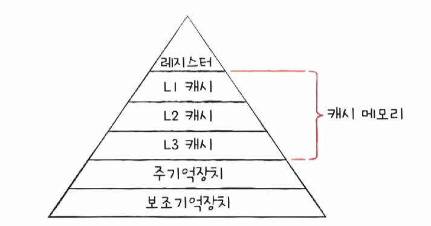

- 현대 CPU설계의 일반적인 방식

- L1, L2는 CPU내부에 있는 캐시메모리

- 멀티코어 프로세서의 캐시메모리는 L1,L2 캐시메모리가 동기화되야한다
- 명령어 L1, 데이터L1 캐시메모리 따로 만든 분리형 캐시구조도 있음

#### 참조지역성의 원리

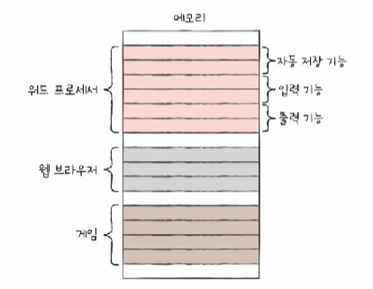

- 캐시메모리는 메모리의 일부만 저장할 수 있다
  - CPU가 자주 사용할 법한 데이터를 예측해서 가져옴
  - 이 예측이 맞으면 '캐시히트', 틀리면 '캐시미스'
  - 캐시적중률 = 캐시히트/(캐시히드+캐시미스)

- 참조지역성 원리란 캐시적중률을 높이기 위한 원리
  - CPU는 촤근에 접근했던 메모리 공간에 다시 접근하려는 경향이 있다
  - CPU는 접근한 메모리 공간 근처를 접근하려는 경향이 있다

