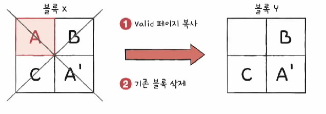

# 보조기억장치

### 1️⃣ 다양한 보조기억장치

#### 들어가며

- 대표적인 보조기억장치: 하드디스크, 플래시 메모리(ex, USB, SD카드 등)

#### 하드디스크

- 

- 
- 
- 
- 스핀들이 플래터를 회전시키고 그 단위가 RPM
- 디스크 암이 헤드를 움직이고 플래터의 정보를 읽는다
- 플래터는 주로 트랙과 섹터로 나뉘고 트랙이 모여 실린더를 이룬다
- 실린더가 필요한 이유는 연속된 정보가 한 실린더에 기록된다

#### 하드디스크의 데이터 접근 과정

#### 플래시 메모리 (ex, USB, SD카드 등)

- 범용성이 넓어 보조기억장치에만 속하는 것은 아님
- 전기적으로 데이터를 일고 쓰는 반도체 기반 저장장치

- 종류: NAND(오늘날), NOR

- 셀: 플레시 메모리에서 데이터를 저장하는 가장 작은 단위
  - SIC(1셀당 1비트),MLC,TLC,QLC
  - 성능에 중요한 요소

1. SLC

   - 

   - 한 셀로 두개의 정보 표현

   - 비트의 빠른 입출력

   - 긴 수명

   - 용량 대비 고가격

2. MLC

   - 

   - 한 셀로 네개의 정보를 표현 (대용량화 유리)

   - SLC보다 느린 입출력

   - SLC보다 짧은 수명

   - SLC보다 저렴

   - 시중에서 많이 사용

3. TLC

   - 

   - 한 셀로 여덟 개의 정보를 표현 (대용량화 유리)

   - MLC보다 느린 입출력

   - MLC보다 짧은 수명

   - MLC보다 저렴

   - 시중에서 많이 사용

정리

- 

- 같은 플래시 메모리라도 수명, 가격, 성능이 달라질 수 있다

#### 플레시 메모리 저장단위

- 

- 읽기/쓰기 단위(페이지)와 삭제 단위(블록)가 다르다

#### 플레시 메모리 페이지 상태

- Free상태: 비어있어서 새로운 데이터를 받을 수 있는 상태
- Valid상태: 유효한 데이터를 저장하고 있는 상태
- Invalid상태: 유효하지 않은 데이터를 저장하고 있는 상태

#### 플레시 메모리 동작: 가비지 컬렉션

- 

- 
- A를 A`로 바꿀때 A만을 삭제할 수 없어서 새로운 페이지에 저장

- A는 Invalid상태가 된다
- 블록의 Valid상태 페이지들만을 새로운 블록으로 복사
- 기존의 블록을 삭제

### 2️⃣ RAID의 정의와 종류

#### RAID (Redundant Array of Independent Disks)

- 

- 하드디스크와 SSD로 사용하는 기술
- 데이터의 안정성 혹은 높은 성능을 위해 여러 물리 보조기억장치를 하나의 논리적 보조기억장치처림 사용하는 기술
  - RAID레벨: RAID를 구성하는 기술, RAID0,RAID1,RAID4,RAID5,RAID6

#### RAID 0

-  

- 
- 
- 각 하드 디스크크는 번갈아 가며 데이터를 저장
- 저장되는 데이터가 하드 디스크 개수만큼 나누어 저장

- 스트라입(stripe): 마치 줄무늬처럼 분산되어 저장된 데이터
- 스트라이핑(striping): 분산하여 저장하는 것
- 장점: 입출력 속도의 향상

- 단점: 저장된 정보가 안정하지 않음

#### RAID1

- 

- 미러링(mirroring): 복사본을 만드는 방식
- 데이터를 쓸 때 원본과 복사본 두 군데에 씀 (느린 쓰기 속도)

- 장점: 안전하다
- 단점: 많은 양의 하드디스크 요구, 비용증가

#### RAID 4

- 

- 
- 패리티 비트를 저장하여 다른 장치들의 오류를 검출하고 있다면 복구
- 오류복구의 자세한 과정은 생략

- 단점: 패리티 디스트의 병목현상

#### RAID 5

- 
- 패리티 정보를 분산해서 저장

#### RAID 6

- 

- 두 종류의 패리티
- RAID5보단 느리고 안전함

마무리

- 각 RAID 레벨마다 장단점이 있다
- 어떤 상황에서 무엇을 최우선으로 원하는지에 따라 최적의 RAID레벨은 달라진다
- 각 RAID레벨의 대략적인 구성과 특징을 아는 것이 중요