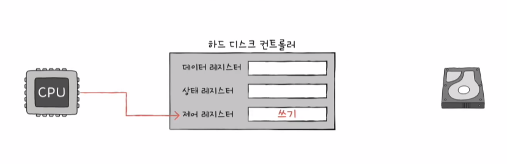

# 입출력 장치

# 1️⃣ 장치 컨트롤러와 장치 드라이버

#### 들어가며

- 
- 입출력 장치
  - 컴퓨터 내부와 데이터를 주고받는 모든 것
  - 보조기억장치도 포함된다

#### CPU는 입출력장치의 신호를 처리하기가 까다롭다

1. 입출력장치 종류가 너무 많다

   - 

   - 다양한 입출력장치와 정보를 주고받는 방식을 규격화하기 어렵다

2. 일반적으로 CPU와 메모리의 데이터 전송률은 높지만 입출력장치의 데이터 전송률은 낮다

   - 

3. 때문에 모든 입출력장치는 하나 이상의 장치컨트롤러를 통해 컴퓨터와 연결된다

   - 

   - 
   - 통신중개(다양한 입출력 장치 신호 번역)
   - 오류검출
   - 데이터버퍼링

 

#### 장치 컨트롤러의 구조

1. 데이터 레지스터
   - CPU와 입출력장치 사이에 데이터가 담기는 레지스터 (버퍼)

2. 상태 레지스터
   - 상태정보 저장
     - 입출력장치가 입출력 작업을 할 준비가 되었는가
     - 입출력 작업이 완료되었는가
     - 입출력장치에 오류는 없는가 등

3. 제어 레지스터
   - 입출력장치가 수행할 내용에 대한 제어정보

#### 장치 드라이버

- 장치 컨트롤러의 동작을 감지하고 제어하는 프로그램

- 운영체제가 장치 드라이버의 사용법을 알 수 있도록 컨트롤러 프로그램을 깔아줘야 한다

# 2️⃣ 다양한 입출력 방법

#### 들어가며

- 장치입출력 방식에는 세가지 방법이 있다

- 프로그램 입출력, 인터럽트 기반 입출력, DMA입출력

## 1. 프로그램 입출력

- 

- 

- 

- CPU가 장치컨트롤러의 레지스터 값을 읽고 씀으로써 이루어지는 것을 프로그램 입출력 방식이라 한다

- 메모리에 저장된 정보를 하드디스크에 백업하는 예시

  1. CPU는 하드디스크 컨트롤러의 제어 레지스터에 쓰기 명령
  
  
    2. 하드 디스크 컨트롤러는 하드 디스크 상태 확인 -> 상태 레지스터에 준비완료 표시
  

​		  3-1. CPU는 상태 레지스터를 주기적으로 읽어보며 하드디스크의 준비 여부 확인

​		  3-2. 히드 디스크가 준비됬다면 백업할 메모리의 정보를 데이터 레지스터에 쓰기

​		  4. 쓰기 작업이 모두 종료될 때까지 1번부터 반복

- 의문점

  - 이전에 입출력장치의 종류는 너무 많아서 신호를 규격화하기 힘들다고 했었다
  - 그럼 CPU는 어떻게 이렇게 많은 종류의 입출력장치들을 제어 할 수 있을까?

  - 장치마다 레지스터가 있는지, 무슨종류가 있는지 어떻게 암?

#### 프로그램 입출력 방식에서 CPU가 장치컨트롤러의 레지스터들(입출력장치의 주소)을 어떻게 알까?

- 
- 메모리 맵 입출력 방식, 고립형 입출력 방식으로 해결한다

#### 1. 메모리 맵 입출력

- 

- 

- 메모리에 접근하기 위한 주소공간과 입출력장치에 접근하기 위한 주소공간을 하나의 주소공간으로 간주하는 방법

#### 2. 고립형 입출력

- 메모리에 접근하기 위한 주소공간과 입출력장치에 접근하기 위한 주소공간을 별도의 주소공간으로 구분
- 메모리 접근, 입출력장치 접근 전용 명령어가 분리되어있다

#### 비교

## 2. 인터럽트 기반 입출력

### 인터럽트 사전지식

- (하드웨어) 인터럽트 개녕

- 플래그 레지스터 속 인터럽트 비트

- 인터럽트 요청 신호

- 인터럽트 서비스 루틴

### 인터럽트 기반 입출력

- 

- 프로그램 입출력처럼 CPU가 주기적으로 상태레지스터를 확인하지 않아도 됨

### 동시다발적인 인터럽트 처리방법

- 

1. 순서대로 처리

   - 

   - 현실적으로 불가능하다

   - 인터럽트 중에서도 더 빨리 처리해야 하는 인터럽트가 있다

2. 우선순위를 반영한 인터럽트 처리

   - 

   - 

   - NMI가 발생한 경우 (정전, 고장 등), 플래그 레지스터 속 인터럽트 비트를 비활성화한 채 인터럽트를 처리

   - PIC (Programmable Interrupt Controller)
     1. 여러 장치컨트롤러에 연결되어
     2. 장치컨트롤러의 하드웨어 인터럽트 우선순위를 판단한 후
     3. CPU에게 지금 처리해야하는 인터럽트가 무엇인지 판단하는 하드웨어

## 3. DMA(Direct Memory Access) 입출력

- 프로그램 입출력, 인터럽트 입출력은 반드시 CPU가 주도하고, 데이터는 CPU를 거친다

   - 하드디스크의 데이터를 메모리에 저장하는 예시
      - 하드디스크의 데이터 레지스터에 저장된 값을 입출력장치를 읽어서 CPU레지스터로 가져옴
      - CPU의 메모리 쓰기 명령어를 통해서 메모리에 데이터 쓰기

- CPU가 더 많은 일을 하게된다

   - 하드디스크 백업과 같이 대용량의 데이터를 이동한다면?
   - 이러한 문제를 해결하기 위한 DMA 입출력 방식

- CPU를 거치지않고 입출력장치가 메모리에 직접적으로 접근하는 DMA입출력 방식

  1. CPU는 DMA컨트롤러에 입출력 작업을 명령

  2. DMA컨트롤러는 CPU 대행으로 장치컨트롤러와 상호작용하며 메모리에 직접적으로 접근하여 입출력 작업을 수행
  3. 입출력 작업이 끝나면 DMA컨트롤러는 인터럽트를 통해 CPU에 작업이 끝났음을 알림

- CPU는 입출력 작업의 시작과 끝만 관여

- 문제
  - DMA컨트롤러는 메모리에 접근하기 위해서 시스템 버스를 이용할텐데
  - 시스템버스는 공용자원이기 때문에 공동으로 사용할 수 없음
  - CPU가 시스템버스를 사용하면 DMA는 사용할 수 없고 그 역도 마찬가지

### DMA의 시스템버스 사용

1. CPU가 시스템버스를 이용하지 않을때마다 DMA가 사용
2. CPU에게 일시적으로 양해를 구하고 시스템 버스를 사용 (*cycle stealing)

- 사실 DMA가 시스템 버스에 직접적으로 연결되는 것은 좋지않음

### 입출력버스

- 장치컨트롤러가 시스템 버스에 직접 연결되면 DMA컨트롤러는 시스템버스를 불필요하게 2번씩 사용하게 된다
  - 메모리 정보를 하드디스크에 백업하는 예시
    - 메모리 접근 1번, 장치컨트롤러 접근 1번, 불필요하게 2번이나 시스템 버스를 사용
    - 시스템버스는 공용자원이라서 CPU도 써야함, 좋지않음
- 따라서 장치컨트롤러는 직접적으로 시스템버스에 연결되지 않고 입출력전용버스에 연결된다
  - DMA와 장치컨트롤러는 입출력버스를 통해 데이터 송신
  - e.g. PCI버스, PCI express 버스 등
