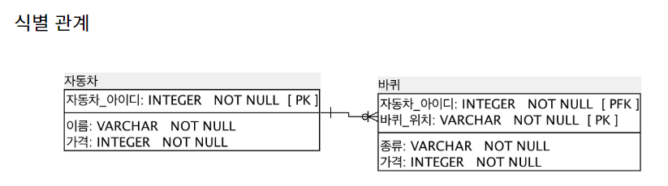
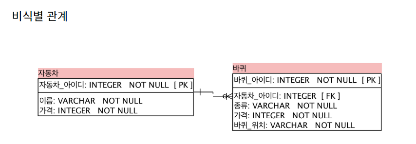
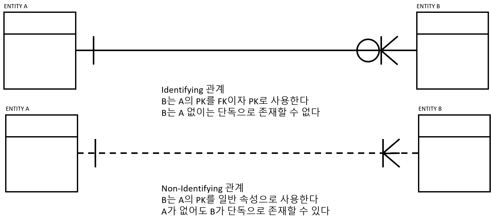

# ERD 관계선 기호

## 사전지식

### 1. 부모테이블과 자식테이블

`다른 테이블의 기본키를 외래키로 가지고 있는 경우`에 그 테이블을 `자식테이블`, 기본키를 넘겨준 테이블을 `부모테이블`이라고 한다.

EX) 자동차테이블과 바퀴테이블, 게시판 테이블과 댓글 테이블

### 2. 식별관계와 비식별관계

위의 부모테이블, 자식테이블 관계에서

`부모테이블의 pk값`을 `자식테이블의 pk값`으로 사용한다면 이를 `식별관계`라고 한다.
(`부pk값`과 `다른 속성`을 `복합키로 사용`하여 식별한다)

`부모테이블의 pk값`을 `자식테이블의 fk값`으로만 사용한다면 이를 `비식별관계`라고 한다.

추가한 키를 인조키라고 한다.

인조키를 추가하여 모든 데이터 관계는 비식별관계로 표현할 수 있다.

비식별관계로 표현했을 때 장점

1. 독립성: 데이터베이스의 유지보수와 변경작업을 더욱 용이하게 해준다.
2. 유연성: DB설계에 유연성을 제공하며 필요에 따라 관계를 변경하거나 추가하기 쉽다.

식별관계로 표현했을 때 장점

1. 데이터 일관성 유지: 부모테이블의 행이 삭제되면 관련된 자식 테이블의 행도 자동으로 삭제되어 데이터의 일관성이 유지된다.
2. 강한 종속성: 자식이 부모테이블의 기본키를 참조하여 강한 종속성을 가지게 된다.
   이를 통해 데이터 간의 관계를 명확하게 정의할 수 있다.

드는 생각이 ONDELETE CASCADE를 이용해서 비식별관계에서도 데이터의 일관성을 유지할 수 있지 않은가?

식별관계가 부모 자식간의 관계를 좀 더 강하게 정의하는 것 외에 장점을 모르겠다.

또한 부모테이블의 레코드가 존재해야만 자식테이블의 레코드가 존재하는게 테이블의 유연성을 막아버리는 듯하다. 

만약 게시판 댓글을 식별관계로 정의했다가 '게시판을 삭제해도 작성했던 댓글은 데이터로 남아있게 해주세요'라고 한다면 댓글 테이블 필드를 다시 작성하고, 데이터를 전부 다 수정해야하는 일이 생길 수 있을것 같다.

필자는 테이블 설계할때 이러한 이유로 비식별관계로 모든 엔티티관계를 정의할 것 같다.

## 본론

### 관계선의 종류

- 실선(Identifying): 식별관계
  - 부모테이블의 PK가 자식테이블의 FK/PK가 되는 경우
  - 부모가 있어야 자식이 생기는 경우 (게시판 댓글)
- 점선(Non-Identifying): 비식별관계
  - 부모테이블의 PK가 자식테이블의 일반속성이 되는 경우
  - 부모가 없어도 자식이 생기는 경우 (부서와 사원)

### 기호의 종류

`실선 (｜) : 1개` , `까마귀 발 (∈) : 여러개`, `고리 (○) : 0개` 

Type1(실선과 실선): 정확히 1개를 가진다.

Type2(까마귀 발): 여러개를 가진다.

Type3(실선과 까마귀발): 1개 이상을 가진다.

Type4(고리와 실선): 0 또는 1개를 가진다.

Type5(고리와 까마귀발): 0개 이상을 가진다.

