# RDB JOIN

### 들어가기 전

JOIN의 의미와 종류를 다루고 각 종류의 성능은 자세히 다루지 않는다.

JOIN을 실현하는 방법은 DB종류마다 다르다.

JOIN의 성능을 정리하는 글은 다음에 작성할 예정


### JOIN이란

분리되어있는 두 표를 합치는 작업


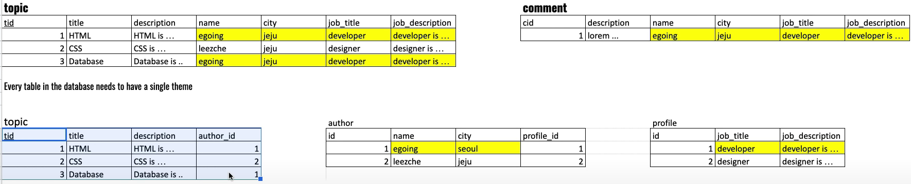

첫번째 표

- 정규화를 거치지 않은 분리되지 않은 표
- 보기편하다.

두번째 표

- 정규화를 거친 분리된 표
- 중복된 데이터가 없어서 수정, 삭제 등 관리하기 편하다.


두 표 모두 장단점이 있으며 이를 trade-off라고 한다.

보통 정규화를 거쳐 표를 분리하고 JOIN을 통해서 필요할때 표를 다시 합친다.


### 기존 테이블

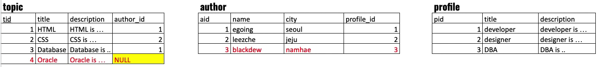

위의 테이블은 정규화가 완료되어있고 샘플데이터가 추가된 테이블이다.

이를 여러 JOIN들을 통해 합쳐보겠다.


### 1.LEFT (Outer) JOIN

가장 많이 사용되는 JOIN으로 왼쪽테이블을 기준으로 오른쪽테이블을 붙이는 것

RIGHT JOIN은 그 반대라고 생각하면 되고 설명은 생략한다.


1. 2개 테이블 LEFT JOIN

```sql
SELECT * FROM topic 
LEFT JOIN author ON topic.author_id=author.id
```

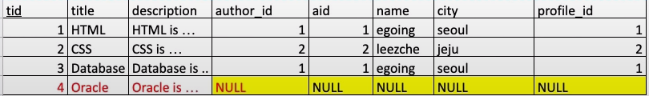

SQL문 해석해볼것


왼쪽테이블을 기준으로 오른쪽테이블을 붙이는 것

외래키가 NULL인 테이블은 관련컬럼이 모두 NULL로 표기된다.


2. 3개 테이블 LEFT JOIN

```sql
SELECT * FROM topic 
LEFT JOIN author ON topic.author_id=author.id 
LEFT JOIN profile ON author.profile_id=profile.pid
```

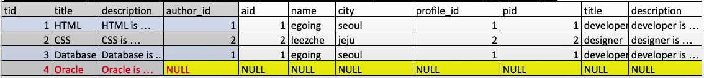


(왼쪽테이블+오른쪽테이블)+오른쪽테이블

마친가지로 왼쪽테이블의 외래키값이 NULL이면 관련컬럼이 모두 NULL로 표기된다.


3. (3개 테이블 LEFT JOIN) 필요한 컬럼만 가져오기

```sql
SELECT tid, topic.title, author_id, name, profile.title AS job_title 
FROM topic 
LEFT JOIN author ON topic.author_id=author.id 
LEFT JOIN profile ON author.profile_id=profile.pid
```


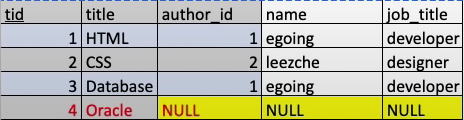


`*`대신 필요한 컬럼이 작성된것을 볼 수 있다.

topic.title과 profile.title의 컬럼이름이 똑같으므로 앞에 테이블명을 명시해주어야한다.

(필자는 SQL문을 작성할 때 이름이 곂치든 안곂치든 그냥 전부 적어줄거 같다.)


profile title같은 경우 `AS job_title`로 컬럼이름을 바꾸어 주었다.


LEFT JOIN에서 필요한 컬럼만 가져온 형태


4. ((3개 테이블 LEFT JOIN) 필요한 컬럼만 가져오기) 필터링

```sql
SELECT tid, topic.title, author_id, name, profile.title AS job_title 
FROM topic 
LEFT JOIN author ON topic.author_id=author.id 
LEFT JOIN profile ON author.profile_id=profile.pid
WHERE aid=1
```


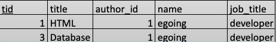


aid=1인 egoing이란 사람이 작성한 글들만 가져올 수 있다.


### 2.INNER JOIN

LEFT JOIN보다 성능이 더 좋다. (왜인지는 다음에 알아보자)


기존테이블


1. 2개 테이블 INNER JOIN으로 합치기

```sql
SELECT * FROM topic 
INNER JOIN author ON topic.author_id=author.id
```

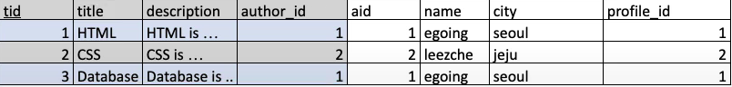


LEFT JOIN에서 author_id(외래키)가 NULL인 데이터는 생략한다

(왼쪽테이블에 오른쪽테이블을 합치는데 외래키가 NULL이면 그 데이터는 생략한다.)


2. 3개 테이블 INNER JOIN으로 합치기

```sql
SELECT * FROM topic 
INNER JOIN author ON topic.author_id=author.id
INNER JOIN profile ON topic.profile.pid=author.pid
```

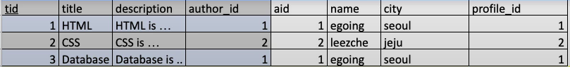


궁금증. author테이블의 2번유저(leezche)의 profile_id 외래키가 NULL이면 어떻게 될까?

(왼쪽 테이블은 외래키가 있는데 그 다음 테이블의 외래키가 없으면 얘도 생략되나?)


### 3.FULL OUTER JOIN

기존테이블


2개 테이블 FULL OUTER JOIN

```sql
SELECT * FROM topic 
FULL OUTER JOIN author ON topic.author.id=author.id
```

```sql
(SELECT * FROM topic 
LEFT JOIN author ON topic.author.id=author.id)
UNION DISTINCT
(SELECT * FROM topic 
RIGHT JOIN author ON topic.author.id=author.id)
```

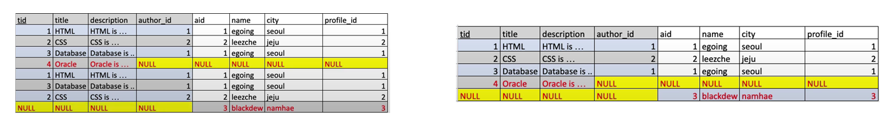

LEFT JOIN과 RIGHT JOIN을 한 뒤 중복되는 테이블을 삭제


### 4.EXCLUSION LEFT JOIN

기존테이블


```sql
SELECT * FROM topic 
LEFT JOIN author ON topic.author.id=author.id
WHERE author.aid is NULL
```

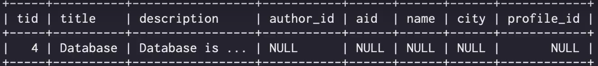


LEFT JOIN에서 외래키가 NULL인 데이터를 가져오는 듯하다


보통 LEFT JOIN과 INNER JOIN을 주로 사용하고

FULL OUTER JOIN과 EXCLUSION LEFT JOIN은 잘 사용하지 않는다고 한다.


### 5. CROSS JOIN

모든 경우의 수를 표현하는 방식

```SQL
select * from product cross join color;
```


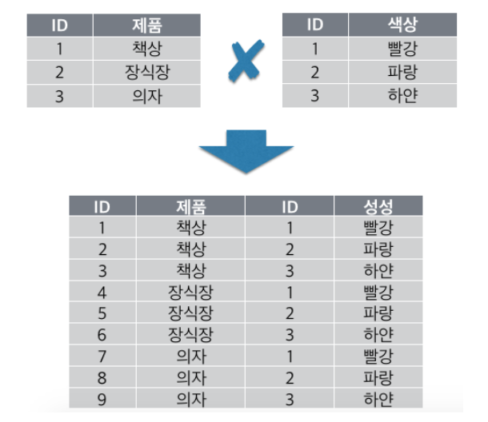


### 6. SELF JOIN

기존테이블

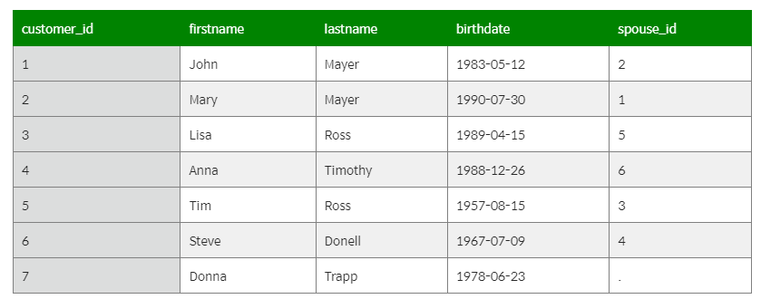


SELF JOIN한 테이블

```sql
SELECT
	cust.customer_id,
 	cust.firstname,
    cust.lastname,
    cust.birthdate,
    cust.spouse_id,
    spouse.firstname AS spouse_firstname,
    spouse_lastname AS spouse_lastname
FROM customer AS cust
INNER JOIN customer AS spouse
ON cust.spouse_id = spouse.customer_id
```

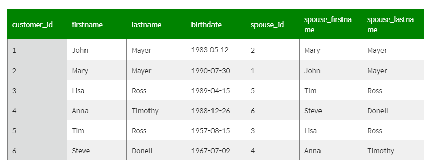


자기자신을 참조하는 외래키?로 LEFT JOIN 한다.