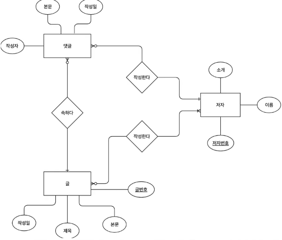
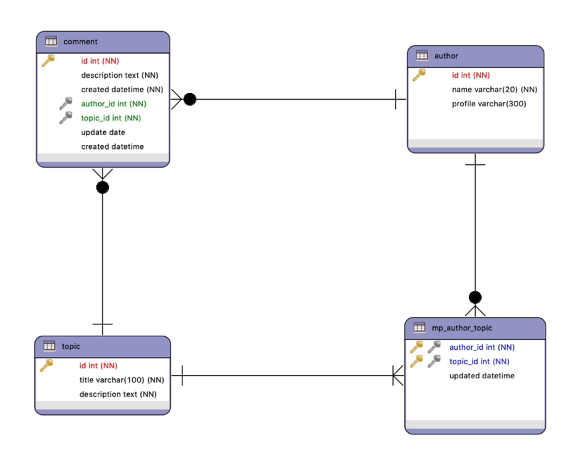
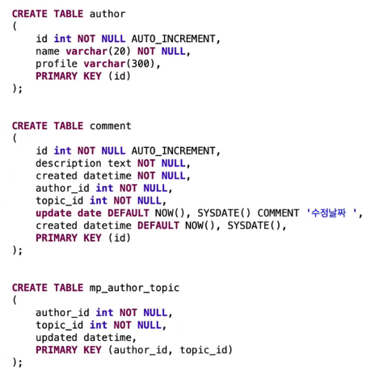

#  데이터 모델링

### MODEL이란 무엇일까

`현실의 객체`를 모방한 것
*객체: 실세계에 존재하거나 생각할 수 있는 것을 객체(object)라고 한다. 흔히 볼 수 있는 `책상, 의자, 전화기 같은 사물`은 물론이고 `강의, 수강 신청 같은 개념`으로 존재하는 것도 모두 객체이다.

`현실의 객체`를 모방한 `MODEL`을 `컴퓨터에 저장`하여 `다량의 데이터를 효율적으로 접근, 관리`한다.

`MODELING`이란 `위의 목적을 위해 개발된 방법`이다.

### MODELING의 순서

업무분석->개념적 데이터 모델링->논리적 데이터 모델링->물리적 데이터 모델링

1. 업무분석

의뢰인의 해당 비지니스 분야에 대해서 설명을 잘 못할 수 있다.
우리는 이 사람으로 부터 필요한 정보를 끌어내기 위한 노화우가 필요하다.

EX) 일을 의뢰한 사람과 UI를 같이 그려보는 방법

- 카카오 Oven앱

위를 토대로 기획서, 요구사항분석표를 작성한다.

2. 개념적 데이터 모델링

기획서를 바탕으로 개념을 충분히 숙고하며 `ER 다이어그램`을 작성한다.

`어떠한 객체들`이 있고, `객체들은 어떻게 상호작용하는가`를 심사숙고하는 시간.

이 단계에서는 엔터티(개체)와 엔터티 간의 관계를 표현하는데 초점을 둔다.

- Entity(실재)를 정의하고 표기한다.

- Entity에 필요할 attribute(속성)을 표기한다.
- Entity간의 Relationship(관계)를 표기한다. 

3. 논리적 데이터 모델링

우리가 생각했던 `객체들, 객체들의 관계`를 표로서 나타내는 작업

이 단계에서는 엔터티의 속성, 관계의 세부 사항, 인덱스, 제약조건 등을 고려한다.

4. 물리적 데이터 모델링

실제로 표를 만들 수 있는 SQL쿼리문을 작성한다.

### 정리

`MDDEL`은 `현실의 객체를 모방한 것`이다.

`MODELING`이란 `현실의 객체에 대한 데이터`를 `컴퓨터에 저장`하여 데이터 관리를 효율적으로 하기 위한 `방법`이다.

`MODELING`을 위해서 `현실의 객체`와 `객체들의 관계`를 정의하고 `하나의 표`로 만든다.

- `1.요구사항분석`>`2.개념적 데이터 모델링`>`3.논리적 데이터 모델링`>`4.물리적 데이터 모델링`

