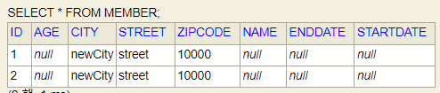

# 값타입, 공유참조 문제 - 불변 객체

### 서론 

JPA의 데이터 타입 분류

1. 엔티티 타입

   - @Entity로 정의하는 객체

   - 데이터가 변해도 식별자로 지속해서 추적 가능, ex. 회원 엔티티의 키나 나이 값을 변경해도 식별자로 인식 가능
2. 값 타입

   - int, Integer, String처럼 단순히 값으로 사용하는 자바 기본 타입이나 객체
   - 식별자가 없고 값만 있으므로 변경시 추적 불가, ex. 숫자 100을 200으로 변경하면 완전히 다른 값으로 대체


갑타입 분류

1. 기본값 타입

   - 자바 기본 타입 (int, double)

   - 래퍼 클래스 (Integer, Long)

   - String

2. 임베디드 타입 (복합값 타입)

3. 컬렉션 값 타입


### 값타입 - 임베디트타입 공유참조

문제코드

```java
Address address = new Address("city", "street", "10000");

Member member1 = new Member();
member1.setHomeAddress(address);
em.persist(member1);

Member member2 = new Member();
member2.setHomeAddress(address);
em.persist(member2);

member2.getHomeAddress().setCity("newCity");
```



의도는 member2의 필드값만 변경하려고 하였다.

하지만 Member1,2 객체는 Address의 "메모리 주소"를 공유하므로 이를 변경하면 두 객체 모두 값이 변경된다.


임베디트 타입 같은 값 타입을 여러 엔티티에서 공유하면 아주 위헙하다. (side effect 발생)

이 대신에 값을 복사해서 사용해야 한다.


### 값타입 복사

위의 문제점을 해결하기 위해 임베디드같은 값 타입은 복사하여 사용해야 한다.

```java
Address address = new Address("city", "street", "10000");

Member member1 = new Member();
member1.setHomeAddress(address);
em.persist(member1);

Address copyAddress = new Address(address.getCity(), address.getStreet(), address.getZipcode());
Member member2 = new Member();
member2.setHomeAddress(address);
em.persist(member2);

member2.getHomeAddress().setCity("newCity");
```


### Setter 사용을 지양하자

임베디드 타입은 객체 타입으로 공유참조로 인한 부작용이 발생할 수 있다.

미숙한 개발자가 이를 고려하지 못해 setter사용으로 side impect를 일으킬 수 있다.

그러므로 setter사용을 지양하고 build메서드를 활용하자! (트랜드)


제목과 같이 `불변 객체`로 생성 시점 이후 정대 값을 변경할 수 없는 객체를 만들고, Setter를 만들ㅈ; 밀자.


참고: Integer, String은 자바가 제공하는 대표적인 불변 객체


### 결론

불변이라는 작은 제약으로 부작용이라는 큰 재앙을 막을 수 있다. (추적하기 어려운 버그를 예방할 수 있다.)

bulider를 사용하거나, 새롭게 new 인스턴스를 만들거나