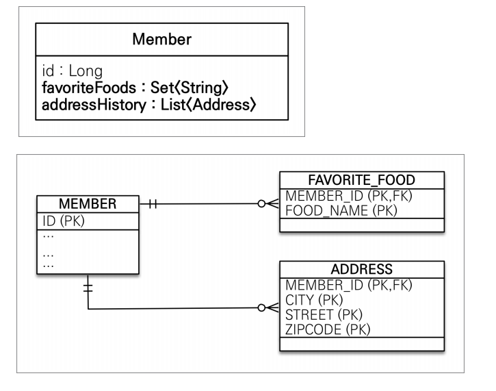
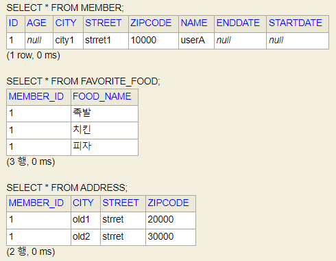
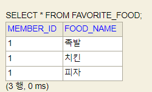
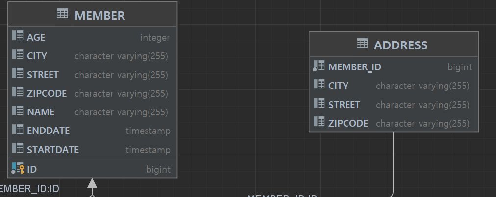

# 값타입 - 컬렉션

[TOC]

### 서론

엔티티의 값타입을 컬렉션 (List, Map)으로 지정하는 것으로, 왠만하면 실무에선 엔티티를 생성하고 `@OneToMany`로 구현하는게 좋고, 권장하지 않는다.

업데이트시 테이블을 모두 삭제하고 컬렉션의 요소들을 모두 하나씩 INSERT한다.

진짜로 "select box" 같이 정말로 단순하고 최적화할 필요가 없는 것이면 고려할 수 있다.

식별자가 필요하고, 지속해서 값을 추적, 변경해야 한다면 그것은 값타입이 아닌 엔티티이다.


### 요구사항 설명



Member는 좋아하는 음식을 여러개로, 주소이력을 여러개로 저장하고 싶다.

기본적으로 RDB에선 컬렉션을 저장할 수 없다. 컬렉션을 DB에서 적용하려면 일대다 관계로 풀어내야한다.

이것을 값타입 컬렉션으로 구현하고 이에 대한 문제점을 살펴본 후 대안법을 알아보겠다.


### 값타입 컬렉션을 가진 엔티티

```java
@Entity 
public class Member {

    @Id
    @GeneratedValue
    private Long id;

    @Column(name = "name")
    private String username;

    private Integer age;

    @Embedded
    private Period workPeriod;

    @Embedded
    private Address homeAddress;

    @ElementCollection(fetch = FetchType.LAZY)
    @CollectionTable(name = "FAVORITE_FOOD", joinColumns =
        @JoinColumn(name = "MEMBER_ID")
    )
    @Column(name = "FOOD_NAME")
    private Set<String> favoriteFoods = new HashSet<>();

    @ElementCollection(fetch = FetchType.LAZY)
    @CollectionTable(name = "ADDRESS", joinColumns =
        @JoinColumn(name = "MEMBER_ID")
    )
    private List<Address> addresseHistory = new ArrayList<>();
}
```


위의 코드의 엔티티는 위의 사진의 테이블과 같이 매핑이 된다.

갑타입 컬렉션의 특징은 다음과 같다.

- 값타입을 하나 이상 저장할 때, 사용한다.
- @ElementCollection, @CollectionTable 사용하여 구현
- DB는 컬렉션을 컬럼에 저장할 수 없기 때문에 컬렉션을 저장하기 위한 별도의 테이블이 필요하다.

- 값 타입 컬렉션은 `영속성 전이(Cascade) + 고아 객체 제거` 기능을 필수로 가진다고 볼 수 있다.


### 값타입 컬렉션의 사용

#### 값타입 저장

```java
Member member = new Member();
member.setUsername("userA");
member.setHomeAddress(new Address("city1", "strret1", "10000"));

member.getFavoriteFoods().add("치킨");
member.getFavoriteFoods().add("족발");
member.getFavoriteFoods().add("피자");

member.getAddresseHistory().add(new Address("old1", "strret", "20000"));
member.getAddresseHistory().add(new Address("old2", "strret", "30000"));

em.persist(member);
```



member의 필드값을 변경하였는데 FAVORITE_FOOD, ADDRESS의 테이블에도 데이터가 저장되어 있는 것을 볼 수 있다. (라이프 사이클이 같다.)


갑타입은 **엔티티의 라이프 사이클을 따른다.**

갑타입 컬렉션도 값타입으로 **엔티티의 라이프 사이클을 따른다.**


#### 값타입 조회

```java
//1. member 조회
Member findMember = em.find(Member.class, member.getId());

//2. member의 AddresseHistory 조회
List<Address> addresseHistory = findMember.getAddresseHistory();
for (Address address : addresseHistory) {
    System.out.println("address.getCity() = " + address.getCity());
}

//3. member의 FavoriteFoods 조회
Set<String> favoriteFoods = findMember.getFavoriteFoods();
for (String favoriteFood : favoriteFoods) {
    System.out.println("favoriteFood = " + favoriteFood);
}
```

1. 기본적으로 갑타입 컬렉션은 지연로딩으로 MEMBER의 데이터만 가져온다.
2. member의 AddresseHistory를 조회할때, ADDRESS 테이블을 조회한다.
3. member의 FavoriteFoods를 조회할때, FAVORITE_FOOD 테이블을 조회한다.


#### 값타입 수정

```java
Member findMember = em.find(Member.class, member.getId());


// findMember.getHomeAddress().setCity("newCity"); 공유참조같은 문제 발생 위험
// 1. 현재주소 가져오기
Address nowAddress = findMember.getHomeAddress();
// 2. 새로운 주소의 도시이름만 바꾸어 새로 생성한 Address 넣어주기
findMember.setHomeAddress(new Address("newCity", nowAddress.getStreet(), nowAddress.getZipcode()));

// 1. 좋아하는 음식 제거
findMember.getFavoriteFoods().remove("치킨");
// 2. 좋아하는 음식 추가
findMember.getFavoriteFoods().add("한식");

// Address에 equals가 Override 되어 있어야 한다.
// 1. 과거 주소이력 제거
findMember.getAddresseHistory().remove(new Address("old1", "strret", "20000"));
// 2. 과거 주소이력 추가
findMember.getAddresseHistory().add(new Address("newCity", "strret", "20000"));
```

Member는 임베디드 타입의 Address 필드를 가지고 있다.

member의 현재 주소 Address의 city값을 "newCity"로 변경하고 싶다.

그럴때, `findMember.getHomeAddress().setCity("newCity");`이런식으로 setter를 사용하여 주입하면 침조공유문제같은 side effect가 발생할 수 있으므로, 완전히 새로만들어서 넣어주어야한다. (builder사용 추천)


#### Member의 현재 Address 수정

1. member의 현재 Address 값을 가져온다.
2. member에 새로운 Address를 새로 생성하여 넣어준다.


#### Member의 좋아하는 음식 수정

1. member의 좋아하는 음식 중 음식을 제거한다.
2. member의 좋아하는 음식 중 음식을 추가한다.



member의 값을 수정하였는데 FAVORITY_FOOD 테이블이 변경된 것을 볼 수 있다.


갑타입은 **엔티티의 라이프 사이클을 따른다.**

갑타입 컬렉션도 값타입으로 **엔티티의 라이프 사이클을 따른다.**


#### Member의 주소 이력 수정

1. 과거 주소이력을 제거한다.

   - 여기서 `list.remove()`를 사용하게 되는데 이 매서드는 **동등성 비교 (equal)**를 비교하기 때문에 **equals를 재정의 해주어야 한다.**

   - ```java
     @Embeddable
     public class Address {
     	//...
         
         @Override
         public boolean equals(Object o) {
             if (this == o) return true;
             if (o == null || getClass() != o.getClass()) return false;
             Address address = (Address) o;
             return Objects.equals(city, address.city) && Objects.equals(street, address.street) && Objects.equals(zipcode, address.zipcode);
         }
     
         @Override
         public int hashCode() {
             return Objects.hash(city, street, zipcode);
         }
     }
     ```

   - 이후 **동등성 비교**가 참인 요소를 제거한다.

2. 과거 주소이력을 추가한다.


여기서 쿼리를 분석하면, ADDRESS 테이블의 데이터를 모두 지우고, 컬렉션에 남아있는 요소들을 모두 INSERT한다.


### 값타입 컬렉션의 문제점

값타입은 엔티티와 다르게 식별자 개념이 없다. 때문에 값을 변경하면 추적이 어려워진다. 

그래서 값타입 컬렉션에 변경사항이 생기면 테이블의 모든 데이터를 삭제하고, 값타입 컬렉션에 있는 현재값을 모두 다시 저장한다.


`OrderColumn(name = address+history_order)`이런 애노테이션을 적어주어 식별자를 만들어주는 방법도 있긴한데, 원하는 대로 동작하지않을 때가 많고 위험하다.

또는 모든 컬럼을 묶어서 기본키를 구성해야한다. 이로 인해 null입력과 중복저장이 제한된다.


이렇게 복잡하게 쓸거면 그냥 일대다 관계로 풀어서 사용하자.


### 값타입 컬렉션의 대안 - 일대다 관계



```java
// 1. 새로운 "다"쪽 엔티티 생성
@Entity
public class AddressEntity {

    public AddressEntity(String city, String street, String zipcode) {
        this.address = new Address(city, street, zipcode);
    }

    @Id @GeneratedValue
    private Long id;

    private Address address;
}

// 2. Member에 단방향 연관관계 매핑
@Entity 
public class Member {
	//...

    @OneToMany(cascade = CascadeType.ALL, orphanRemoval = true)
    @JoinColumn(name = "MEMBER_ID")
    private List<AddressEntity> addressHistory = new ArrayList<>();
}
```


일대다 관계를 권장하지 않는다고 했었는데 ("일"을 주인으로 설정한다는 의미), 값타입 컬렉션의 대안으로는 이를 사용하는 듯하다.

- "일"을 수정했는데 "다"에 update(외래키 수정) 쿼리문이 나가는 직관적인 불편함
- update 쿼리문이 추가로 나가게됨


Member를 주인으로 함으로써 AddressEntity의 생명주기를 함께 관리하기 위함인가?


어쨌든, 이렇게 엔티티 코드를 작성해주고,

```java
Member member = new Member();
member.setUsername("userA");

member.getAddressHistory().add(new AddressEntity("old1", "strret", "20000"));
member.getAddressHistory().add(new AddressEntity("old2", "strret", "30000"));

em.persist(member);
```

이렇게 코드를 작성하여 주면, AddressEntity에 데이터가 작성되게 된다.

이처럼 값타입 컬렉션을 `영속성 전이 + 고아 객체 제거`를 사용하여 대체할 수 있다.


### 정리

#### 엔티티 타입의 특징

- 식별자가 있다.
- 생명주기가 관리된다.
- 공유할 수 있다.


#### 값타입 특징

- 식별자가 없다.
- 생명주기를 엔티티에 의존한다.
- 공유하지 않는 것이 안전하다.
- 불변객체로 만드는 것이 안전하다.


값 타입은 정말 값 타입이라고 판단될 때만 사용한다.

엔티티와 값 타입을 혼동해서 엔티티를 값 타입으로 만들면 안된다.

식별자가 필요하고, 지속해서 값을 추적, 변경해야 한다면 그것은 값 타입이 아닌 엔티티이다.