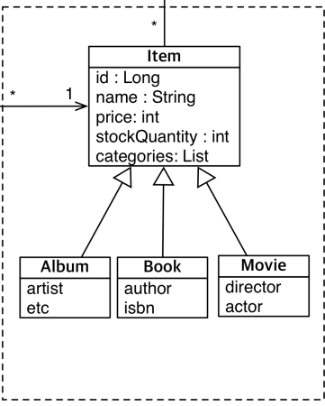
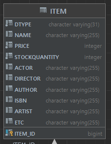
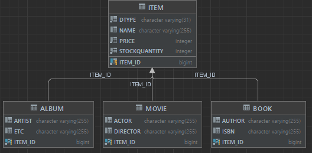

# 8-3. 상속관계 매핑 실습

### 도메인 모델




Item를 상속받은 Album, Book, Movie 3개의 자식클래스가 있는 상태.

이것을 Join전략 or 통합테이블전략 둘 중 하나를 선택하여 테이블을 설계할 것.

일단 통합테이블로 하겠다.


### 코드구현

```java
@Entity
@Inheritance(strategy = InheritanceType.SINGLE_TABLE)
@DiscriminatorColumn(name = "DTYPE")
public class Item {

    @Id @GeneratedValue
    @Column(name = "ITEM_ID")
    private Long id;

    private String name;

    private int price;

    private int stockQuantity;
}

@Entity
public class Album extends Item{

    private String artist;
    private String etc;
}

@Entity
public class Book extends Item{

    private String author;
    private String isbn;
}

@Entity
public class Movie extends Item{

    private String director;
    private String actor;
}
```

- @Inheritance로 부모테이블임을 적어주고, 테이블전략을 정한다.
- @DiscriminatorColumn을 사용하여 DTYPE 컬럼을 추가할 수 있다.


생성된 테이블




### JOINED으로 전략을 변경하면?

```java
@Entity
@Inheritance(strategy = InheritanceType.JOINED)
@DiscriminatorColumn(name = "DTYPE")
@Getter @Setter
public class Item {
	//...
}
```



거의 코드의 변경없이 서브타입으로 테이블이 매핑되는 것을 볼 수 있다.


### 공통 매핑정보 상속

```java
@MappedSuperclass
@Getter @Setter
public abstract class BaseEntity {

    @Column(name = "INSERT_MEMBER")
    private String createdBy;
    private LocalDateTime createdDate;
    @Column(name = "UPDATE_MEMBER")
    private String lastModifiedBy;
    private LocalDateTime lastModifiedDate;

}


@Entity
@Inheritance(strategy = InheritanceType.JOINED)
@DiscriminatorColumn(name = "DTYPE")
public class Item extends BaseEntity{

}
```

- 공통매핑정보를 모아놓은 추상클래스를 생성하고, @MappedSuperclass를 붙인다.
- 공통매핑정보를 적용할 엔티티에 상속한다.
- 부모-자식 타입의 객체에서는 부모만 상속받으면 된다.


결과


### 실무에서 객체 상속관계를 쓰는가?

장단점이 있다.


애플리케이션이 작고, 데이터가 적으면 상속관계를 써도 큰 문제가 없다.

객체지향적 설계를 유지할 수 있다.


그러나 데이터가 많아지고 파티셔닝해야하고 하면 상속관계는 너무 복잡하다. 이럴수록 테이블은 단순하게 유지해야한다.

노가다를 하더라도 그냥 Item에 때려넣고 Json으로 반환하기도 한다.

