### Blocking I/O & Non-Blocking I/O

#### 들어가기 전

I/O란?

- input/output, 데이터의 입출력

I/O의 종류

- network(socket), file, pipe, device

Socket

- 네트워크 통신은 socket을 통해 데이터가 입출력 된다.
- 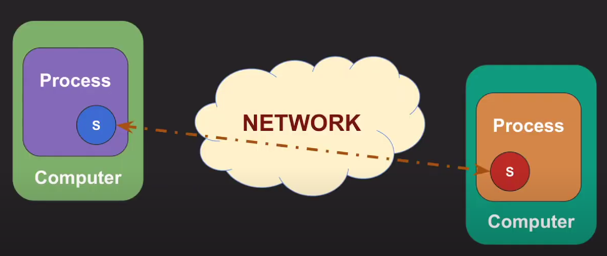

- 두 컴퓨터의 각 프로세스가 통신을 하고 싶을 때는 반드시 이 프로세스 안에서 소켓을 열고 이 소켓에서 통신을 한다.

- backend서버는 네트워크 상의 요청자들과 각각의 소켓을 열고 통신한다.

- 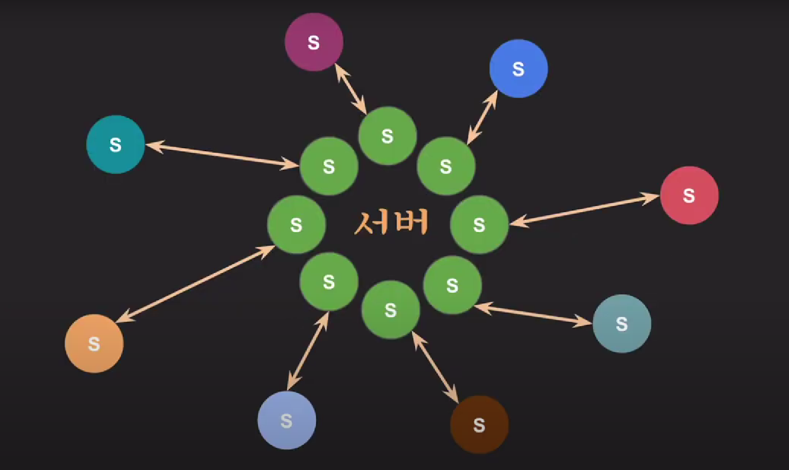

아래는 os수준에서 설명

#### Block I/O

I/O작업을 요청한 프로세스/쓰레드는 요청이 완료될 때까지 블락됨

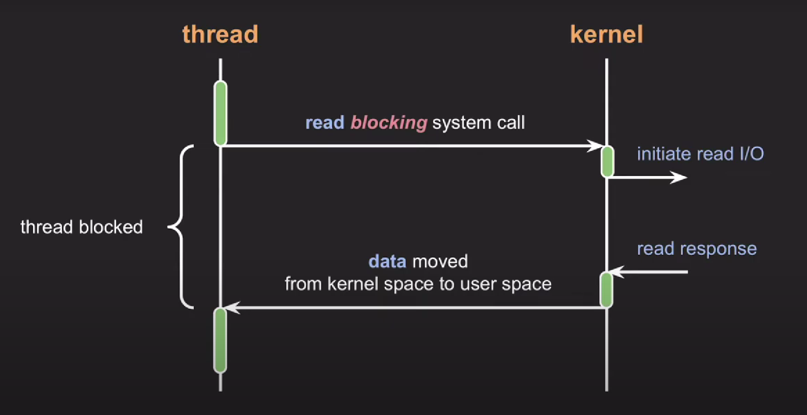

쓰레드에서 read 시스템을 호출하면 쓰레드는 Block이 되고 Kernel모드로 전환됨.

Kernel에서 I/O작업이 끝나면 response를 넘겨주고 data는 kernel space에서 user space로 옮겨짐.

블락이 된 쓰레드는 언블락되어 작업을 다시 수행

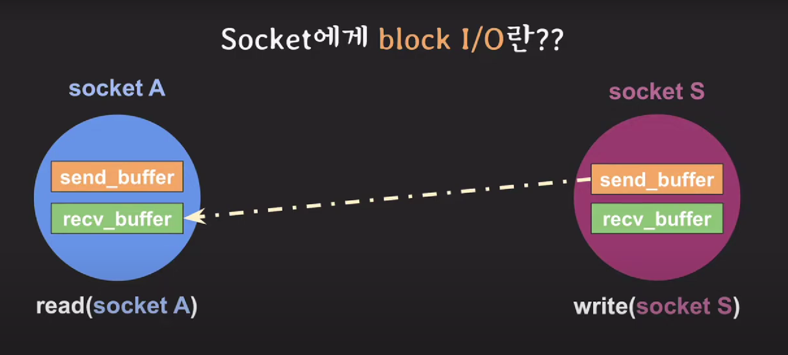

read를 호출한 소켓A의 쓰레드는 계속 Block이 됨

send_buffer가 가득찼을때 비워질때까지 write를 호출한 소켓S의 쓰레드는 계속 Blcok이 됨

#### Non-block I/O

프로세스/쓰레드를 블락시키지 않고 요청에 대한 현재 상태를 즉시 리턴

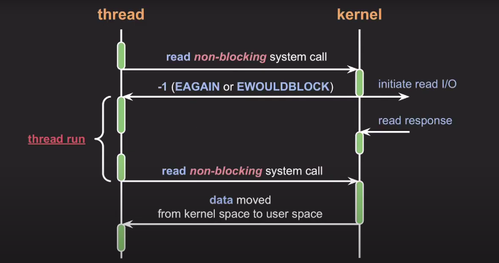

쓰레드에서 read를 호출하면 Kernel모드로 컨텍스트 스위칭이 된다.

Kernel에서는 I/O작업을 진행함과 동시에 EWOULDBLOCK를 바로 리턴

쓰레드는 다른 작업을 수행

I/O작업을 끝마친 kernel에서 response반환

쓰레드는 다시 read를 호출, 다시 Kernel로 컨텍스트 스위칭

Kernel이 data를 kernel space에서 user space로 전송

때문에 non-block I/O는 블락되지않고 즉시 리턴하기 때문에 쓰레드가 다른 작업을 진행할 수 있다.

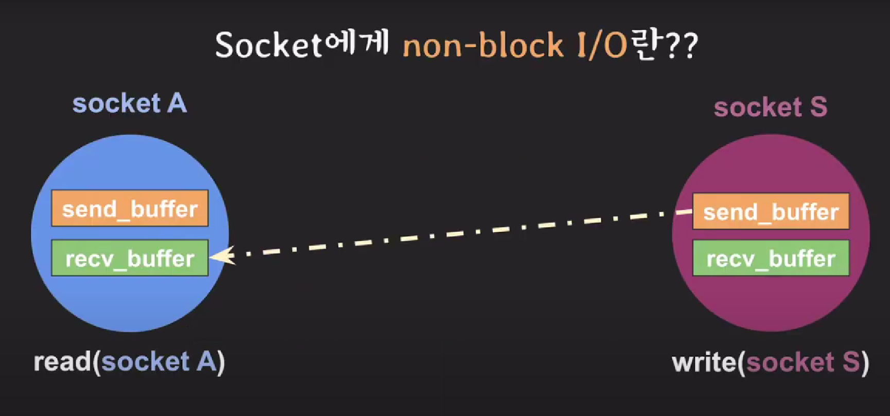

read를 호출한 소켓A에서는 반환값을 바로받아서 Block이 되지않아 작업을 계속 진행

write를 호출한 소켓S에서도 send_buffer가 가득 찼더라도 적절한 에러코드와 함께 반환되어 다른 작업을 계속 진행

#### non-block I/O 결과 처리 방식

그러면 kernel에서 데이터가 준비되었을 때 어떻게 다시 read/write를 호출하여 받아올 것인가?

1. 완료되었는지 반복적으로 확인

- 완료된 시간과 완료를 확인한 시간 사이의 갭으로 처리속도가 느려질 수 있다 (Time Gap이 발생)
- 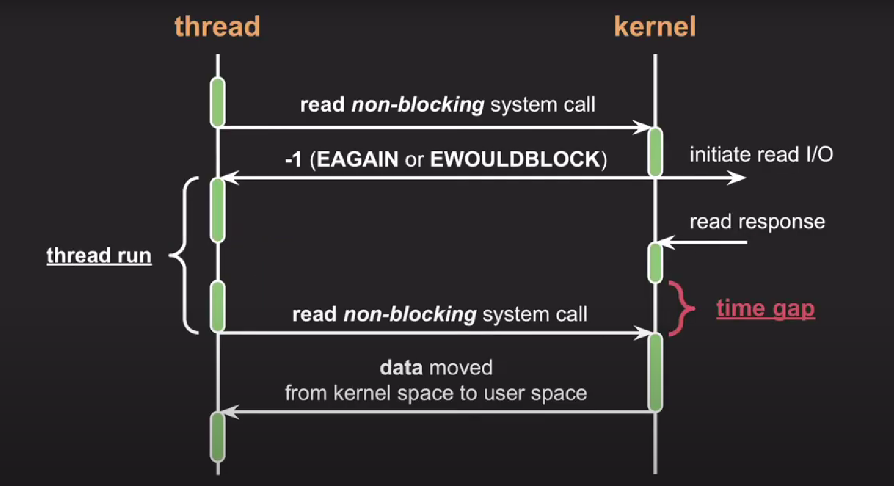

- 완료됐는지 반복적으로 확인하기 때문에 CPU낭비가 발생

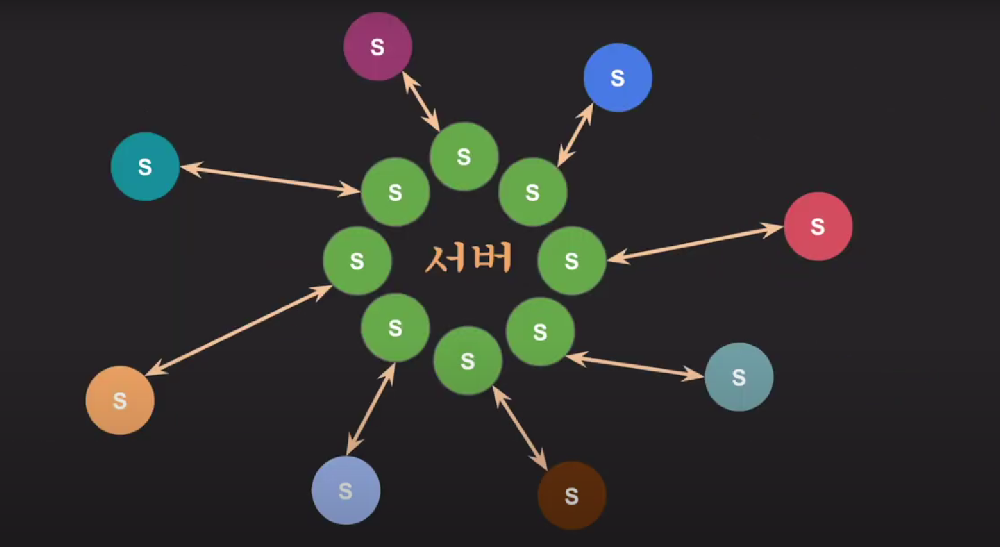

- 서버입장에서 모든 소켓을 계속 반복적으로 확인할려면 CPU에 큰 낭비

2. I/O multiplexing

- 관심있는 I/O작업들을 동시에 모니터링하고 그 중에 완료된 I/O작업들을 한번에 알려줌

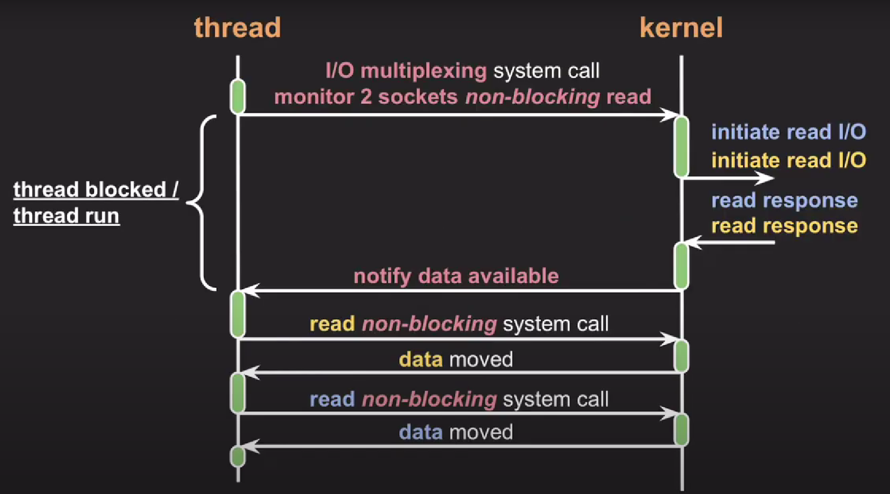

- block, non-block모두에서 사용될 수 있다.
- 새로 들어온 data가 있는지 monitoring을 하여 kernel에서 작업이 끝나면 data를 받아옴

#### async, sync/ block, non-block

1. sync + blocking

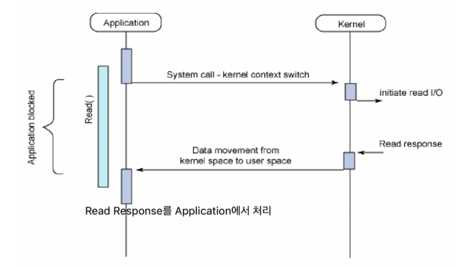

2. async + block

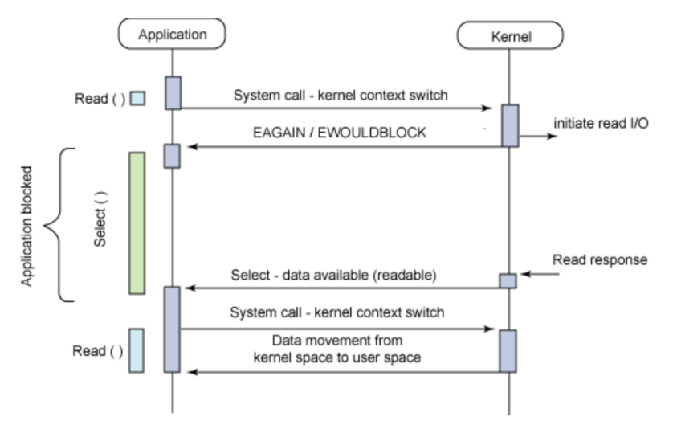

- 잘못개발했을때
- node.js + mysql 일때
  - 어쩔수 없이 발생된다

3. sunc + non-block

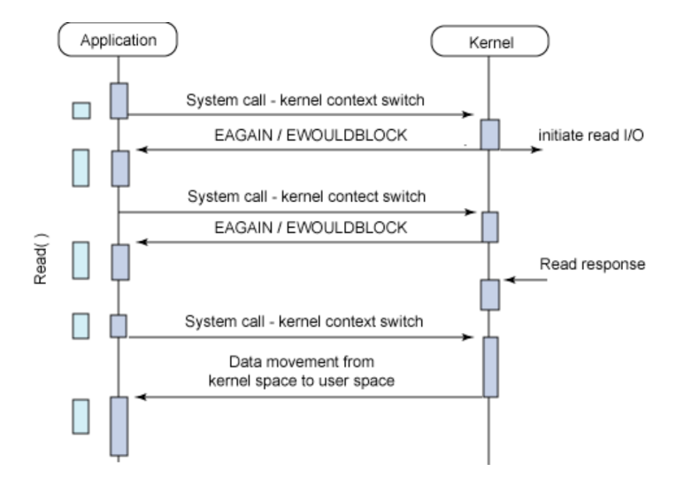

- too many context switching

- time gap

4. async + non-blocking

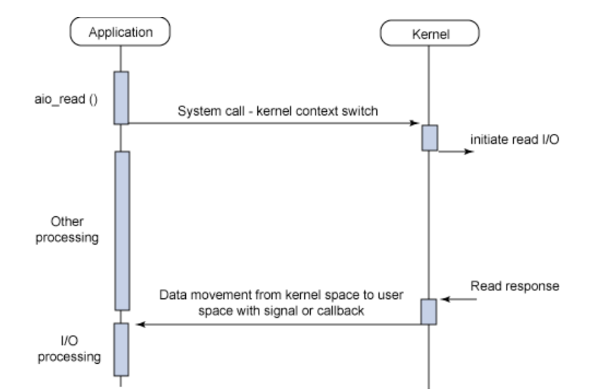