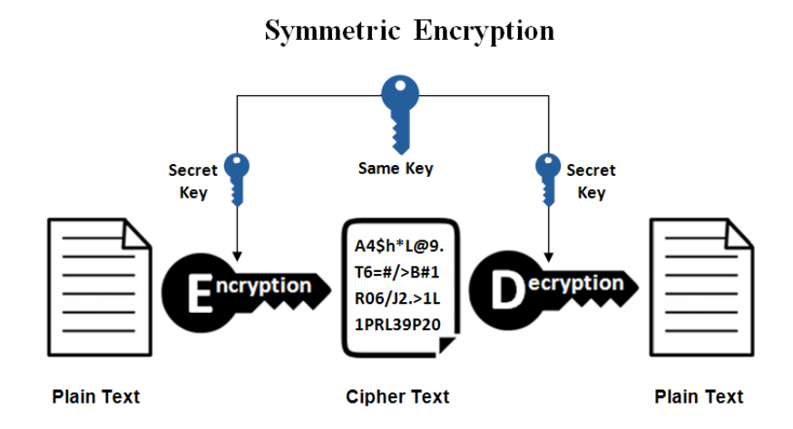
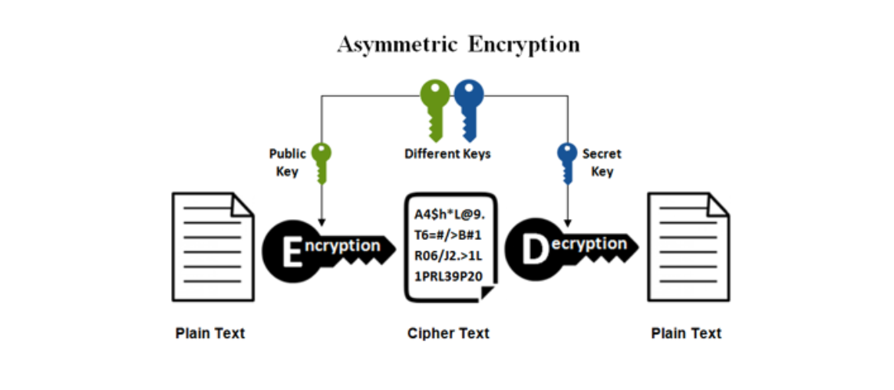
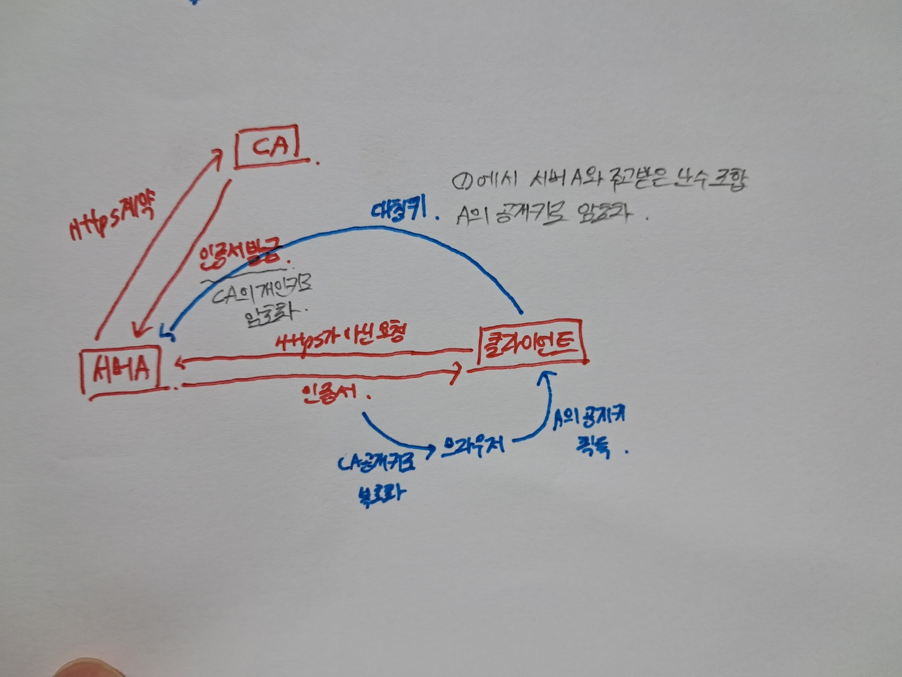

#### 대칭키 암호화 방식

> 키가 동일한 암호화 방식

해당 키를 알면 모두 복호화 가능

-> 연산속도 O, 키 교환 도중 탈취 가능성

#### 공개키 암호화 방식 / 비대칭키 암호화 방식

> 문서를 공개키로 암호화 -> 암호화된 문서를 개인키로 복호화 

#### HTTP & HTTPS

- HTTP(HyperText Transfer Protocol)

  클라이언트와 서버가 자원을 주고 받을 때 쓰는 통신 규약

단순 텍스트 교환으로 중간자 공격으로 정보 노출이 될 수 있다

- HTTPS(HyperText Transfer Protocol Secure)

  인터넷 상에서 정보를 암호화하는 SSL 프로토콜을 사용해 클라이언트와 서버가 자원을 주고 받을 때 쓰는 통신 규약

텍스트를 공개키 암호화 방식으로 암호화한다

HTTPS 통신 흐름

1. 서버(A)는 HTTPS를 적용하기 위해 공개키와 개인키를 만든다
2. 신뢰할 수 있는 CA기업을 선택하고 공개키 관리를 부탁하며 계약한다
3. 계약 완료된 CA 기업은 해당 기업의 이름, A서버 공개키, 공개키 암호화 방법을 담은 인증서를 만들고, 해당 인증서를 CA 기업의 개인키로 암호화해서 A서버에게 제공한다.
4. A서버는 암호화된 인증서를 갖게 되었다. 이제 A서버는 A서버의 공개키로 암호화된 HTTPS 요청이 아닌 요청이 오면, 이 암호화된 인증서를 클라이언트에게 건내준다.

5. 클라이언트가 `main.html` 파일을 달라고 A서버에 요청했다고 가정하자. HTTPS 요청이 아니기 때문에 CA기업이 A서버의 정보를 CA 기업의 개인키로 암호화한 인증서를 받게 된다.

6. 브라우저에 저장된 CA의 공개키로 암호화인증서를 해독하여 A서버의 공개키를 얻는다
7. 클라이언트가 A서버와 HandShaking 과정에서 주고받은 난수를 조합하여 pre-master-key(대칭키)를 생성한 뒤, A서버의 공개키로 해당 대칭키를 암호화하여 서버로 보낸다.

8. A서버는 암호화된 대칭키를 자신의 개인키로 복호화 하여 클라이언트와 동일한 대칭키를 획득한다
9. 클라이언트-서버사이의 통신을 할 때 주고받는 메세지는 이 pre-master-key(대칭키)를 이용하여 암호화, 복호화를 진행합니다.

대칭키가 탈취당할 위험이 있으므로 비대칭키 방식으로 대칭키를 공유하고 정보를 주고받는 것이다

모든정보를 비대칭키 방식으로 통신하기엔 부담이 크다

