# CPU 스케줄링

### 1️⃣ CPU 스케줄링 개요

#### CPU 스케줄링

-  운영체제가 프로세스들에게 공정하고 합리적으로 CPU자원을 배분하는 것

#### 프로세스 우선순위

- 입출력 집중 프로세스 > CPU 집중 프로세스

  - 가장 공정한 CPU 스케줄링입출력 작업이 많은 프로세스 (입출력 집중 프로세스)

  - CPU작업이 많은 프로세스 (CPU 집중 프로세스)

- Windows OS Process Explorer

#### 스케줄링 큐

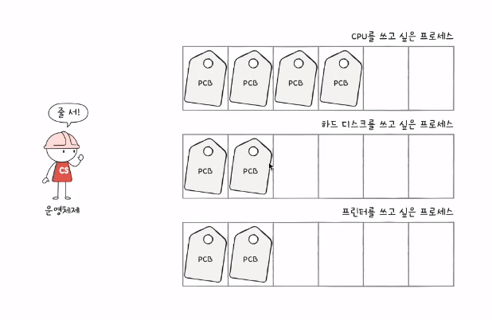

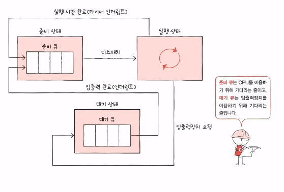

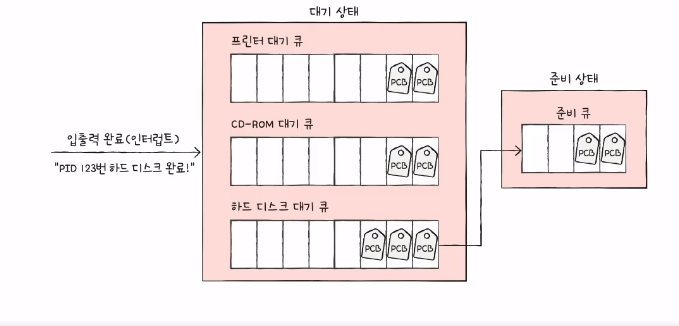

- 특정 자원이 필요한 프로세스들을 담는 자료구조
  - 선입선출일 필요는 없다

- 준비 큐

  - CPU가 필요한 프로세스들이 기다리는 줄

- 대기 큐

  - 입출력장치를 이용하기 위해 기다리는 줄

  - 여러 입출력장치가 있는 것처럼 여러 대기 큐가 존재한다
    - 같은 장치를 요구한 프로세스들을 같은 큐에서 대기

#### 프로세스 상태 다이어그램

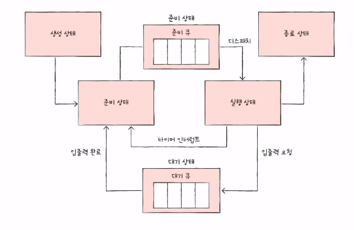

#### 선점형과 비선점형 스케줄링

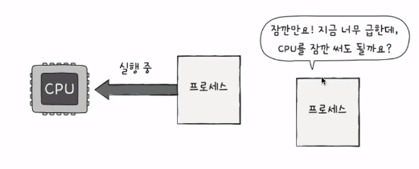

1. 선점형 스케줄링 (preemptive scheduling)
   - 현재 CPU을 이용 중인 프로세스로부터 CPU 자원을 빼앗아 다른프로세스에 할당
     - 어느 한 프로세스의 자원 독점을 막고 프로세스들에 골고루 자원을 배분할 수 있다
     - 그만큼 문맥교환 과정에서 오베헤드가 발새할 수 있다
2. 비선점형 스케줄링(non-preemptive schedulling)
   - 현재 CPU을 이용 중인 프로세스의 작업이 끝날 때까지 프로세스 기다리기
     - 선점형 스케줄링에 비해 문맥교환에서 발생하는 오버헤드가 적다
     - 모든 프로세스가 자원을 골고루 이용하기 어렵다

### 2️⃣ CPU 스케줄링 알고리즘

#### 7가지 CPU 스케줄링 알고리즘

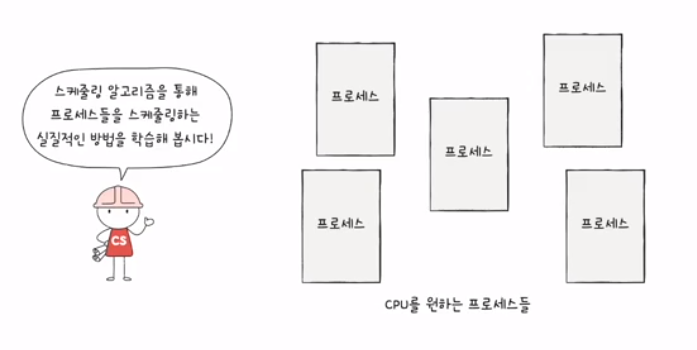

- 사실 CPU 스케줄링 알고리즘은 운영체제마다 다르고 종류도 더 많다

- 대표적인 7가지 CPU 스케줄링 방법
  - 작동방식, 장단점에 주목

#### 1. 선입 선처리 스케줄링

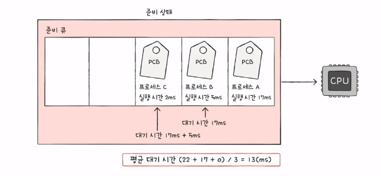

- FCFS (First Come First Served) 스케줄링

- 단순히 준비 큐에 삽입된 순서대로 처리하는 비선점 스케줄링
- 단점: 프로세스들이 기다리는 시간이 매우 길어질 수 있다는 부작용 (=호위 효과)

#### 2. 최단 작업 우선 스케줄링

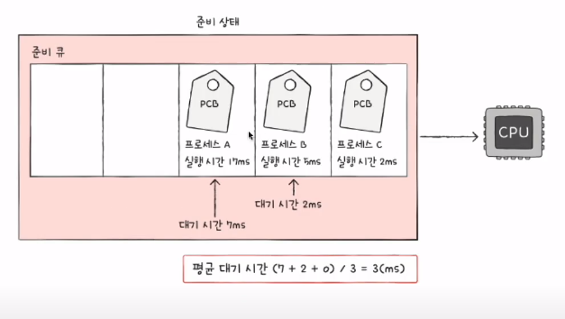

- SJF 스케줄링 (Shortest Job First) 스케줄링
- 호위 효과를 방지
- CPU 사용 시간이 가장 짧은 프로세스부터 처리하는 스케줄링

#### 3. 라운드 로빈 스케줄링

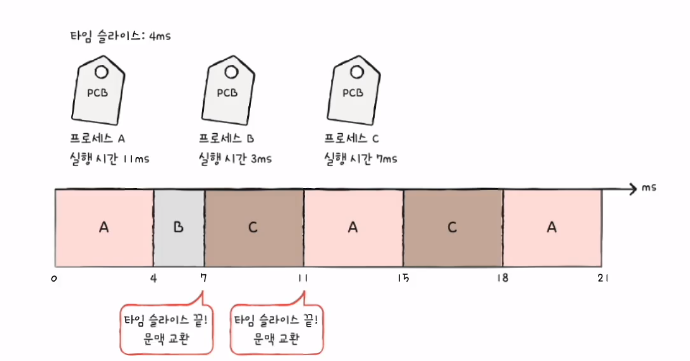

- RB(Round Robin) 스케줄링
- 선입 선처리 스케줄링 + 타임 슬라이스 (time slice)
  - 타임 슬라이스: 각 프로세스가 CPU를 사용할 수 있는 정해진 시간
- 정해진 타임 슬라이스만큼의 시간 동안 돌아가며 CPU를 이용하는 선점형 스케줄링
  - 큐에 삽입된 프로세스들은 순서대로 CPU를 이용하되 정해진 시간만큼만 이용
  - 정해진 시간을 모두 사용하였음에도 아직 프로세스가 완료되지 않았다면 다시 큐의 맨뒤에 삽입(문맥 교환)

- 타임 슬라이스의 크기가 중요
  - 너무 크면 선입 선처리 스케줄링과 별 다를 바가 없음
  - 너무 작으면 문맥교환이 너무 많이 일어남

#### 4. 최소 잔여 시간 우선 스케줄링

- SRT (Shortest Remaining Time) 스케줄링
- 최단 작업 우선 스케줄링 + 라운드 로빈 스케줄링
  - 작업 시간이 짧은 프로세스부터 처리하는 스케줄링
  - 정해진 타임 슬라이스만큼 돌아가며 사용하는 스케줄링
- 정해진 시간만큼 CPU를 이용하되 다음으로 CPU를 사용할 프로세스로는 남은 작업 시간이 가장 적은 프로세스 선택

#### 5. 우선순위 스케줄링

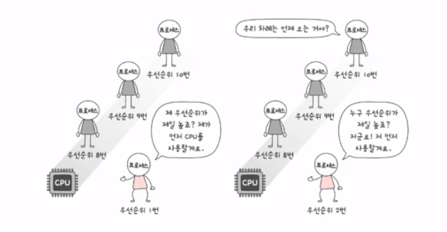

- 프로세스들에 우선순위를 부여하고, 우선순위가 높은 프로세스부터 실행
- 우선순위가 같은 프로세스들은 선입 선처리로 스케줄링

- 최단 작업 우선 스케줄링, 최소 잔여 시간 스케줄링이 포함됨
- 근원적인 문제: 우선순위가 높은 프로세스만 주구장장 실행, 기아 (starvation) 현상
  - 해결기법: 에이징(aging)
  - 오랫동안 대기한 프로세스의 우선순위를 점차 높이는 방식
  - 우선순위가 낮아도 언젠가는 우선수위가 높아진다
  - 공익이랑 비슷한듯

#### 6. 다단계 큐 스케줄링

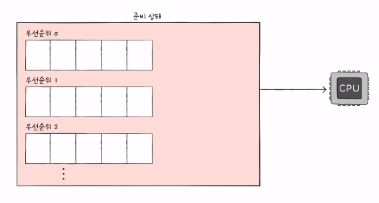

- Mutilevel queue 스케줄링
- 우선순위 스케줄링의 발전된 형태
- 우선순위별로 준비 큐를 여러 개 사용하는 스케줄링 방식
  - 우선순위가 가장  높은  큐에 있는 프로세스를 먼저 처리
  - 비어있다면 그 다음 우선순위 큐에 있는 프로세스 처리

- 장점: 큐마다 스케줄링 알고리즘을 다르게 적용할 수 있음
- 단점: 프로세스의 큐간 이동이 불가능해서 기아 현상 발생

#### 7. 다단계 피드백 큐 스케줄링

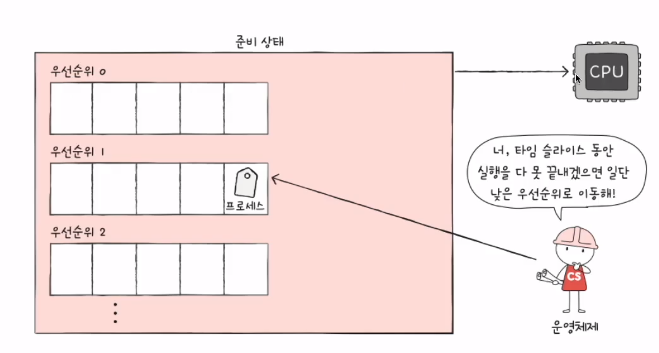

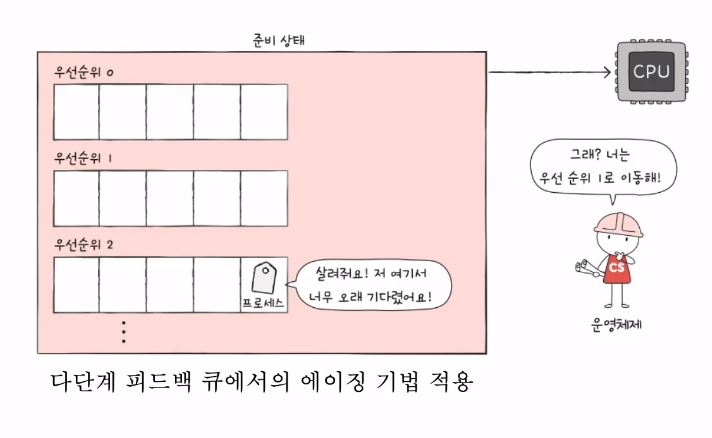

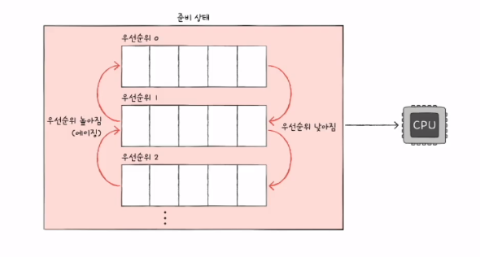

- Mutilevel feedback queue 스케줄링
- 다단계 큐 스케줄링의 발전된 형태
- 큐간의 이동이 가능한 다단계 큐 스케줄링
  - 준비상태의 프로세스를 가장 높은 우선순위 큐에 삽입
  - CPU를 할당받고 작업이 다 끝나지 않으면 다음 우선순위 큐로 이동
  - CPU 집중 프로세스의 우선순위는 상대적으로 낮아지고, 입출력 집중 프로세스의 우선순위는 상대적으로 높아진다

- 에이징 기법 활용

- 구현이 어렵지만 일반적으로 이 스케줄링 방식을 사용한다
  - 어떤 프로세스의 CPU 시간이 길면 우선순위가 낮아지고
  - 어떤 프로세스가 낮은 우선순위 큐에서 너무 오래 기다리면 우선순위를 높이는 방식