# 운영체제 시작하기

### 1️⃣ 운영체제를 알아야 하는 이유

#### 들어가며

- 컴퓨터 부품들은 전기만 공급하면 마법처럼 알아서 작동하는 것이 아닙니다
- 리소스 (자원)
  - 프로그램 실행에 있어서 마땅히 필요한 요소
  - 컴퓨터의 네 가지 핵심 부품 포함
  - 하드웨어 자원, 네트워크 자원 등

#### 운영체제

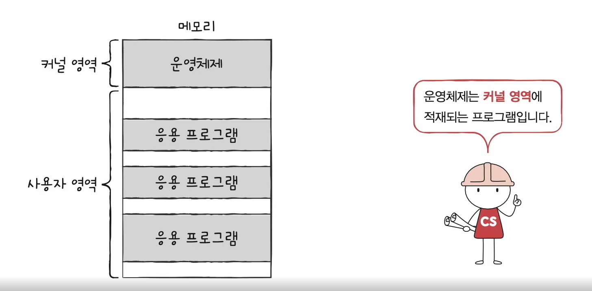

- 실행할 프로그램에 필요한 자원을 할당하고
- 프로그램이 올바르게 실행되도록 돕는 특별한 프로그램

- 모든 프로그램은 메모리에 적재되어 실행된다
  - 운영체제는 메모리의 특별한 커널영역에 적재되어 실행된다
  - *응용프로그램: 메모장, 워드 등

#### 운영체제의 메모리 관리

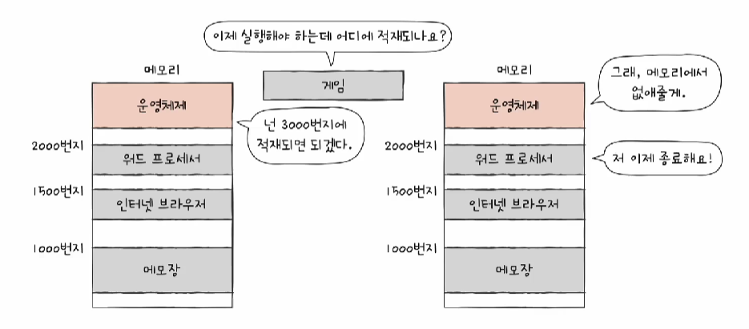

- 응용프로그램을 실행할 때 몇 번지 메모리에 적재할 것인지를 정한다
- 응용프로그램을 종료할 때 메모리를 비우는 작업을 한다

#### 운영체제의 CPU관리

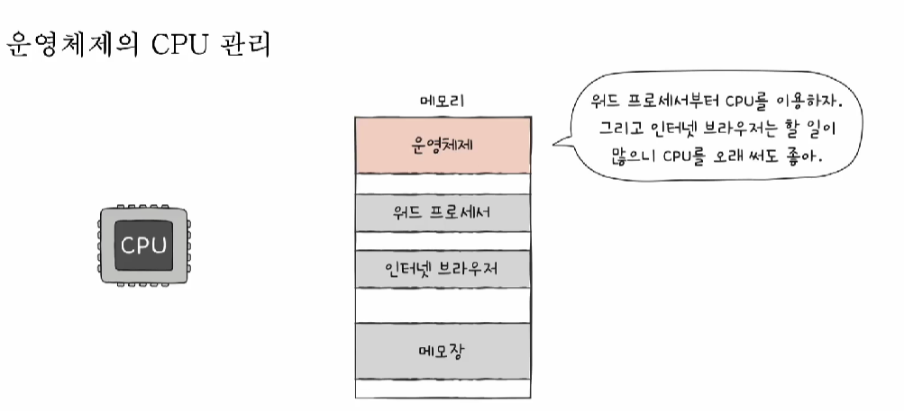

- CPU는 보통 여러 프로그램을 동시에 실행한다
  - 우리가 인지하지 못할 정도로 빠르게 번갈아가며 실행된다
- 운영체제는 여러 프로그램이 동시에 실행되는 환경에서
  - 어떤 프로그램을 먼저 실행할지, 나중에 실행할지,
  - 어떤 프로그램을 얼마나 오랫동안 실행할지 결정한다

#### 운영체제의 입출력장치 관리

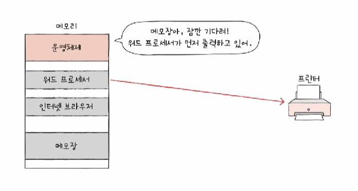

- 워드에서 프린터를 사용할때 메모장 프른터 사용을 대기시킨거나
- 보조기억장치의 정보들을 파일, 폴더(디렉토리)로 관리 등
- 입출력장치들을 관리

#### 운영체제를 정부에 비유

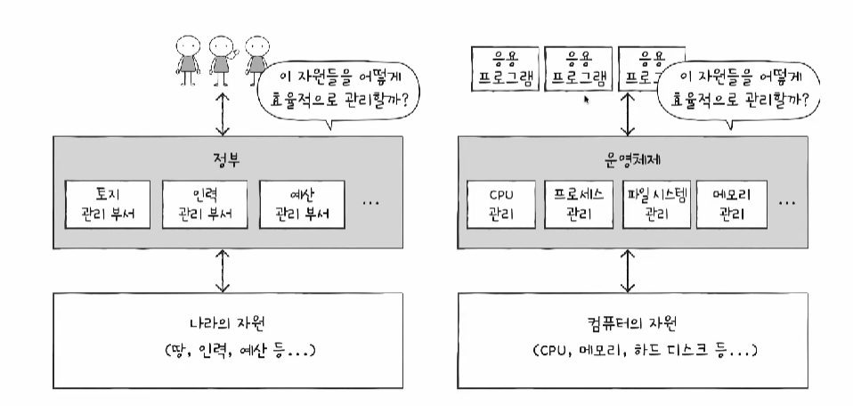

- 컴퓨터의 자원을 응용프로그램들에 배분해주는 역할을 하고
- 프로그램들이 문제가 없게끔 관리해주는 역할
- 각 자원들을 관리하는 부서들이 따로 있다

#### 운영체제가 없이 프로그램을 개발한다면

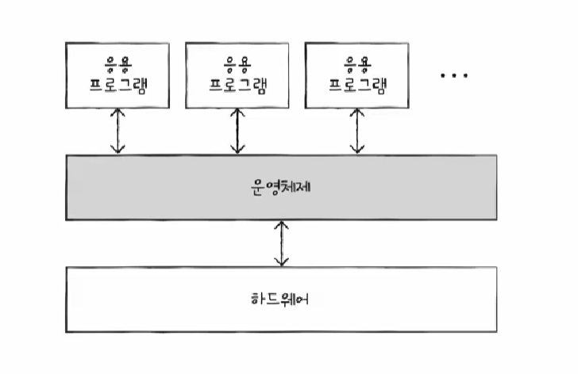

- 하드웨어를 직접 접근하고 조작하는 코드를 개발자가 일일히 하나하나 다 만들어야 한다
- 1과 2를 더한 결과를 모니터에 출력하는 프로그램 예시
  - 프로그램을 메모리에 적재하는 코드
  - CPU로 하여금 1과 2를 더하게 하는 코드
  - 모니터에 계산 결과를 출력하는 코드 등등 

- 운영체제 덕분에 하드웨어에 접근하는 코드를 직접 작성할 필요가 없다

#### 운영체제가 필요한 이유

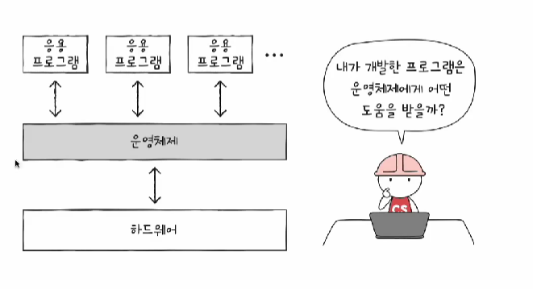

- 운영체제는 프로그램을 위한 프로그램이다

- 때문에 프로그램 개발자는 운영체제를 알아야한다

  - 하드웨어, 응용프로그램 등에서 문제가 생기면 운영체제가 그 문제를 가장 빨리 알아챈다

  - 하드웨어는 문제가 생기면 동작을 안하지만 운영체제는 대화가 통한다
    - 운영체제가 보내는 오류메시지를 통해 문제를 파악할 수 있다
    - 오류메시지에 대한 이해가 높아지고 문제해결 능력이 높아진다
    - 또는 운영체제 지식이 있어야지만 해결할 수 있는 문제도 있다

### 2️⃣ 운영체제의 큰 그림

#### 들어가며

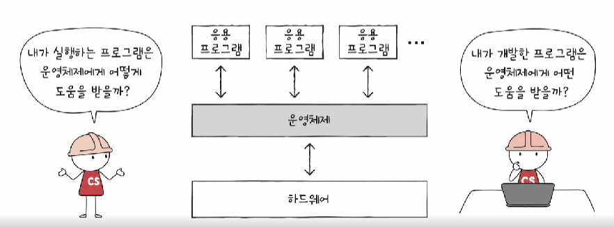

- 커널이란?
- 운영체제의 서비스 종류?
- 시스템 콜과 이중모드란?

#### 운영체제의 심장, 커널

운영체제의 특징

- 프로그램 중 규모가 가장 큰 프로그램 중 하나
- 윈도우, 맥, 안드로이드 등 다양한 종류의 운영체제가 있다
- 그렇게에 운영체제가 제공하는 기능은 다양하다
- 그러나 가장 핵심적인 서비스는 존재한다
  - 자원에 접근하고 조작하는 기능
  - 프로그램이 올바르고 안전하게 실행되는 기능

커널(kernel)

- 운영체제의 핵심 서비스를 담당하는 부분

- 운영체제에는 속하는데 커널에는 속하지 않는 기능
  - 유저 인터페이스 등
  - 운영체제의 핵심기능은 아님
  - 리눅스의 경우 같은 커널을 사용해도 다른 유저인터페이스를 사용할 수 있음

#### 응용프로그램이 자원에 직접 접근해도 될까?

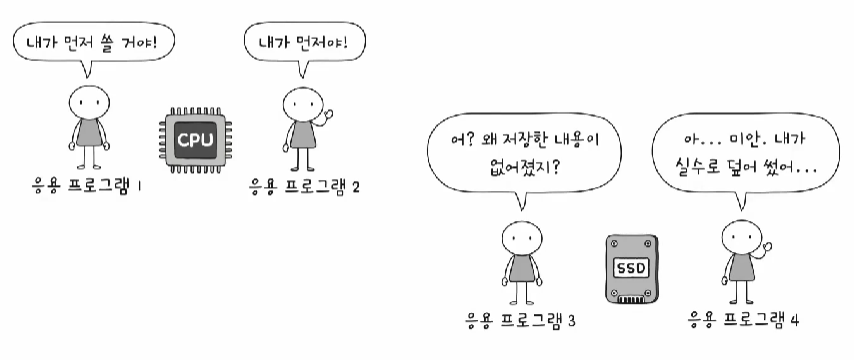

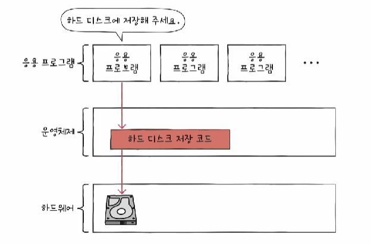

- 응용 프로그램의 자원 직접 접근은 위험하다
- 응용 프로그램이 자원에 접근하여면 운영체제에 도움을 요청해야한다

#### 이중모드

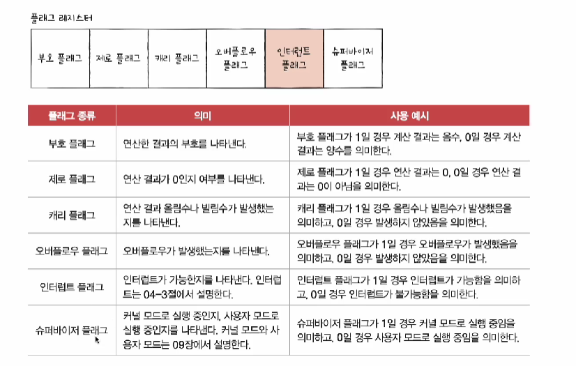

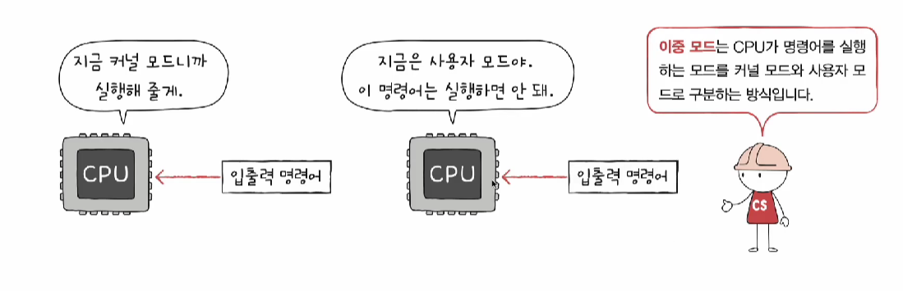

- CPU가 명령어를 실행하는 모드를 크게 사용자 모드, 커널모드로 구분하는 방식
- 사용자모드
  - 운영체제 서비스를 제공받을 수 없는 실행모드
  - 커널 영역의 코드를 실행할 수 없는 실행모드
  - 자원 접근 불가
- 커널모드
  - 운영체제의 서비스를 제공받을 수 있는 실행모드
  - 자원 접근을 비록한 모든 명령어 실행 기능

- 슈퍼바이저 플래그를 확인하여 자원에 접근할 수 있는지 판단한다

#### 시스템 호출

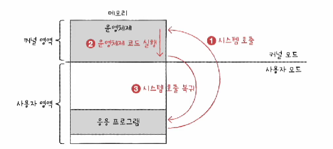

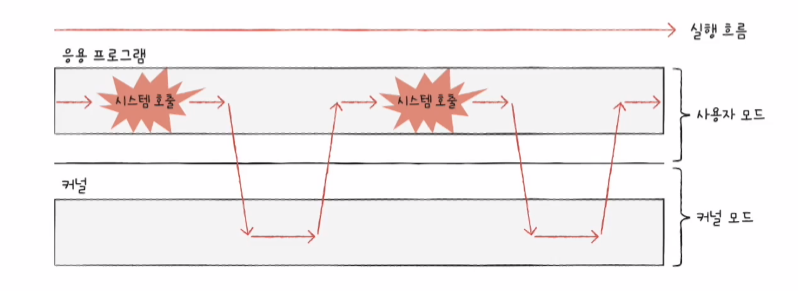

- 커널 모드로 전환하여 실행하기 위해 호출

- 일종의 소프트웨어 인터럽트
  - 시스템 호출이 처리되는 방식은 하드웨어 인터럽트 처리방식과 유사하다

#### 운영체제의 핵심 서비스

1. 프로세스 관리

   - 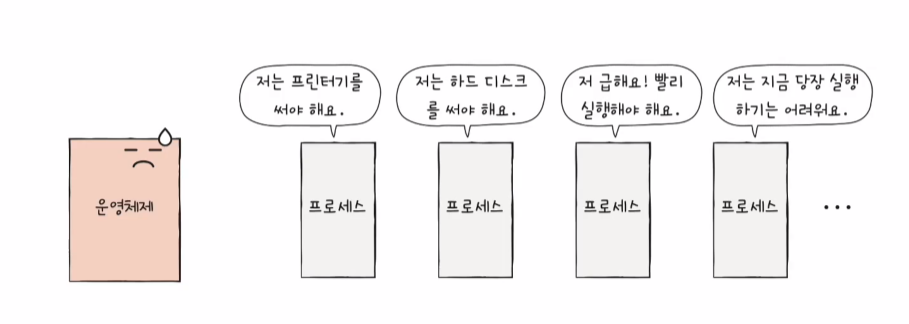

   - 프로세스 == 메모리에 적재되서 실행 중인 프로그램
   - 수많은 프로세스들이 동시에 실행된다
     - 작업관리자를 열어보면 많은 프로그램들이 메모리에 적재되서 돌아가는 것을 볼 수 있다
   - 동시다발적으로 생성/실행/삭제 되는 다양한 프로세스를 일목요연하게 관리
     - 프로세스와 스레드, 프로세스 동기화, 교착상태 해결

2. 자원 접근 및 할당 (추후에 자세하게 배울 것)

   - CPU
     - CPU스케줄링: 어떤 프로세스를 먼저, 얼마나 오래 실행할 것인가

   - 메모리
     - 페이징, 스와핑
   - 입출력장치
     - 인터럽트 서비스 루틴

3. 파일 시스템 관리
   - 파일과 폴더(디렉토리) 또한 운영체제가 지원해주는 기능
     - 보조기억장치에 있는 데이터를 파일이라는 단위로 묶어서 저장창치에 보관
     - 파일들을 묶어 폴더(디렉토리) 단위로 저장장치에 보관