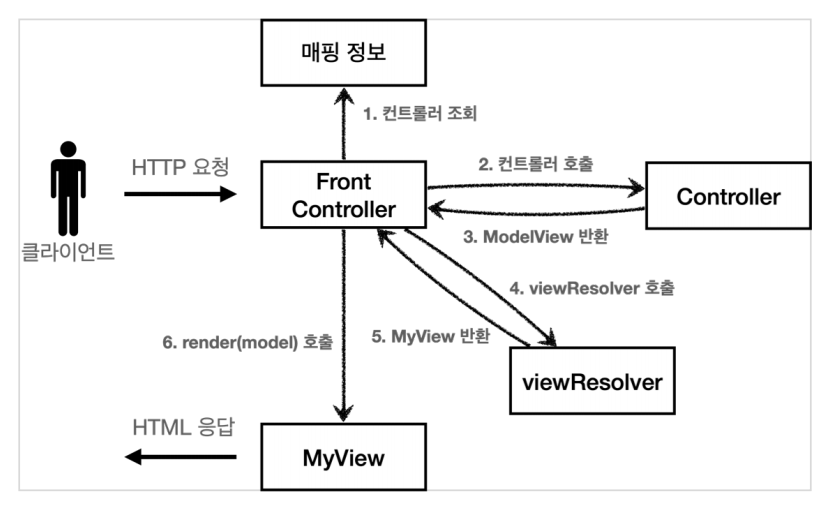
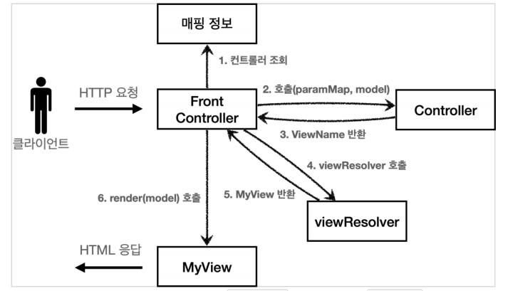

# 스프링 MVC V4

### 스프링 MVC V3 구조



1. 프론트 컨트롤러에서 서블릿을 하나로 요청을 받는다.
2. 프론트 컨트롤러가 맵핑 URI에 맞는 컨트롤러를 찾아 호출
3. 컨트롤러가 비지니스 로직을 처리하고 **ModelView 객체를 반환한다.**
   - 뷰에 필요한 정보를 담고있다. (논리이름 + 데이터)

4. **ViewResolver 객체로 논리이름을 물리이름으로 변환한다.**

5. **MyView에 물리이름과 ModelView의 model을 넘겨준다.**
6. **MyView에서 model의 데이터를 가지고 뷰를 랜더링한다.**


### 스프링 MVC V3의 문제점

개발자 입장에선 항상 ModelView를 만들어야하는 불편함 (실용성 문제)

-> 컨트롤러에 model을 파라미터로 넘기고 뷰의 논리이름을 반환하자


### 스피링 MVC V4 구조



1. 프론트 컨트롤러에서 서블릿을 하나로 요청을 받는다.
2. 프론트 컨트롤러가 맵핑 URI에 맞는 컨트롤러를 찾아 호출
3. 컨트롤러가 비지니스 로직을 처리하고 **model에 데이터를 담고, viewName을 반환한다.**
   - ModelView (논리이름 + model)을 담음
   - V4에선 model을 param으로 받고 model에 데이터를 담고, viewName(논리이름) 반환

4. **ViewResolver 객체로 논리이름을 물리이름으로 변환한다.**

5. **MyView에 물리이름과 model을 넘겨준다.**
6. **MyView에서 model의 데이터를 가지고 뷰를 랜더링한다.**


### 스피링 MVC V3 예시코드

FrontControllerV4

```java
@WebServlet(name = "frontControllerServletV4", urlPatterns = "/front-controller/v4/*")
public class FrontControllerServletV4 extends HttpServlet {

    private Map<String, ControllerV4> controllerMap = new HashMap<>();
	
    // 1. 매핑정보
    public FrontControllerServletV4() {
        controllerMap.put("/front-controller/v4/members/new-form", new MemberFormControllerV4());
        controllerMap.put("/front-controller/v4/members/save", new MemberSaveControllerV4());
        controllerMap.put("/front-controller/v4/members", new MemberListControllerV4());
    }

    @Override
    protected void service(HttpServletRequest request, HttpServletResponse response) throws ServletException, IOException {
		
        // 2. URI에 맞는 컨트롤러 가져오기
        String requestURI = request.getRequestURI();

        ControllerV4 controller = controllerMap.get(requestURI);

        if (controller == null) {
            response.setStatus(HttpServletResponse.SC_NOT_FOUND);
            return;
        }
		
        // 3. request parameter들을 Map에 담아서 controller로 보내주기
        Map<String, String> paramMap = createParamMap(request);
        // 4. 빈 model객체를 controller로 보내주기
        Map<String, Object> model = new HashMap<>();
		
        // 5. 파라미터 정보로 비지니스 로직 처리
        String viewName = controller.process(paramMap, model);
		
        // 9.view 논리이름을 물리이름으로 변환
        MyView view = viewResolver(viewName);
        
        // 10. (모델 + 뷰 논리이름)을 받아 뷰에서 랜더링 처리
        view.render(model, request, response);
    }

    private static MyView viewResolver(String viewName) {
        return new MyView("/WEB-INF/views/" + viewName + ".jsp");
    }

    private static Map<String, String> createParamMap(HttpServletRequest request) {
        Map<String, String> paramMap = new HashMap<>();
        request.getParameterNames().asIterator()
                .forEachRemaining(paramName -> paramMap.put(paramName, request.getParameter(paramName)));
        return paramMap;
    }
}
```


MemberListControllerV4

```java
package hello.servlet.web.frontcontroller.v4.controller;

import hello.servlet.domain.member.Member;
import hello.servlet.domain.member.MemberRepository;
import hello.servlet.web.frontcontroller.v4.ControllerV4;

import java.util.List;
import java.util.Map;

public class MemberListControllerV4 implements ControllerV4 {
    private MemberRepository memberRepository = MemberRepository.getInstance();

    @Override
    public String process(Map<String, String> paramMap, Map<String, Object> model) {
        
        // v3 코드
        // ModelView mv = new ModelView("members");
        // mv.getModel().put("members", members);
        // return mv;
        
        // 6. 컨트롤러 프로세스 수행
        List<Member> members = memberRepository.findAll();
        // 7. model에 데이터 담기
        model.put("members", members);
        // 8. view 논리이름 반환
        return "members";
    }
}

```


MyView

```java
@AllArgsConstructor
public class MyView {
    private String viewPath;
    
    // V2에서 사용
    public void render(HttpServletRequest request, HttpServletResponse response) throws ServletException, IOException {
        RequestDispatcher dispatcher = request.getRequestDispatcher(viewPath);
        dispatcher.forward(request, response);
    }
    
    // V3, V4에서 사용
    public void render(Map<String, Object> model, HttpServletRequest request, HttpServletResponse response) throws ServletException, IOException{
        modelToRequestAttribute(model, request);
        RequestDispatcher dispatcher = request.getRequestDispatcher(viewPath);
        dispatcher.forward(request, response);
    }

    private static void modelToRequestAttribute(Map<String, Object> model, HttpServletRequest request) {
        model.forEach((key, value) -> request.setAttribute(key, value));
    }
}
```


### V5에서 개선될 문제점

V1, V2, V3, V4 버전을 개발자가 선택적으로 사용할 수 없다.

-> 어뎁터 구조로 해결할 예정


