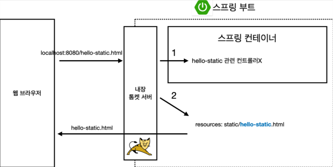
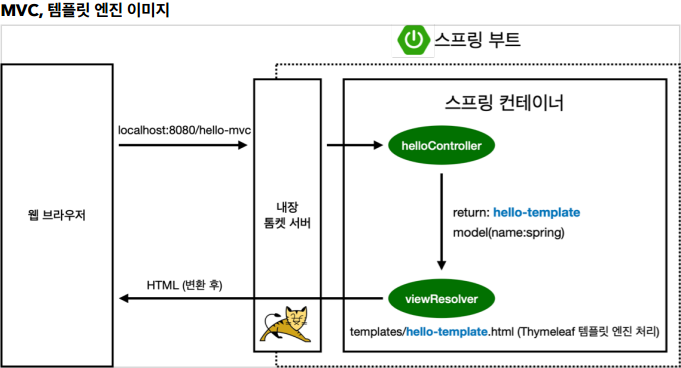
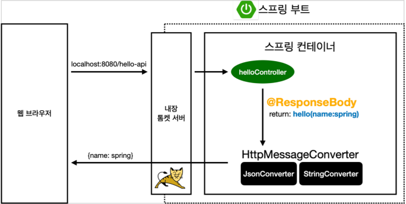

# 스프링 웹 개발 3가지 방법

### 1️⃣ 정적 컨텐츠

- 생 html파일을 전달해주는 방식

그림설명

1. 웹 브라우저에서 hello-static.html을 GET요청으로 보낸다. 

2. 내장톰켓서버에서 
   1. 스프링컨테이너에 hello-static관련 컨트롤러가 있는지 확인한다.
   2. 없다면 resources/static/hello-static.html이 있는지 확인한다.
3. 이 정적 html파일을 웹 브라우저에 반환한다.

아직 내장톰켓서버가 무엇인지 확실하게 모르겠다.

지금은 브라우저와 서버 중간에서 요청을 처리하는 작업을 한다 정도로만 이해하겠다.

### 2️⃣ MVC와 템플릿 엔진

- 동적 HTML파일을 전달해주는 방식

MVC란

예전에는 View에 DB접근, 서비스로직 등 모든 작업을 수행했다고 한다.

현재는 Model, View, Controller를 나누어 각각의 역할과 책임을 부여할 수 있다.

재사용성과 유지보수의 증가효과

- Model: 데이터와 비지니스 로직 담당
- View: 사용자 인터페이스, 보여주는 역할
- Controller: 사용자 입력처리, 요청을 적적한 모델과 뷰를 연결, 데이터 흐름 제어

템플릿 엔진

서버측에서 사용자 인터페이스를 동적으로 생성하는데 사용되는 도구

동적인 HTML파일을 랜더링하게 해준다.

자세한 내부 동작은 아직 모르겠다.

그림설명

1. 웹 브라우저에서 hello-mvc로 GET요청으로 보낸다. 

2. 내장톰켓서버에서 스프링컨테이너에 hello-mvc 관련 컨트롤러가 있는지 확인한다.

3. Controller에서 요청을 받고 
   1. 데이터를 Model에서 가져온다.
   2. viewResolver에 `hello-template`값과 데이터를 넘겨준다.
4. viewResolver에서 `hello-template`으로 View를 찾아주고 데이터와 함께 템플릿엔진에게 넘긴다.
5. 템플릿엔진에서 View를 받은데이터로 변환을 한 Html을 브라우저에 넘겨준다.

마찬가지로 내장톰켓서버와 viewResolver 구체적인 동작은 모르겠다.

일단 큰 그림에서 이해를 하는 것을 목표로 한다.

### 3️⃣ API

- 웹브라우저에 View룰 반환하는게 아닌 데이터를 반환하는 방식
  - 데이터는 Xml이나 Json 형식(대부분)으로 반환한다.

그림설명

1. 웹 브라우저에서 hello-api를 GET요청으로 보낸다. 

2. 내장톰켓서버에서 스프링컨테이너에 hello-api관련 컨트롤러가 있는지 확인한다.
3. @ResponseBody 어노테이션이 붙은 메서드라면 HttpMessageConverter로 넘겨준다.
   1. JsonConverter: 데이터가 객체라면 Json으로 변환해준다.
   2. StringConverter: 문자데이터 처리
4. 처리한 데이터를 웹브라우저에 반환한다.

@ResponseBody

- HTTP의 BODY에 문자 내용을 직접 반환

- viewResolver 대신에 HttpMessageConverter 가 동작
- 기본 문자처리: StringHttpMessageConverter 라이브러리

- 기본 객체처리: MappingJackson2HttpMessageConverter 라이브러리

이는 스프링에서 기본적으로 설정된 값이며  HttpMessageConverter를 커스텀할 수 있다고 한다.

그러나 보통 실무에서 기본값 그대로 사용한다고 한다.