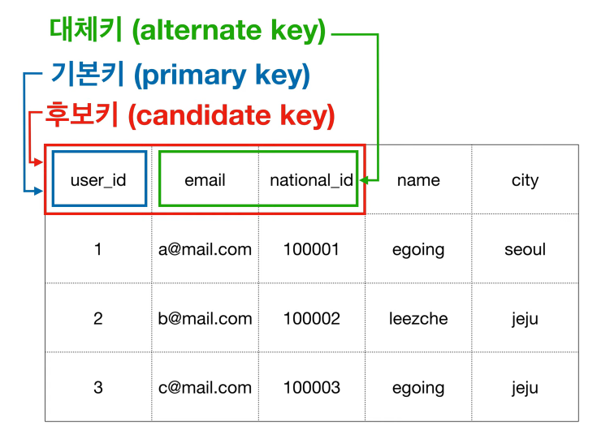

# 관계형 테이블 키 정리

Key란?: 검색, 정렬시 Tuple을 구분할 수 있는 기준이 되는 Attribute

1. Candidate Key 후보키

- Tuple을 유일하게 식별하기 위해 사용할 수 있는 key들

- 유일성, 최소성을 만족해야한다.

*최소성: 키를 구성하는 속성들 중 꼭 필요한 최소한의 속성들로만 키를 구성하는 성질.
다른 속성을 통해 한 속성을 유추할 수 있으면 안된다.

2. Primary Key 기본키

- 후보키 중 식별자로 사용할 Main Key
- Null X, 중복 X
- 보통 auto increasement로 제작함

3. Alternate Key 대체키

- 후보키 중 기본키를 제외한 나머지
- 보조키

참고 사진

4. Super Key (슈퍼키)

- 후보키처럼 유일성을 갖고 tuple을 식별할 수 있다.
- 두 attribute를 합쳐서 만든다. (최소성 X)

5. Foregin Key (외래키)

- 다른 테이블의 기본키와 관계를 맺는 attribute

- Join을 할 때 사용