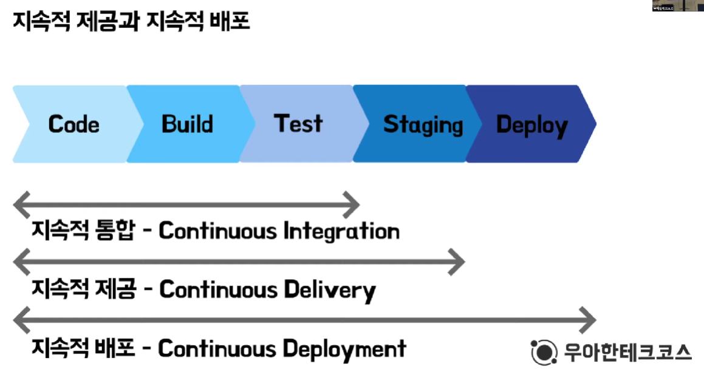
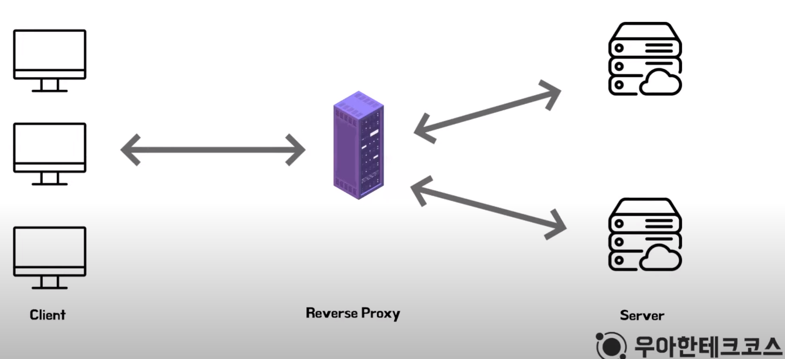
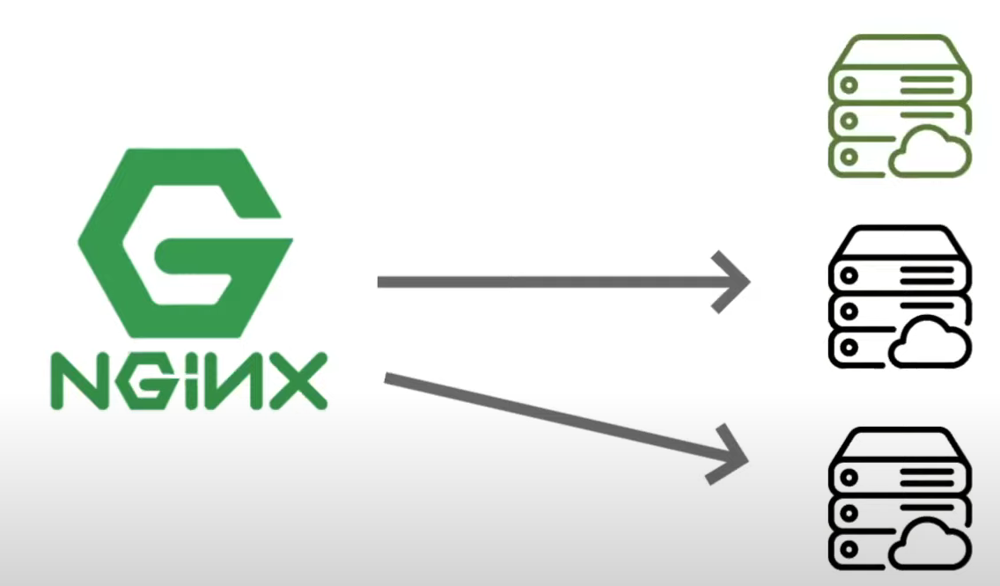
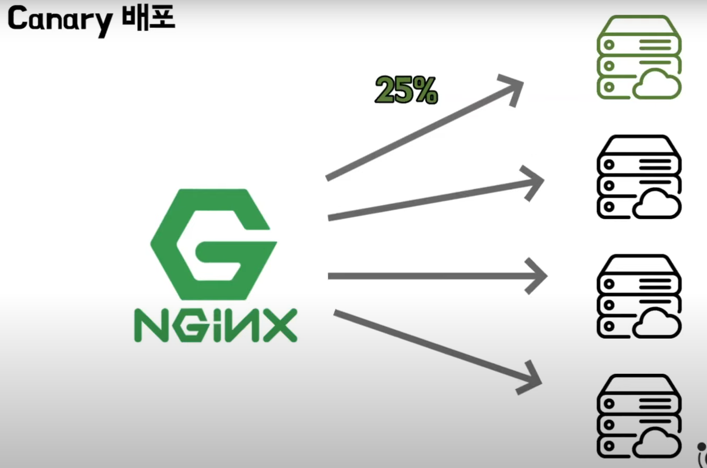
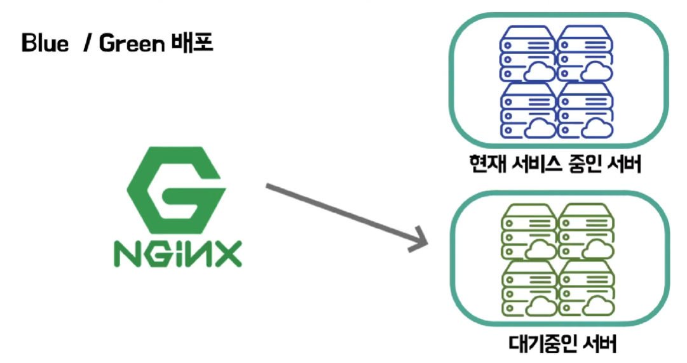

# CI/CD와 무중단 배포

[TOC]

## 1. CI와 CD

### 서론

#### 용어정리

컴파일

- 작성한 소스코드를 기계어로 변환하는 과정

빌드

- 소스코드 파일을 컴퓨터에서 실행할 수 있는 소프트웨어 산출물로 만드는 과정

배포

- 소프트웨어 산출물을 사용자가 접근할 수 있는 환경에 배치하는 것

보통 빌드안에 컴파일 과정이 포함되어 있다.

예시를 들면

한글을 영어로 변환하는 과정이 **컴파일**이고,

영어로 된 글을 책으로 만드는 과정이 **빌드**이며,

이 책을 서점이 배치하는 것을 **배포**라고 할 수 있다.

#### 애자일 방법론 중 하나인 Extreme Programing

1999년 미국의 IT붐과 더불어 시시각각 변하는 고객의 요구사항을 빠르게 대응할 필요가 생겼다.

이를 위해 `Extreme Programing`의 여러 실천방안들을 제안한다.

`Testing`, `Refactoring`, `Pair Programming`, `CI`, ...

여기서 나오는 CI란 무엇일까?

### CI (Continuous Integration)

#### CI가 왜 필요할까?

CI가 있기 전,

개발자들은 개발을 진행하고 MergeDay에 모든 분기소스를 병합하였다. 이 과정에서 많은 수작업과 병합 중 에러가 발생하는 등 리소스 낭비가 심하였다.

CI가 생긴 후,

업무를 쪼개서 코드작성이 완료될 때마다 이를 빠르게 병합할 수 있게 되었다. 

#### CI의 과정

1. 코드작성
   - 개발자가 새로운 코드를 작성하거나 기존 코드를 수정한다. 
2. 자동화된 빌드
   - 코드 변경사항이 원격저장소에 commit되면 CI 서버가 자동으로 새로운 코드를 가져와 컴파일, 빌드 프로세스를 실행한다. 
3. 자동화된 테스트
   - 빌드 후, CI 서버는 자동화된 테스트 스위트를 실행하여 코드 변경 사항이 이전 코드와 호환성이 있는지, 버그가 있는지 확인한다. 
   - 테스트는 유단위 테스트(Unit Test), 통합 테스트(Integration Test), 기능 테스트(Functional Test) 등을 포함할 수 있다. 
   - ex.)Junit
4. 통합
   - 테스트가 통과되면 코드 변경 사항은 공유 코드베이스(예: 공용 저장소)에 통합된다.
   - 이로 인해 모든 팀원은 최신 코드를 공유하게 되며, 충돌이나 호환성 문제를 조기에 발견할 수 있다.

이후 CD로 코드변경이 테스트를 통과하면 자동으로 배포환경으로 이동할 수 있다.

#### CI의 4가지 규칙 (by 마틴 파울러)

- 모든 소스코드가 살아있고, 누구든 현재의 소스에 접근할 수 있는 단일지점을 유지할 것
- 빌드 프로세스를 자동화하여 누구든 소스로부터 시스템을 빌드할 수 있게 할 것
- Testing을 자동화하여 언제든지 시스템에 대한 건전한 테스트 수트를 실행할 수 있게 할 것
- 누구든 현재 실행 파일을 얻으면 지금까지 가장 완벽한 실행 파일을 얻었다는 확신을 하게 할 것

즉 CI는 Code작성, Build, Test를 자동화

### CD

#### 지속적 제공과 지속적 배포

1. **지속적 제공 (Continuous Delivery, CD):**
   - **목표**: 지속적 제공의 주요 목표는 소프트웨어를 언제든지 제품 환경으로 배포할 수 있는 상태로 유지하는 것입니다. 이것은 테스트와 품질 보증 단계를 거쳐 개발자가 배포를 수동으로 트리거할 수 있는 상태를 말합니다.
   - **프로세스**: 지속적 제공에서는 CI/CD 파이프라인을 사용하여 코드 변경 사항이 빌드, 테스트 및 스테이징 환경까지 자동으로 배포되지만, 실제 제품 환경으로의 배포는 수동으로 실행됩니다.
   - **장점**: 지속적 제공을 통해 소프트웨어의 변경 사항은 품질이 보장된 상태로 고객에게 전달할 수 있으며, 배포 프로세스를 개발자나 품질 담당자의 개입 없이 자동화할 수 있습니다.
2. **지속적 배포 (Continuous Deployment, CD):**
   - **목표**: 지속적 배포의 목표는 소프트웨어의 변경 사항이 테스트를 거친 후 자동으로 실제 제품 환경으로 배포되는 것입니다. 이것은 인간의 개입이 필요 없는 자동 배포를 의미합니다.
   - **프로세스**: 지속적 배포에서는 코드 변경이 CI/CD 파이프라인을 통과하면 자동으로 실제 제품 환경으로 배포됩니다. 이것은 변경 사항을 고객에게 더 빠르게 제공할 수 있는 이점을 제공합니다.
   - **장점**: 지속적 배포를 사용하면 개발 팀은 더 빠르게 새로운 기능을 고객에게 제공하고 피드백을 빠르게 수집하며, 빠르게 문제를 식별하고 해결할 수 있습니다.

#### CD의 과정

1. 코드작성
2. 자동화된 빌드
3. 자동화된 테스트
4. 통합
5. 배포
   - 통합된 코드가 배포환경인 Amzon EC2같은 곳에 배치된다.
   - CD에서는 이 과정을 자동화하여 빠르게 새로운 기능을 제공할 수 있다.

### CI/CD 정리

#### CI

- 고객의 요구사항에 빠르게 대응하기 위해 나온 XP의 실천방안 중 1가지
- 여러명이 하나의 코드에 대해서 수정을 진행해도 지속적으로 통합할 수 있음을 의미

#### CD

- CI의 연장선 개념
- 빌드 결과물을 프로덕션으로 지속적으로 배포하는 것을 의미

## 2. 무중단배포

### 개념

CI/CD가 적용되어 자동배포가 되어있는 상황에서, 새로운 버전의 서비스를 배포하게 되면

기존서비스의 종료와 새로운 서비스의 시작 사이 다운타임이 발생한다.

이를 위해 사용자가 기다림 없이 새로운 서비스로 업데이트하는 방법

### 무중단 배포 구현방법

- AWS에서 Blue-Green 무중단 배포
- 도커를 이용한 무중단 배포
- L4, L7 스위치를 이용한 무중단 배포
- Nginx를 이용한 무중단 배포 (쉽고 저렴하여 가장 많이 사용)

### 배경지식

#### 리버스 프록시

- 인터넷과 서버 사이에 위치한 중계서버
- 클라이언트의 요청내용을 캐싱
- 서버 정보를 클라이언트로 부터 숨길 수 있어 보안에 용이

#### 로드 밸런싱

- 부하 분산이라는 뜻
- 서버에 가해지는 부하를 분산해주는 역할을 한다.
- 하나의 서버가 멈추더라도 서비스 중단없이 다른 서버가 계속 서비스를 유지할 수 있는 무중단 배포를 가능하게 해준다.
- 해당 그림은 로드 밸런싱 중 라운드-로빈의 알고리즘을 적용한 설계

### 무중단 배포 방식

#### Rolling 배포

- 무중단 배포의 가장 기본적인 방식, 서버를 차례대로 업데이트 시킴
- 하나의 서버를 연결을 끊고 새로운 버전으로 업데이트 시킨 후 다시 라우팅 설정
- 돌아가며 모든 서버에 새로운 버전 적용

- 장점
  - 인스턴스를 추가하지 않아도 돼서 관리가 편리
- 단점
  - 사용중인 인스턴스에 트래픽이 몰릴 수 있음
  - 구버전과 신버전의 공존으로 인한 호환성 문제

#### Canary 배포

- 신버전을 소수 사용자들에게만 배포 후 문제가 없으면 점진적으로 다른 서버에도 배포

- 장점

  - 문제상황을 빠르게 감지 가능
  - A/B 테스트로도 활용이 가능

- 단점

  - 모니터링 관리비용 증가
  - 구버전과 신버전의 공존으로 인한 호환성 문제

  

#### Blue-Green 배포

- Blue가 구버전, Green이 신버전을 지칭
- 구버전과 동일하게 신버전의 인스턴스를 구성하고 배포시 로드밸런서를 통해 신버전으로만 트래픽을 전환한다.

- 장점
  - 배포하는 속도가 빠르다.
  - 신속하게 롤백이 가능하다.
  - 남아 있는 기존 버전의 환경을 다음 배포에 재사용할 수 있다.
- 단점
  - 시스템 자원이 2배로 필요하다.

### 정리

#### 무중단 배포

- 다운타임 없이 서버를 운영할 수 있게 해주는 배포방식
- Rolling, Canary, Blue-Green

#### 리버스 프록시

- 클라이언트의 요청을 대신 받아 서버에 전달하는 대리 서버

#### 로드 밸런싱

- 클라이언트의 요청을 여러 서버에 분산해주는 역할

## 3. 참고자료

https://www.youtube.com/watch?v=sIPU_VkrguI (CI/CD, 무중단 배포)

https://aws.amazon.com/ko/devops/continuous-integration/ (CI)

Chat-GPT 답변 (CI, 지속적 제공과 배포)

