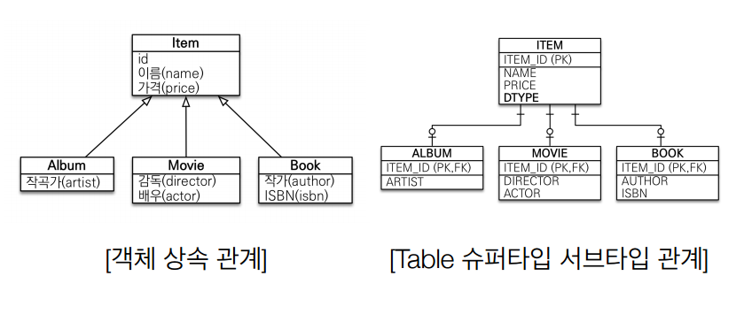
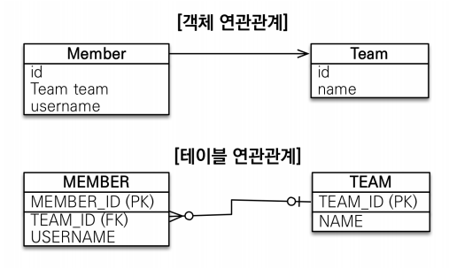

# SQL 중심적인 개발의 문제점

**참고자료**

해당 내용은 다음 강의를 참고하여 정리하였습니다.


[자바 ORM 표준 JPA 프로그래밍 - 기본편](https://www.inflearn.com/course/ORM-JPA-Basic/dashboard)


### 1️⃣ 상속관계

왼쪽은 Item 객체와 이를 상속받는 Album, Movie, Book 객체들이다.
하지만 RDB에서는 `상속관계`라는 개념이 없고 이와 비슷한 `Table 슈퍼타입 서브타입 관계`가 존재한다.
Album이라는 데이터를 저장할때, 슈퍼타입과 서브타입 모두에 저장한 뒤, Join을 통해 데이터를 가져온다.
```sql
SELECT ITEM.ITEM_ID, ITEM.NAME, ITEM.PRIC, ITEM.DTYPE
FROM ITEM
JOIN ALBUM ON ITEM.ITEM_ID = ALBUM.ITEM_ID
```
JAVA코드에서 문제점
1. ALBUM을 저장
   - ALBUM 객체를 분해하고 `INSERT INTO ITEM`, `INSERT INTO ALBUM` 하는 코드를 다 짜주어야 한다.
2. ALBUM을 조회
   - ALBUM 객체를 ITEM과 JOIN하는 SQL을 다 짜주어야한다
3. 추가 필드가 생김
   - 관련 테이블의 저장, 조회 코드에 모두 추가해주어야한다.
모든 객체를 이런식으로 코딩하는 것은 생산성이 떨어진다.
자바 컬렉션에 저장, 조회한다면?
Item을 상속한 Album 객체를 만든다. 라스트에 Album 객체를 담는다.
`list.add(album)`, `Album album = list.get(albumId)`로 간단하게 할 수 있다.
또한 `Item item = list.get(albumId)`로 부모타입으로 조회하여 다형성을 활용할 수 있다.
(Album ,Book, Movie를 하나의 Item 형으로 받을 수 있음)
JPA는 복잡한 RDB CRUD를 간단한 자바 컬렉션 CRUD처럼 사용할 수 있게 해준다.
### 2️⃣ 연관관계

객체는 참조를 사용하여 연관관계 데이터를 얻는다. `member.getTeam()`
테이블은 외래키를 사용하여 연관관게 데이터를 얻는다. `JOIN ON M.TEAM_ID = T.TEAM_ID`
JAVA코드에서 문제점
1.필요한 SQL문을 모두 작성해 주어야 한다.
```java
class Member {
	String id;
    TEAM team; 
 	String username;
}
class Team {
 Long id; //TEAM_ID PK 사용
 String name; //NAME 컬럼 사용
}
```
```sql
# 자바코드로 member객체를 조회 시 다음 SQL문을 다 작성해야함
INSERT INTO MEMBER(MEMBER_ID, TEAM_ID, USERNAME) VALUES …
SELECT M.*, T.*
FROM MEMBER M
JOIN TEAM T ON M.TEAM_ID = T.TEAM_ID
```
2. 엔티티 신뢰문제
위에서 만약 Member가 Order와도 연관관계가 있다면?
ORDER 테이블도 MEMBER 테이블과 JOIN하여 member객체에 Order객체를 넣어주어야 할 것이다.
딜레마
- 다른 사람이 개발한 코드에서 Order객체가 있는지 없는지 확인하며 작업해야한다.
- 모든 연관관계를 미리 JOIN해서 가져오는건 성능상 비효율적이다.
그래서 보통 상황에 따라 동일한 회원 조회 메서드를 여러벌 생성하곤 했다.
```java
memberDAO.getMember(); //Member만 조회
memberDAO.getMemberWithTeam();//Member에 Team 넣고 조회
memberDAO.getMemberWithOrderWithDelivery(); //Member에 Team, Order 넣고 조회
```
즉 계층형 아키테처, 진정한 의미의 계층 분할이 어렵다. (이 말은 아직 이해안됨)
3. 서로 다른 인스턴스
memberId값으로 조회할때
- memberId값으로 member1, member2를 RDB에서 가져오면 다른 인스턴스
- memberId값으로 컬렉션에서 가져오면 같은 인스턴스
객체답게 모델링을 하는것이 권장되지만 이렇게 할 수록 매핑작업이 늘어났다.
JPA는 이러한 문제점들을 해결해주고 DB를 컬렉션처럼 사용할 수 있게 해준다.
