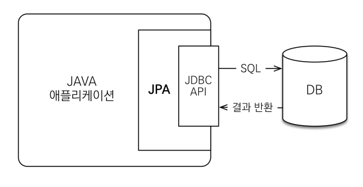

# JPA란?

**참고자료**

해당 내용은 다음 강의를 참고하여 정리하였습니다. 

[실전! 스프링 부트와 JPA 활용1 - 웹 애플리케이션 개발](https://www.inflearn.com/course/%EC%8A%A4%ED%94%84%EB%A7%81%EB%B6%80%ED%8A%B8-JPA-%ED%99%9C%EC%9A%A9-1/dashboard)

### 0️⃣ ORM이란?

Object-relational mapping (객체 관계 매핑)의 약자

객체는 객체대로 설계하고 RDB는 RDB대로 설계한 후 이 둘을 중간에서 매핑해주는 기술

대중적인 언어에는 대부분 ORM이 존재하고, 자바에는 JPA가 존재한다.

### 1️⃣ JPA와 JDBC

JDBC는 자바 프로그램에서 DB에 접속하고 관리하기 위한 표준 API이다.

DB연결, SQL쿼리 전송 등과 같은 일을 하며 구체적인 것은 필요하면 알아볼 예정

JPA는 JAVA앱과 JDBC사이에 존재하며 이 둘을 매핑해주는 역할을 한다.

JPA에서 ORM으로 SQL쿼리문을 만들고 JDBC에서 DB로 이를 전송해주는 듯하다.

### 2️⃣ JPA의 등장

자바진영에서 EJB ORM을 만들었지만 별로였다고 한다.

금융권에서 일하던 개발자가 EJB쓰다가 화나서 오픈소스로 만든 것이 하이버네이터 오픈소스

자바진영에서 이 개발자를 데려와 JPA 개발을 맡겼다고 한다.

하이버네이트와 많이 유사하다고 한다.

### 3️⃣ JPA 인터페이스와 3가지 구현체

JPA는 인터페이스로 이를 구현한 구현체는 하이버네이트, EclipseLink, DataNucleus

보통 하이버네이트를 많이 쓴다고 한다.

