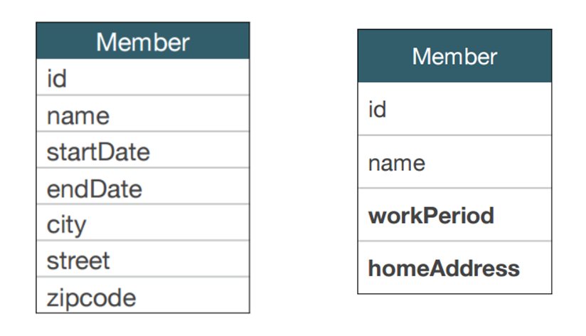
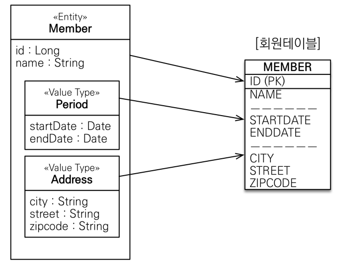

# 값타입 - 임베디드 타입

**참고자료**

해당 내용은 다음 강의를 참고하여 정리하였습니다.


[자바 ORM 표준 JPA 프로그래밍 - 기본편](https://www.inflearn.com/course/ORM-JPA-Basic/dashboard)


### 서론
JPA의 데이터 타입 분류
1. 엔티티 타입
   - @Entity로 정의하는 객체
   - 데이터가 변해도 식별자로 지속해서 추적 가능, ex. 회원 엔티티의 키나 나이 값을 변경해도 식별자로 인식 가능
2. 값 타입
   - int, Integer, String처럼 단순히 값으로 사용하는 자바 기본 타입이나 객체
   - 식별자가 없고 값만 있으므로 변경시 추적 불가, ex. 숫자 100을 200으로 변경하면 완전히 다른 값으로 대체
갑타입 분류
1. 기본값 타입
   - 자바 기본 타입 (int, double)
   - 래퍼 클래스 (Integer, Long)
   - String
2. 임베디드 타입 (복합값 타입)
3. 컬렉션 값 타입
### 임베디드 타입
새로운 값 타입을 직접 정의할 수 있다.
기본 값 타입을 모아 만들어 복합 값 타입이라고도 한다.
int, String과 같은 엔티티타입이 아닌 값타입으로 변경하면 추적이 불가능하다.
### 임베디드 타입 적용 예시상황
회원엔티티는 다음과 같은 필드를 가진다고 가정해보자.

회원엔티티는
1.이름, 2.근무 시작일, 3.근무 종료일, 4.주소 도시, 5.주소번지, 6.주소 우편번호를 가진다
보통 우리는 이렇게 설명하지않고, 
회원엔티티는
1.이름, 2.근무기간, 3.집 주소를 가진다.
라고 추상화하여 쉽게쉽게 설명한다. 이렇게 부분을 묶어서 설명할 수 있는 타입을 **임베디드 타입**이라고 한다.
추상화한 엔티티를 데이터베이스 매핑 도식도는 다음과 같다.

### 임베디드 타입 구현 방법
임베디드 타입 적용전 엔티티
```java
@Entity
public class Member {
    @Id
    private Long id;
    @Column(name = "name")
    private String username;
    private Integer age;
	
    //Period
    private LocalDateTime startDate;
    private LocalDateTime endDate;
    //Address
    private String city;
    private String street;
    private String zipcode;
}
```
임베디드 타입 적용 후 엔티티
```java
@Entity
public class Member {
    @Id
    private Long id;
    @Column(name = "name")
    private String username;
    private Integer age;
    
    @Embedded
    private Period workPeriod;
    
    @Embedded
    private Address homeAddress;
}
@Embeddable
public class Address {
    private String city;
    private String street;
    private String zipcode;
}
@Embeddable
public class Period {
    private LocalDateTime startDate;
    private LocalDateTime endDate;
}
```
매핑하는 테이블 구조는 그대로 이나, 엔티티가 추상화되어 좀 더 객체지향스럽게 구현되었다.
여기 Period에 `boolean isWork()`같은 메서드를 만들 수도 있다. 이런식으로 활용할 수 있는 메서드를 만들 수 있다.
또한 추상화를 통해 설명하기도 쉽다.
잘 설계한 ORM 애플리케이션은 매핑한 테이블 수보다 클래스의 수가 더 많다.
### 임베디드 타입과 연관관계
임베디드 타입의 클래스는 Value와 Entity 모두 가질 수 있다.
```java
@Embeddable
public class Address {
	
    private 객체 객체;
    
    private String city;
    private String street;
    private String zipcode;
}
```
또한 @Column 애노테이션도 사용할 수 있다.
### 참고 - 임베디드 타입을 2개 사용하고 싶다면?
```java
@Entity // name속성: JPA가 내부적으로 구분하는 이름
public class Member {
    @Id
    private Long id;
    @Column(name = "name")
    private String username;
    private Integer age;
    @Embedded
    private Period workPeriod;
    @Embedded
    private Address homeAddress;
    @Embedded
    @AttributeOverrides({
            @AttributeOverride(name = "city", column = @Column("WORK_DITY")),
            @AttributeOverride(name = "street", column = @Column("WORK_STREET")),
            @AttributeOverride(name = "zipcode", column = @Column("WORK_ZIPCODE"))
    })
    private Address workAddress;
}
```
이런식으로 사용하면 된다. MEMBER의 컬럼수는 `Address` 속성 개수만큼 늘어난다.
많이 사용하지는 않는다고 한다.
### 참고 - 임베디드 타입값을 null로 설정하면 관련 컬럼은 모두 null로 저장된다.
```java
@Entity
public class Member {
    @Id
    private Long id;
    @Column(name = "name")
    private String username;
    private Integer age;
    @Embedded
    private Period workPeriod;
    @Embedded
    private Address homeAddress;
}
Member member = new member;
member.setWorkPeriod = null;
// Period 관련 컬럼이 모두 null로 저장됨
```
