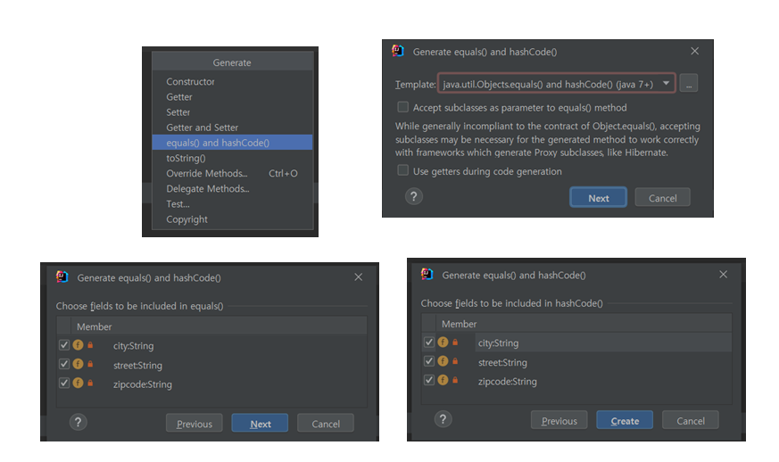

# 값타입 - 비교 방법, 동등성 비교

**참고자료**

해당 내용은 다음 강의를 참고하여 정리하였습니다.


[자바 ORM 표준 JPA 프로그래밍 - 기본편](https://www.inflearn.com/course/ORM-JPA-Basic/dashboard)


### 상황
현재 address1와 address2의 **값이 일치하는지를 알고 싶다**
이를 위해선 **동일성**이 아닌 **동등성**비교를 해야한다.
### 예시코드
```java
int a = 10;
int b = 10;
System.out.println("a == b" + (a == b));
// true
```
```java
Address address1 = new Address("city", "street", "10000");
Address address2 = new Address("city", "street", "10000");
System.out.println("address1 == address2" + (address1 == address2));
// false
```
이를 이해하기 위해선 **동일성 비교(==)**와 **동등성 비교(equlas())**를 구분할 수 있어야 한다.
값 타입은 **equlas()**로 동등성 비교를 해야한다.
**값 타입의 equals() 메소드를 적절하게 재정의 해야함 (주오 모든 필드에서)**
### equals()
이는 기본값이 **== 비교**이다.
이를 overide하여 **값이 같은것을 비교하도록** 사용해야한다.
이는 Generate에서 기본값으로 equals()를 만들어주는 대로 만들면 된다.
그런데 실무에서 크게 사용하는 일은 없다고 한다. (영한님 피셜)
사용되게 되면 사용하면 된다.

```java
@Embeddable
public class Address {
    private String city;
    private String street;
    private String zipcode;
    @Override
    public boolean equals(Object o) {
        if (this == o) return true;
        if (o == null || getClass() != o.getClass()) return false;
        Address address = (Address) o;
        return Objects.equals(city, address.city) && Objects.equals(street, address.street) && Objects.equals(zipcode, address.zipcode);
    }
    @Override
    public int hashCode() {
        return Objects.hash(city, street, zipcode);
    }
```
```java
Address address1 = new Address("city", "street", "10000");
Address address2 = new Address("city", "street", "10000");
System.out.println("address1 == address2: " + (address1 == address2)); // false
System.out.println("address1 eqauls address2: " + (address1.equals(address2))); // true
```
