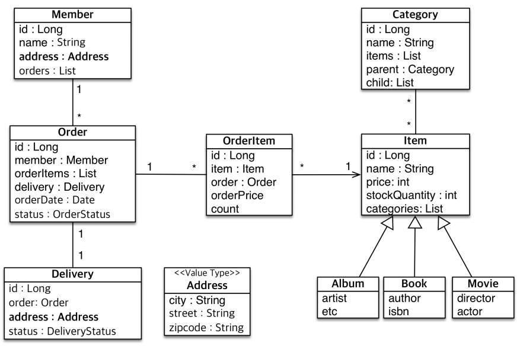
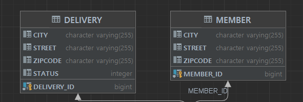

# 값타입 매핑
### 엔티티 설계도

city, street, zipcode를 묶어서 Address로 Member와 Delivery에 적용해보겠다.
### 임베디드 타입 생성 코드
임베디드타입 생성
```java
@Embeddable
public class Address {
    private String city;
    private String street;
    private String zipcode;
    @Override
    public boolean equals(Object o) {
        if (this == o) return true;
        if (o == null || getClass() != o.getClass()) return false;
        Address address = (Address) o;
        return Objects.equals(city, address.city) && Objects.equals(street, address.street) && Objects.equals(zipcode, address.zipcode);
    }
    @Override
    public int hashCode() {
        return Objects.hash(city, street, zipcode);
    }
}
```
- 임베디드 타입의 값타입을 만들어 주고, 동등성 비교를 위해 equals를 재정의해준다.
엔티티에 적용
```java
@Entity
public class Member {
    @Id @GeneratedValue
    @Column(name = "MEMBER_ID")
    private Long id;
    @Embedded
    private Address address;
    @OneToMany(mappedBy = "member")
    List<Order> orders = new ArrayList<>();
}
@Entity
public class Delivery {
    @Id @GeneratedValue
    @Column(name = "DELIVERY_ID")
    private Long id;
    @Embedded
    private Address address;
    private DeliveryStatus status;
    @OneToOne(mappedBy = "delivery")
    private Order order;
}
```
테이블 확인

MEMBER와 DELIVERY에 CITY, STRRET, ZIPCODE가 모두 매핑되어 있는 것을 확인할 수 있다.
### 임베디드 타입의 장점 - 의미있는 메서드, 공통관리
```java
@Embeddable
@Getter
public class Address {
    // 공통 관리
    @Column(length = 10)
    private String city;
    @Column(length = 15)
    private String street;
    @Column(length = 20)
    private String zipCode;
	
    // 의미 있는 메서드
    public String fullAddress() {
        return getCity() + " " + getStreet() + " " + getZipCode();
    }
    
    @Override
    public boolean equals(Object o) {
        if (this == o) return true;
        if (o == null || getClass() != o.getClass()) return false;
        Address address = (Address) o;
        return Objects.equals(city, address.city) && Objects.equals(street, address.street) && Objects.equals(zipCode, address.zipCode);
    }
    @Override
    public int hashCode() {
        return Objects.hash(city, street, zipCode);
    }
}
```
임베디드 타입의 속성값을 사용한 의미있는 메서드를 생성할 수 있다.
속성에 제한을 걸면서 MEMBER, DELIVERY 테이블의 `CITY, STRRET, ZIPCODE`에 모두 제약사항을 거는 등의 공통관리가 가능하다.