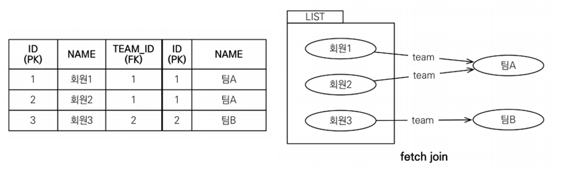
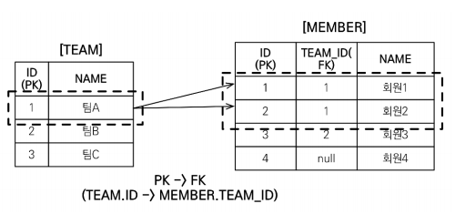
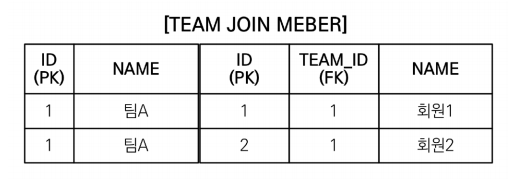

# JPQL 중급 - fetch join (중요)

### fetch join이란?

- SQL에서는 이런 join이 없다.

- JPQL에서 성능 최적화를 위해 저공하는 기능이다.
- 연관된 엔티티나 컬렉션을 SQL 한번에 함께 조회하는 기능이다.
- 실무에서 정말정말 중요함


### 엔티티 fetch join

회원을 조회하며 연관된 팀도 함께 조회하고 싶을때, 다음과 같은 JPQL을 작석할 수 있다,

```java
String jpql = "select m from Member m join fetch m.team";

List<Member> members = em.createQuery(jpql, Member.class)
    .getResultList();

for (Member member : members) {
    //페치 조인으로 회원과 팀을 함께 조회해서 지연 로딩X
    System.out.println("username = " + member.getUsername() + ", " +
                       "teamName = " + member.getTeam().name()); 
}
```

그러면 아래의 SQL문으로 전환된다.

```sql
SELECT M.* , T.* FROM MEMBER M 
	INNER JOIN TEAM T ON M.TEAM_ID = T.ID
```




만약 지연로딩설정 상태에서 member와 team을 함께조회하는데, 이러한 경우가 아주 많다면?

select query가 2배로 늘어날 것이다.

이때의 해결책으로 fetch join을 사용해서 해결할 수 있다.

참고로 즉시로딩은 사용응 지양하는게 좋다.	


### 컬렉션 fetch join

다음은 TEAM과 MEMBER의 테이블이다.




팀A를 조회하며 연관된 멤버를 조회하고 싶을때, 다음과 같이 JPQL을 작성하면?

```java
String jpql = "select t from Team t join fetch t.members where t.name = '팀A'";

List<Team> teams = em.createQuery(jpql, Team.class).getResultList();

for(Team team : teams) {
    System.out.println("teamname = " + team.getName() + ", team = " + team);
    for (Member member : team.getMembers()) {
        //페치 조인으로 팀과 회원을 함께 조회해서 지연 로딩 발생 안함
        System.out.println("-> username = " + member.getUsername() + ", member = " + member);
    }
}
```

결과

```
teamname = 팀A, team = Team@0x100
-> username = 회원1, member = Member@0x200
-> username = 회원2, member = Member@0x300
teamname = 팀A, team = Team@0x100
-> username = 회원1, member = Member@0x200
-> username = 회원2, member = Member@0x300
```

쿼리의 결과값이 "팀A"가 컬렉션에 2번 담긴 것을 볼 수 있다.

일대다 관계 join을 할때, 데이터가 뻥튀기 될 수 있는데,



뻥튀기된 SQL결과를 컬렉션으로 옮기다보니 중복이 생긴것 같다.


#### fetch join의 distinct

이를 해결하기 위해서 DISTINCT를 사용하면 해결이 될까?

```java
String jpql = "select distinct t from Team t join fetch t.members where t.name = '팀A'";

List<Team> teams = em.createQuery(jpql, Team.class).getResultList();

for(Team team : teams) {
    System.out.println("teamname = " + team.getName() + ", team = " + team);
    for (Member member : team.getMembers()) {
        //페치 조인으로 팀과 회원을 함께 조회해서 지연 로딩 발생 안함
        System.out.println("-> username = " + member.getUsername() + ", member = " + member);
    }
}
```

보통 DB에선 레코드가 완전히 일치해야 중복을 제거하는데, 이것만으로는 컬렉션에서 중복을 제거할 수 없다. 이에 JPQL의 distinct는 2가지 기능을 한다.

1. SQL에 DISTINCT를 추가
2. 애플리케이션에서 엔티티 중복 제거


DISTINCT 추가시 결과

```
teamname = 팀A, team = Team@0x100
-> username = 회원1, member = Member@0x200
-> username = 회원2, member = Member@0x300
```


#### 하이버네이트6 부터는 DISTINCT 명령어를 사용하지 않아도 애플리케이션에서 중복 제거가 자동으로 적용된다. 
https://www.inflearn.com/questions/717679


### fetch join과 join의 차이

일반 join은 연관된 엔티티를 함께 조회하지 않는다.

fetch join을 사용할 때만 연관된 엔티티도 함께 조회한다.(즉시로딩)

fetch join은 객체 그래프를 한번의 SQL 쿼리로 조회하는 개념


예시 쿼리

JPQL

```sql
select t 
from Team t join fetch t.members
where t.name = ‘팀A'
```

SQL

```sql
SELECT T.*, M.*
FROM TEAM T
INNER JOIN MEMBER M ON T.ID=M.TEAM_ID 
WHERE T.NAME = '팀A'
```

