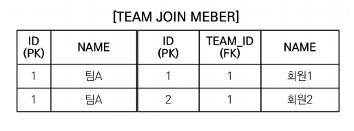

# JPQL 중급 - fetch join의 한계 (중요)

**참고자료**

해당 내용은 다음 강의를 참고하여 정리하였습니다.

[자바 ORM 표준 JPA 프로그래밍 - 기본편](https://www.inflearn.com/course/ORM-JPA-Basic/dashboard)

### 1. fetch join의 대상에는 별칭을 줄 수 없다.
- ex. `select t from Team t join fetch t.members` 
  ->  `select t from Team t join fetch t.members m` (X)
만약 team을 조회하는데, member에서 age가 20이상인 member만 컬렉션에 넣고싶다.
` select t from Team t join fetch t.members m where m.age >= 20`
이렇게 적으면 될 것 같지만, 
기본적으로 JPQL의 fetch join 설계는 모든 데이터를 가져올 것을 가정하며 설계되있다.
영속성 컨테이너에서 모든 member를 넣은 teamA객체와 필터링한 member를 넣은 teamA 객체를 구분할 방법이 없다.
하이버네이트에서는 가능하나 가급적 사용하지않는 것을 권장한다.
데이터의 정확성이나 객체그래프의 사상에 맞지 않기 때문에 fetch join의 대상 별칭은 사용하지 말자.
아주 위험하다.
### 2. 둘 이상의 컬렉션은 fetch join 할 수 없다.
데이터의 정확성이 안맞을 수 있다.
fetch join의 컬렉션은 하나만 정할 수 있다.
### 3. 컬렉션을 fetch join하면 페이징 API를 사용할 수 없다.

일대다관계에서 join은 데이터가 뻥튀기된다.
여기서 페이징 API(setFirstResult, setMaxResults)를 사용하면, 
DB가 아닌 메모리에서 페이징을 하여 원하는 대로 페이징이 되지 않는다. (아주 위험하다)
일대일, 다대일 관계에서 fetch join은 페이징이 가능하다.
일대다에서 페이징을 사용하고 싶을 경우 방향을 다대일로 바꾸어서 해결하자.
