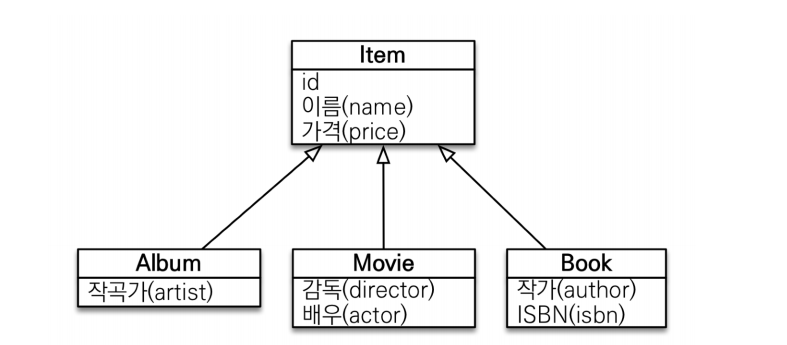

# JPQL 중급 - 다형성 쿼리

**참고자료**

해당 내용은 다음 강의를 참고하여 정리하였습니다. 


[실전! 스프링 부트와 JPA 활용1 - 웹 애플리케이션 개발](https://www.inflearn.com/course/%EC%8A%A4%ED%94%84%EB%A7%81%EB%B6%80%ED%8A%B8-JPA-%ED%99%9C%EC%9A%A9-1/dashboard)


### 상속관계의 객체



예시 엔티티 설계도이다.


### type

위의 상속관계를 가지는 엔티티들이 있을 때, 특정 자식만을 조회하고 싶다면?

JPQL

```sql
select i from Item i
where type(i) IN (Book, Movie)
```

SQL로 변환

```sql
select i from ITEM i
where i.DTYPE in (‘B’, ‘M’)
```


### TREAT

java의 타입캐스팅처럼 부모타입을 자식타입으로 다룰 때 사용한다.

부모인 Item과 자식 Book이 있다.

JPQL

```sql
select i from Item i
where treat(i as Book).author = ‘kim’
```

SQL로 변환

```sql
select i.* from ITEM i
where i.DTYPE = ‘B’ and i.author = ‘kim’
```


