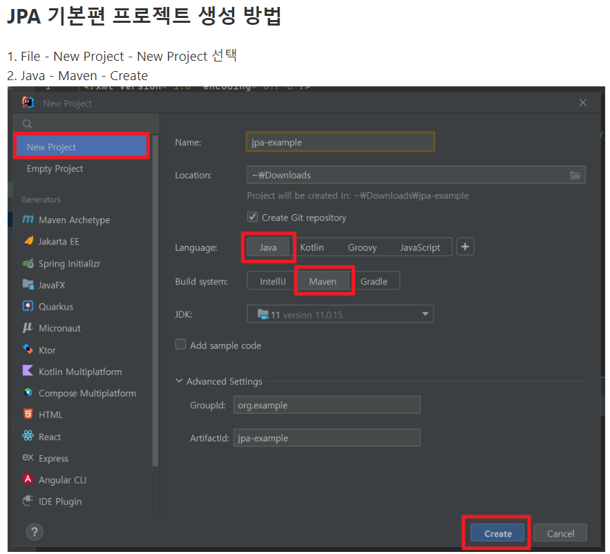

# 프로젝트 세팅 - H2, Maven 

**참고자료**

해당 내용은 다음 강의를 참고하여 정리하였습니다.


[자바 ORM 표준 JPA 프로그래밍 - 기본편](https://www.inflearn.com/course/ORM-JPA-Basic/dashboard)


### H2 데이터 베이스 설치
1. 설치
- http://h2database.com/html/main.html 다운로드
- exe실행
- H2 Console 실행
2. 설정
- Generic H2 (Server)
- jdbc:h2:tcp://localhost/~/test
### Project 생성

### pom.xml - 빌드 라이브러리 관리
```xml
<?xml version="1.0" encoding="UTF-8"?>
<project xmlns="http://maven.apache.org/POM/4.0.0"
         xmlns:xsi="http://www.w3.org/2001/XMLSchema-instance"
         xsi:schemaLocation="http://maven.apache.org/POM/4.0.0 http://maven.apache.org/xsd/maven-4.0.0.xsd">
    <modelVersion>4.0.0</modelVersion>
    <groupId>jpa-basic</groupId>
    <artifactId>ex1-hello-jpa</artifactId>
    <version>1.0.0</version>
    <build>
        <plugins>
            <plugin>
                <groupId>org.apache.maven.plugins</groupId>
                <artifactId>maven-compiler-plugin</artifactId>
                <version>3.8.1</version>
                <configuration>
                    <source>8</source>
                    <target>8</target>
                </configuration>
            </plugin>
        </plugins>
    </build>
    <dependencies>
        <!-- JPA 하이버네이트 -->
        <dependency>
            <groupId>org.hibernate</groupId>
            <artifactId>hibernate-core</artifactId>
            <version>5.4.29.Final</version>
        </dependency>
        <dependency>
            <groupId>javax.xml.bind</groupId>
            <artifactId>jaxb-api</artifactId>
            <version>2.3.1</version>
        </dependency>
        <!-- H2 데이터베이스 -->
        <dependency>
            <groupId>com.h2database</groupId>
            <artifactId>h2</artifactId>
            <version>2.1.214</version>
        </dependency>
        <!-- logback -->
        <dependency>
            <groupId>ch.qos.logback</groupId>
            <artifactId>logback-classic</artifactId>
            <version>1.4.5</version>
            <scope>test</scope>
        </dependency>
    </dependencies>
</project>
```
- 강의 질문을 참고하여 복붙하였음
- 요즘은 대부분 gradle을 사용
- 버전은 다른거 같아서 Spring.io > Projects > SpringBoot > CURRENT 버전 Reference Doc. > Dependency Versions([링크](https://docs.spring.io/spring-boot/docs/current/reference/html/dependency-versions.html#appendix.dependency-versions))를 참고하여 버전을 설정할려고 했으나 해당 버전을 찾을 수 없다고함...
- Maven Repository 사이트([링크](https://mvnrepository.com/artifact/ch.qos.logback/logback-classic/1.4.6))에서 제일 사용빈도 높은걸로 버전 설정함
### JPA 설정하기 - persistence.xml
/META-INF/persistence.xml 위치
```xml
<?xml version="1.0" encoding="UTF-8"?>
<persistence version="2.2"
             xmlns="http://xmlns.jcp.org/xml/ns/persistence" xmlns:xsi="http://www.w3.org/2001/XMLSchema-instance"
             xsi:schemaLocation="http://xmlns.jcp.org/xml/ns/persistence http://xmlns.jcp.org/xml/ns/persistence/persistence_2_2.xsd">
    
    <persistence-unit name="hello">
        
        <properties>
            <!-- 필수 속성 -->
            <property name="javax.persistence.jdbc.driver" value="org.h2.Driver"/>
            <property name="javax.persistence.jdbc.user" value="sa"/>
            <property name="javax.persistence.jdbc.password" value=""/>
            
            [B] - DB url
            <property name="javax.persistence.jdbc.url" value="jdbc:h2:tcp://localhost/~/test"/>
            
            [A] - DB 방언설정
            <property name="hibernate.dialect" value="org.hibernate.dialect.H2Dialect"/>
            <!-- 옵션 -->
            [C] - 쿼리
            <property name="hibernate.show_sql" value="true"/>
            <property name="hibernate.format_sql" value="true"/>
            <property name="hibernate.use_sql_comments" value="true"/>
            [D] - 테이블 자동생성
            <!--<property name="hibernate.hbm2ddl.auto" value="create" />-->
        </properties>
        
    </persistence-unit>
</persistence>
```
[A] 부분
- 해당 DB종류를 설정하면 JPA는 해당 DB에 맞게 SQL문을 생성해준다. 
[B] 부분
- jdbc가 연결할 DB url을 작성한다.
- 로컬 파일 기반, TCP 서버 모드 사용, 웹 콘솔 사용 등에 맞게 url을 설정해주면 된다.
- 여기서는 TCP 서버모드로 DB에 연결하였다.
[C] 부분
- Jdbc에서 DB로 전달되는 쿼리문을 콘솔에서 볼 수 있다.
[D] 부분
- JPA가 객체를 보고 테이블을 생성하는 DDL을 전달해준다.
- 개발단계에서만 사용하고 운영단계에서는 새로 만들거나 다듬어서 사용
