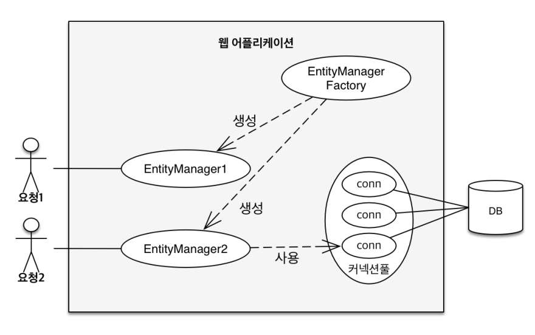

# JPA 동작 원리
### 객체와 테이블 생성
```sql
create table Member ( 
 id bigint not null, 
 name varchar(255), 
 primary key (id) 
);
```
```java
import javax.persistence.Column;
import javax.persistence.Entity;
import javax.persistence.Id;
import javax.persistence.Table;
@Entity
@Table(name = "")
@Getter @Setter
public class Member {
    @Id
    private Long id;
    @Column(name = "")
    private String name;
}
```
javax에서 지원하는 @Entity 애노테이션
- 객체를 DB의 테이블과 맵핑해준다.
@Table과 @Column
- 객체 이름과 객체 속성을 테이블 이름, 속성에 맵핑 이름을 설정한다.
- 기본값은 객체 값 그대로이다.
### EntityManagerFactory, EntityManager
```java
import javax.persistence.EntityManager;
import javax.persistence.EntityManagerFactory;
import javax.persistence.EntityTransaction;
import javax.persistence.Persistence;
public class JpaMain {
    public static void main(String[] args) {
        
        EntityManagerFactory emf = Persistence.createEntityManagerFactory("hello");
        EntityManager em = emf.createEntityManager();
		
        //code
        
        em.close();
        emf.close();
    }
}
```

EntityManagerFactory
- 애플리케이션이 구동 될 때, 1번만 생성된다.
EntityManager
- 요청이 올때마다 생성하고 DB 커넥션 풀을 사용한다.
- 비지니스 로직을 처리한 후 DB 커넥션을 닫아준다. (이때 자동으로 소멸된다.)
- 절대 쓰레드간 공유하면 안되며 메모리 누수 방지를 위해 요청 후 닫아준다.
### JPA 기본 코드 구조
```java
package hellojpa;
public class JpaMain {
    public static void main(String[] args) {
        EntityManagerFactory emf = Persistence.createEntityManagerFactory("hello");
        EntityManager em = emf.createEntityManager();
        EntityTransaction tx = em.getTransaction();
        tx.begin();
        try {
            tx.commit();
        } catch (Exception e) {
            tx.rollback();
        } finally {
            em.close();
        }
        emf.close();
    }
}
```
트랜잭션을 시작하고
- 성공하면 commit
- 실패하면 rollback
- 요청이 끝나면 엔티티매니저를 닫아준다.
- 앱이 종료되면 앤티티 매니저 팩토리를 닫아준다.
실제로 JPA코드는 이렇게 복잡하지 않고 한 줄이면 가능했다. 이것이 가능한 이유는 스프링부트 프레임워크 덕분인 것으로 추정된다.
### JPA 코드 맛보기
```java
package hellojpa;
public class JpaMain {
    public static void main(String[] args) {
        EntityManagerFactory emf = Persistence.createEntityManagerFactory("hello");
        EntityManager em = emf.createEntityManager();
        EntityTransaction tx = em.getTransaction();
        tx.begin();
        try {
            [A] - 저장
            Member member = new Member();
            member.setId(1L);
            member.setName("HelloA");
            em.persist(member);
			
            [B] - 업데이트
            Member findMember = em.find(Member.class, 1L);
            findMember.setName("HelloB");
            
            [C] - 모두 조회
            List<Member> members = em.createQuery("select m from Member as M", Member.class)
                    .setFirstResult(5)
                    .setMaxResults(8)
                    .getResultList();
            for (Member member1 : members) {
                System.out.println("member.name = " + member.getName());
            }
            tx.commit();
        } catch (Exception e) {
            tx.rollback();
        } finally {
            em.close();
        }
        emf.close();
    }
}
```
[A] 부분
새로운 Member 객체를 생성하고 값을 넣어준 후 저장하면,
**JPA가 Member 객체 인스턴스를 보고, Member테이블 인스턴스를 생성하는 SQL을 생성한다.**
[B] 부분
마찬가지로 업데이트 SQL문을 JPA가 작성해준다.
그러나 여기선 업데이트 명령어가 없는데 업데이트가 된 이유가 무엇일까?
**JPA는 트랜잭션이 일어난 후 변경된 사항들을 모두 찾아 commit시 이를 반영하기 때문이다.**
[C] 부분
**JPA는 객체를 대상으로 SQL문을 짤 수 있다. 이후 이를 실제 SQL문으로 변경하여 준다.**
**객체와 테이블의 패러다임 문제를 해결하여 준다.**
**또한 setFirstResult(5), setMaxResults(8) 처럼 JPQL을 생성시 페이지네이션 같은 편리한 기능을 제공한다.**
