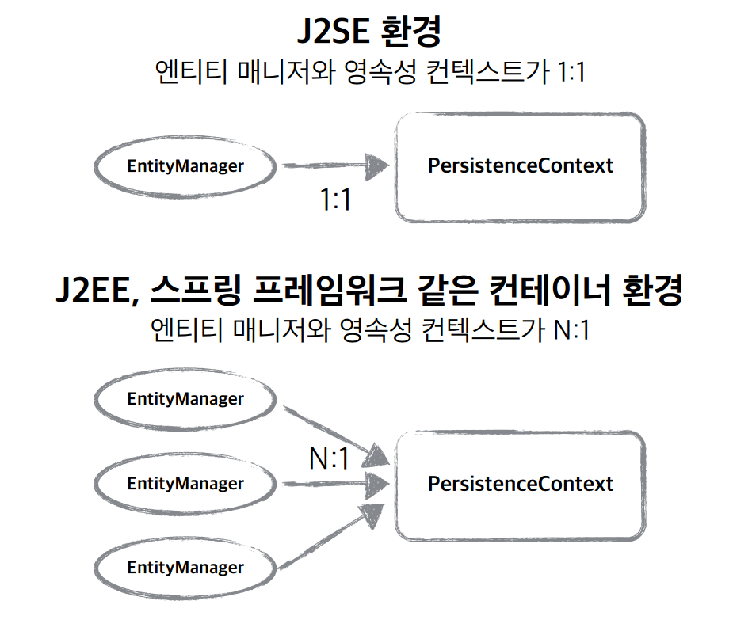
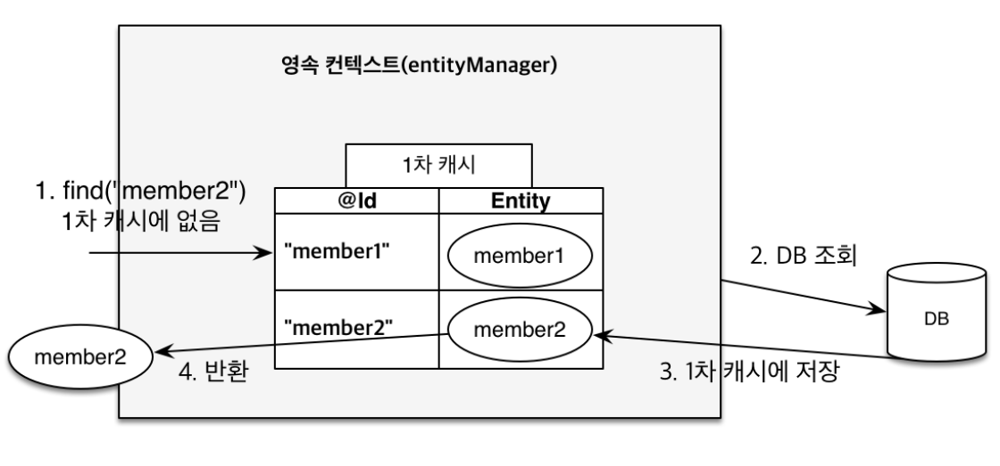
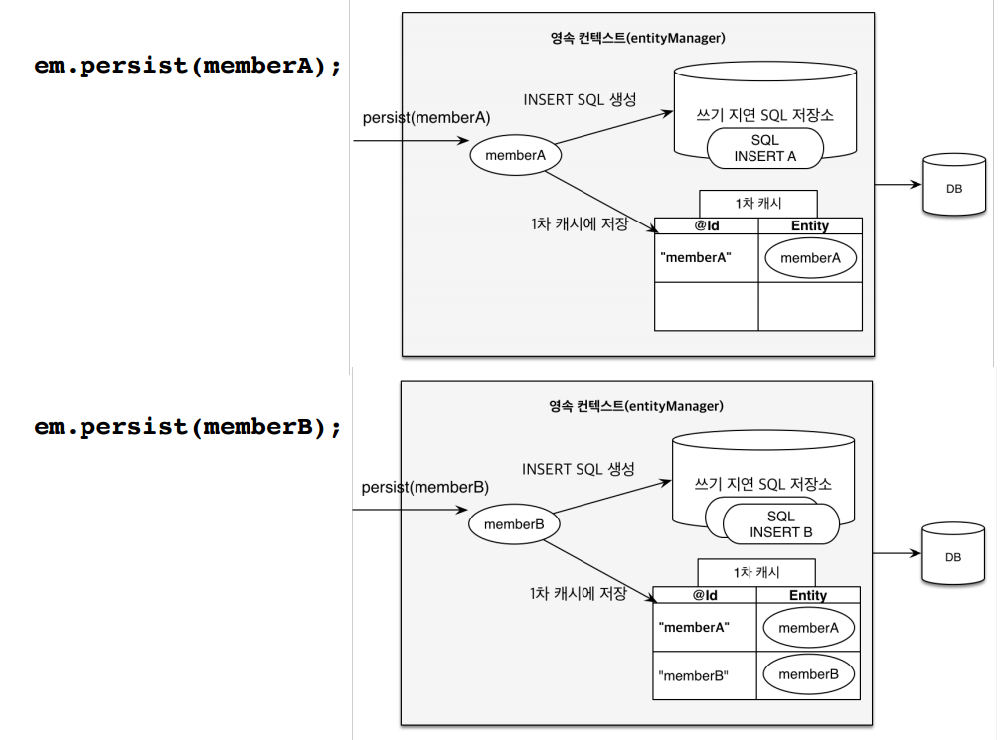
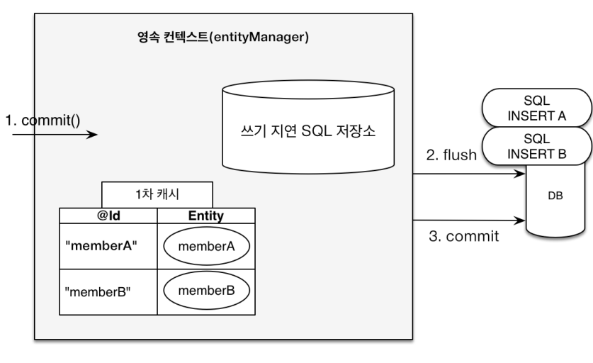
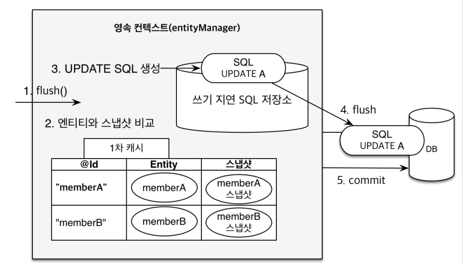

# 영속성 컨텍스트

[TOC]

### - 영속성 컨텍스트 인트로

JPA가 DB를 조작하는 방식을 이해하는데 가장 중요한 개념이다.

요청에서 엔티티매니저가 생성되고, 엔티티매니저가 논리적인 개념인 영속성 컨텍스트에 접근하게되는데, 이때 영속성 컨텍스트가 애플리케이션와 DB사이에 존재하게 되며 여러 이점을 가질 수 있다.


참고 사진




### - 영속성 컨텍스트에서 엔티티의 생명주기

엔티티매니저를 통해 엔티티는 영속성 컨텍스트에서 관리되며 다음과 같은 생명주기를 가진다.


비영속 (new/transient)

- 영속성 컨텍스트와 전혀 관계가 없는 새로운 상태 

영속 (managed)

- 영속성 컨텍스트에 관리되는 상태 

준영속 (detached)

- 영속성 컨텍스트에 저장되었다가 분리된 상태 

삭제 (removed)

- 삭제된 상태


### - 영속성 컨텍스트의 이점 개요

영속성 컨텍스트는 다음과 같은 이점을 가지게 된다.

- 1차 캐시 
- 동일성(identity) 보장 
- 트랜잭션을 지원하는 쓰기 지연 (transactional write-behind) 
- 변경 감지(Dirty Checking) 
- 지연 로딩(Lazy Loading)


### - 영속성 컨텍스트 이점 - 1차 캐시

```java
package hellojpa;

import javax.persistence.EntityManager;
import javax.persistence.EntityManagerFactory;
import javax.persistence.EntityTransaction;
import javax.persistence.Persistence;
import java.util.List;

public class JpaMain {

    public static void main(String[] args) {
        EntityManagerFactory emf = Persistence.createEntityManagerFactory("hello");
        EntityManager em = emf.createEntityManager();
        EntityTransaction tx = em.getTransaction();
        tx.begin();
        
        try {
            // code
            Member findMember1 = em.find(Member.class, 101L);
            Member findMember2 = em.find(Member.class, 101L);
            tx.commit();

        } catch (Exception e) {
            tx.rollback();
        } finally {
            em.close();
        }
        emf.close();
    }
}
```

DB에 101번의 Member가 저장되어 있는 상태에서 실행한 코드이다.

해당 코드에서 쿼리문은 1번만 전송되는 것을 확인할 수 있다.


동작



1. 영속성 컨텍스트에 없는 101번 Member를 DB에서 조회 쿼리문을 날려 1차 캐시에 저장한다.
2. 101번 Member를 1차 캐시에서 조회한다.


### - 영속성 컨텍스트 이점 - 동일성 보장

핵심코드만 발췌 (emf, em 생성 코드 등 제외)

```java
Member findMember1 = em.find(Member.class, 101L);
Member findMember2 = em.find(Member.class, 101L);
System.out.println(findMember1 == findMember2);
```

findMember2는 1차 캐시에서 가져온 값으로,

findMember1과 findMember2가 같은 인스턴스임을 보장할 수 있다.

자바 컬렉션처럼 동일성을 보장한다.


### - 영속성 컨텍스트 이점 - 트랜잭션을 지원하는 쓰기 지연

핵심코드만 발췌 (emf, em 생성 코드 등 제외)

```java
Member member1 = new Member(150L, "A");
Member member2 = new Member(160L, "B");

em.persist(member1);
em.persist(member2);
//여기까지 INSERT SQL을 데이터베이스에 보내지 않는다.

//커밋하는 순간 데이터베이스에 INSERT SQL을 보낸다.
tx.commit();
```

persist 시점이 아닌 commit 이후에 sql문이 전송되는 것을 확인할 수 있다.

영속성 컨텍스트 내의 `쓰기 지연 SQL 저장소`에 SQL문을 저장해 두었다가 commit시점에 한번에 SQL문들을 전송한다.


참고사진






### - 영속성 컨텍스트 이점 - 변경 감지

핵심코드만 발췌 (emf, em 생성 코드 등 제외)

```java
1. Member member = em.find(Member.class, 150L);
2. member.setName("zzzzzz");

//em.update(member) 이런 코드가 있어야 하지 않을까?

3. tx.commit();
```

1. find로 DB에서 Member 데이터를 가져와서 member객체를 만들어 줬을 것임
2. member객체의 name값을 변경


여기서 드는 의문

따로 명령어가 없는데 update SQL문은 언제 생성되는거지?

-> 영속성 컨택스트의 스냅샷 




JPA는 commit 시점에 Entity와 스냅샷을 모두 비교한다.

이때 변경이 감지되면 `쓰기 지연 SQL 저장소`에 update SQL을 생성해주고, commit시 `쓰기 지연 SQL 저장소`의 SQL문들이 모두 DB로 전송된다.


#### - 삭제시

```java
Member memberA = em.find(Member.class, “memberA");
em.remove(memberA); //엔티티 삭제
```

위의 메커니즘대로 commit시점에 JPA가 Entity와 스냅샷을 비교함

영속성 컨택스트에 엔티티는 없고 스냅샷은 있음 (이거 맞는지 잘 모르겠다. 반대일 수도 있다.)


### - 플러시

영속성 컨택스트의 `쓰기 지연 SQL 저장소`의 쿼리문을 모두 전송한다.

```java
1. Member findMember = em.find(Member.class, 200L);
2. findMember.setName("aaaa");
3. em.flush();

4. tx.commit();
```

1. find로 DB에서 Member 데이터를 가져와서 member객체를 만들어 줬을 것임
2. Member객체의 Name속성을 변경
3. 스냅샷과 엔티티를 비교하여 update쿼리문을 `쓰기 지연 SQL 저장소`에 저장, `쓰기 지연 저장소`의 SQL문들을 모두 전송


#### - JPQL 쿼리 실행시 플러시는 자동호출된다.

```java
em.persist(memberA);
em.persist(memberB);
em.persist(memberC);

//중간에 JPQL 실행
query = em.createQuery("select m from Member m", Member.class);
//여기서 flush 자동호출
List<Member> members= query.getResultList();
```

다음과 같은 코드에서 flush는 Jpql쿼리문을 날리기 전에 자동으로 호출된다.

그렇지 않으면 여러 에러상황이 발생할 수 있다.

그러나 Jpql을 날릴 때 flush를 호출안하게 설정할 수도 있다.

- 근데 큰 도움은 안되고 그냥 AUTO모드로 사용하면 된다.
- 설정방법은 아래 "플러시 모드 옵션" 참고


#### - 플러시 모드 옵션

사실 AUTO로 사용하면 되고 굳이 COMMIT모드로 사용할 필요는 없다.

이런게 있다라는 참고 정도로만 보고가자

```java
em.setFlushMode(FlushModeType.COMMIT)
```

FlushModeType.AUTO

- 커밋이나 쿼리를 실행할 때 플러시 (기본값) 

FlushModeType.COMMIT

- 커밋할 때만 플러시


#### - 플러시 정리

- 영속성 컨택스트를 비우지 않는다.
- 영속성 컨택스트의 변경내용을 DB에 동기화
- 트랜잭션이라는 잡업 단위가 중요한거고 커밋 직전에만 동기화하면 된다.


### - 준영속상태

엔티티매니저는 엔티티를 영속성컨택스트에 넣어서 관리한다. 이때, 관리되는 엔티티를 영속상태에 있다고 표현한다. 

준영속상태는 영속상태의 엔티티가 영속성 컨택스트에서 분리된 상태를 말한다.

```java
1. Member findMember = em.find(Member.class, 200L);
2. findMember.setName("aaaa");
3. em.detach(findMember);
4. tx.commit();
```

1. find로 DB에서 Member 데이터를 가져와서 Member객체를 만들어 줬을 것임

2. findMember 인스턴스의 name값을 변경

3. findMember 인스턴스를 영속성컨택스트에서 제외(준영속상태)
4. commit시 영속성컨택스트에 findMember 인스턴스가 없으므로, 변경감지로 인한 SQL문 생성이 일어나지 않고, `쓰기 지연 SQL 저장소`에 update 쿼리문이 생성되지 않는다.


#### - 준영속상태로 만드는 방법

em.detach: 특정 엔티티를 영속성 컨택스트에서 제외

em.clear: 모든 엔티티를 영속성 컨택스트에서 제외

em.close: 영속성 컨택스트를 닫아버림