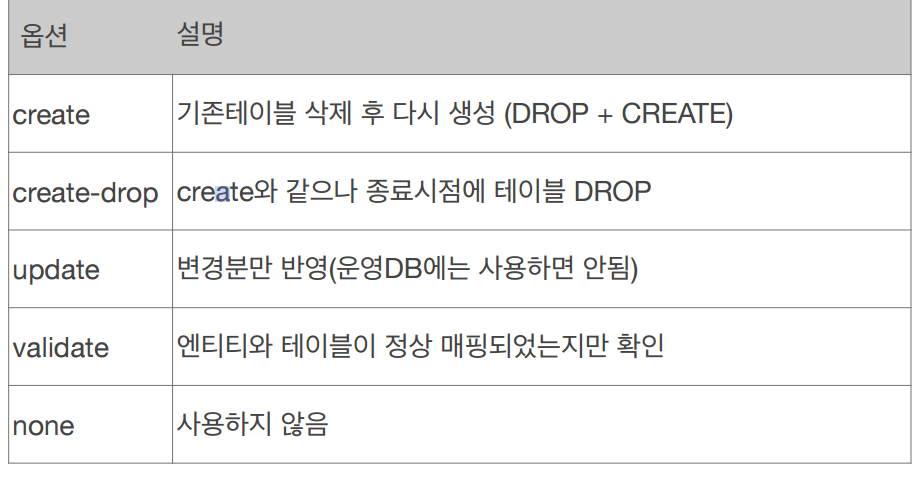

# [참고] 데이터베이스 스키마 자동생성 (DDL 자동 생성) 

**참고자료**

해당 내용은 다음 강의를 참고하여 정리하였습니다.


[자바 ORM 표준 JPA 프로그래밍 - 기본편](https://www.inflearn.com/course/ORM-JPA-Basic/dashboard)


### persistence.xml
```xml
<?xml version="1.0" encoding="UTF-8"?>
<persistence>
    <persistence-unit>
        
        <properties>
            <property name="javax.persistence.jdbc.driver" value="org.h2.Driver"/>
            <property name="hibernate.hbm2ddl.auto" value="create" />
        </properties>
        
    </persistence-unit>
</persistence>
```
애플리케이션 실행 시점에 객체를 참고하여 DDL을 생성하며, 데이터베이스의 방언에 따라 적절한 DDL을 생성한다.
이 DDL은 개발 장비에서만 사용을 권장하고 운영서버에서는 사용하지 않거나 적절히 다듬어 사용
### 설정

### 데이터베이스 스키마 자동생성시 주의사항
**운영 장비에는 절대 create, create-drop, update 사용하면 안된다.**
- 데이터가 계속 날라갈 수 있음
개발 초기 단계는 create 또는 update
테스트 서버는 update 또는 validate
스테이징과 운영 서버는 validate 또는 none
가급적 개발단계에서만 사용하고 여러 사람이 쓸 때는 사용하지 않는것이 좋다.
보통 개발단계의 DDL을 각색하여 직접 SQL문을 짜서 사용함
### @Column(nullable = false, length = 10) 
객체의 속성에 다음의 어노테이션을 사용하면 스키마 자동생성시 DDL에 제약조건을 같이 작성하여준다.
이후 JPA의 실행로직에는 영향을 주지 않는다.
### 예시
```java
@Entity 
@Getter @Setter
@AllArgsConstructor @NoArgsConstructor
public class Member {
    @Id
    private Long id;
    @Column(name = "name")
    private String username;
    private Integer age;
    
    @Enumerated(EnumType.STRING)
    private RoleType roleType;
    
    // 자바는 Date는 DATE, TIME을 
    // 데이터베이스는  DATE, TIME, TIMESTAMP를 가져서 매핑할때 설정해줘야 함
    @Temporal(TemporalType.TIMESTAMP) 
    private Date createdDate;
    
    @Temporal(TemporalType.TIMESTAMP)
    private Date lastModifiedDate;
    
    @Lob // 무언가 긴 String을 가질때
    private String description;
}
```
```SQL
create table Member (
       id bigint not null,
        age integer,
        createdDate timestamp,
        description clob,
        lastModifiedDate timestamp,
        roleType varchar(255),
        name varchar(255),
        primary key (id)
    )
```
