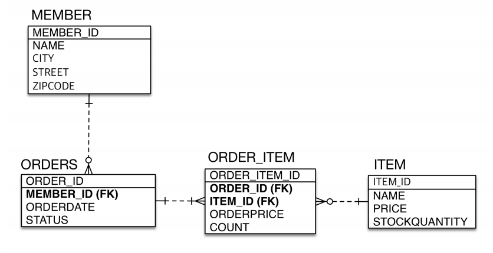
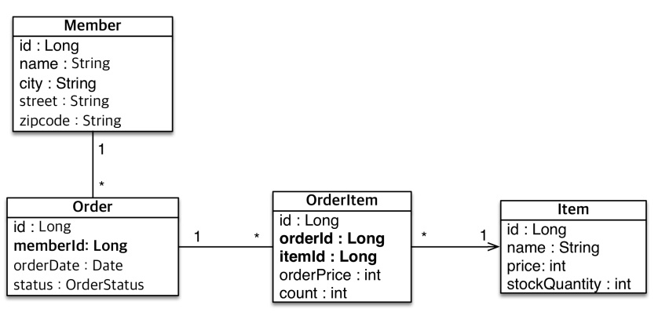

# 테이블 중심 설계의 문제점

**참고자료**

해당 내용은 다음 강의를 참고하여 정리하였습니다.


[자바 ORM 표준 JPA 프로그래밍 - 기본편](https://www.inflearn.com/course/ORM-JPA-Basic/dashboard)


### 테이블 설계

### 엔티티 설계

위는 테이블 설계에 엔티티 설계를 맞춘 형태이다.
객체스럽지 않고 테이블스러운 구조
### 문제코드
```java
Order order = em.find(Order.class, 1L);
Long memberId = order.getMemberId();
Member findMember = order.getMember();
```
해당 주문의 고객정보를 알고싶을 때, 위처럼 엔티티를 설계하게 되면,
1. pk값으로 DB에서 ORDER 데이터를 가져오고, order 객체에 넣어준다.
2. order 객체에서 memberId 값으로 DB에서 MEMBER 데이터를 가져오고, member객체에 넣어준다.
무언가 객체스럽지 않고 DB스러운 느낌
우리는 `order.getMember()`로 객체를 그래프 탐색 하고싶다. -> **연관관계 매핑으로 해결**
문제점들 정리
- 현재 방식은 객체 설계를 테이블 설계에 맞춘 방식
- 테이블의 외래키를 객체에 그대로 가져옴
- 객체 그래프 탐색이 불가능
- 참조가 없으므로 UML도 잘못됨
