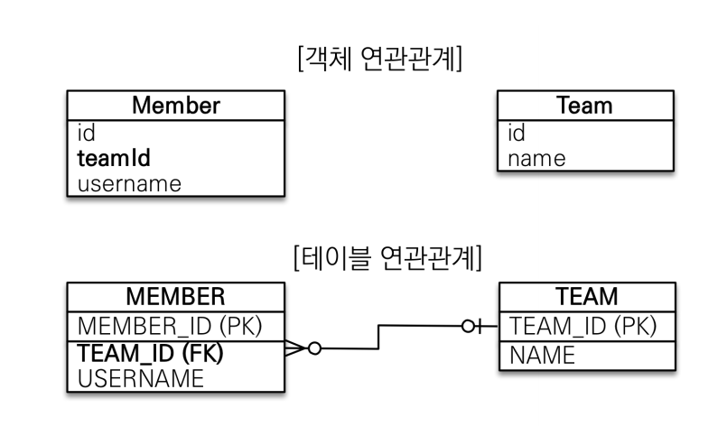
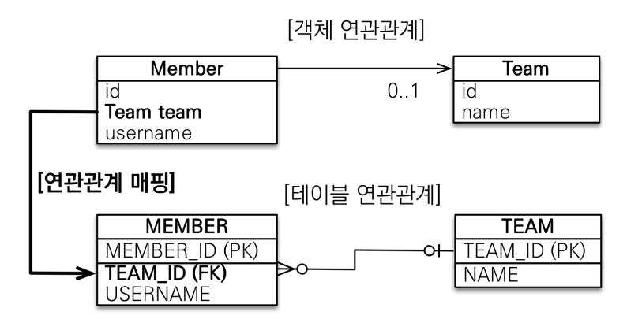

# 객체 중심 설계 - 단방향 연관관계 매핑
### 테이블 중심 설계의 문제점
테이블 중심 설계

자바 코드
```java
@Entity
public class Member { 
    //...
    @Column(name = "TEAM_ID")
    private Long teamId; 
    
} 
@Entity
public class Team {
    @Id @GeneratedValue
    private Long id;
    private String name; 
}
```
비지니스 로직 코드
```java
//팀 저장
Team team = new Team();
team.setName("TeamA");
em.persist(team);
//회원 저장
Member member = new Member();
member.setName("member1");
member.setTeamId(team.getId());
em.persist(member);
```
위처럼 테이블에 맞추어서 엔티티를 설계하게 되면 다음과 같은 문제점이 발생하게 된다.
- 테이블은 외래 키로 조인을 사용해서 연관된 테이블을 찾는다. 
- 객체는 참조를 사용해서 연관된 객체를 찾는다. 
- 테이블과 객체 사이에는 이런 큰 간격이 있다.
우리는 엔티티를 **객체**처럼 사용하고 싶다. 이러한 테이블과 객체의 패러다음을 해결하기 위해서 JPA는 다음과 같이 **연관관계 매핑**을 통해서 해결한다.
### 단방향 연관관계 매핑 - @ManyToOne, @JoinColumn
객체 중심 설계

자바 코드
```java
@Entity
public class Member { 
    
    @Id @GeneratedValue
    private Long id;
    
    @Column(name = "USERNAME")
    private String name;
    
    private int age;
    
    @ManyToOne
    @JoinColumn(name = "TEAM_ID")
    private Team team;
}
@Entity
public class Team {
    @Id @GeneratedValue
    private Long id;
    private String name; 
}
```
비지니스 로직 코드
```java
//팀 저장
Team team = new Team();
team.setName("TeamA");
em.persist(team);
//회원 저장
Member member = new Member();
member.setName("member1");
member.setTeam(team); //단방향 연관관계 설정, 참조 저장
em.persist(member);
```
이렇게 @ManyToOne, @JoinColumn을 사용하여 **단방향 연관관계**를 매핑하게 되면, 
JPA가 내부적으로 데이터베이스와 객체의 패러다임을 해결해주어,
엔티티를 컬렉션에 있는 **객체**처럼 사용할 수 있게 된다.
