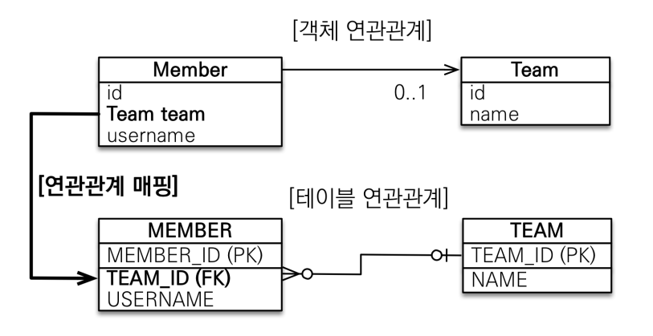

# 객체 중심의 설계 - 양방향 연관관계

**참고자료**

해당 내용은 다음 강의를 참고하여 정리하였습니다.


[자바 ORM 표준 JPA 프로그래밍 - 기본편](https://www.inflearn.com/course/ORM-JPA-Basic/dashboard)


[TOC]
### 단방향 연관관계의 살짝 아쉬운점? - 양방향 탐색이 안된다.

단방향 연관관계 매핑만으로 이미 연관관계 매핑은 완료가 되었지만, Team 엔티티에서 Member 엔티티로 역방향 조회를 할 수는 없다.
실제로 JPQL에서 역방향으로 탐색할 경우가 많기 때문에 이러한 경우 양방향 연관관계 매핑을 통해서 엔티티에서 역방향 조회를 구현할 수 있다.
보통 단방향 연관관계로 모두 매핑을 한 후 **필요할 경우** 양방향 연관관계 매핑을 추가로 설정해주면 된다.
### 양방향 연관관계

```java
@Entity
public class Member { 
    // ...
    @ManyToOne
    @JoinColumn(name = "TEAM_ID")
    private Team team;
}
@Entity
public class Team {
    
    @Id @GeneratedValue
    private Long id;
    
    private String name;
    
    @OneToMany(mappedBy = "team")
    List<Member> members = new ArrayList<Member>();
}
```
```java
Team findTeam = em.find(Team.class, team.getId()); 
int memberSize = findTeam.getMembers().size(); //Team에서 Member 역방향 조회
```
위와 같이 Team 엔티티에 List<Member> 필드를 추가해줌으로서 역방향 탐색을 구현할 수 있다.
위의 예시에서는 mappedBy를 Team에 설정해주어 연관관계주인을 Member로 정하였는데, 그 이유는 다음에서 알자보자.
### 연관관계 주인 설정
#### 주인 설정 이유
DB는 하나의 외래키로 두 테이블을 연결하는데, 객체에선 Member에 Team 속성을 넣어주어야 하고, Team에서 Members에 member를 추가해줘야 양방향 연결이 가능하다.
이 차이점에서 Member 객체의 Team값을 수정할 때 DB의 외래키를 수정할 것인지, Team객체의 Members값을 수정할 때 DB의 외래키를 수정할 것인지 선택해야한다.
이 역할을 어떤 객체가 수행할 것인지 정하는 것을 **연관관계 주인 설정**이라고 한다.
```java
// 연관관계 주인
@Entity
public class Member { 
    @ManyToOne
    @JoinColumn(name = "TEAM_ID")
    private Team team;
}
// mappedBy 사용
@Entity
public class Team {
    @OneToMany(mappedBy = "team")
    List<Member> members = new ArrayList<Member>();
}
```
#### 주인 설정 기준
보통 테이블에서 외래키를 보유하고 있는 테이블에 매핑된 객체를 주인으로 설정한다. (비지니스 로직 기준이 아닌)
왜냐하면, Team객체를 수정했는데 MEMBER 테이블의 외래키 값이 수정되는 SQL문이 전송된다면, 무언가 직관에 맞지않고, 여러 문제점이 있다고 한다.
### 예시코드
```java
Team team = new Team();
team.setName("TeamA");
em.persist(team);
Member member = new MEmber();
member.setUsername("member1");
member.setTeam(team);
team.getMembers().add(member);
em.persist(team);
```
| MEMBER_ID | USERNAME | TEAM_ID |
| --------- | -------- | ------- |
| 1         | member1  | null    |
| TEAM_ID | NAME  |
| ------- | ----- |
| 1       | TeamA |
현재 연관관계의 주인은 Member로 DB의 외래키를 수정하기 위해선 Member 객체의 Team 속성을 수정해주어야한다.
하지만 위의 코드에서는 Team객체의 Members 속성을 바꾼 코드로 연관관계 주인이 아닌 Team객체는 DB의 외래키를 바꿀 수 없다.(읽기만 가능)
그렇기 때문에 연관관계의 주인인 Member객체의 Team속성을 수정해주어야 DB의 외래키가 수정된다.
```java
Team team = new Team();
team.setName("TeamA");
em.persist(team);
Member member = new MEmber();
member.setUsername("member1");
member.setTeam(team);
member.setTeam(team);
// team.getMembers().add(member);
em.persist(team);
```
연관관계 주인 객체의 속성을 바꾸어 주어야 DB에 반영이 되며, `team.getMembers().add(member);`는 DB와는 관계는 없지만, 넣어주는게 객체입장에서 명확하다. 만약 이를 넣어주지 않으면 team객체의 members 필드에 데이터가 없는 상태가 된다.
### 양방향 연관관계 주의할 점
#### 순수한 객체상태를 고려해서 항상 양쪽에 값을 설정하자
```java
Team team = new Team();
team.setName("TeamA");
em.persist(team);
Member member = new MEmber();
member.setUsername("member1");
member.setTeam(team);
// 핵심부분
member.setTeam(team);
team.getMembers().add(member);
em.persist(team);
```
연관관계 주인 객체의 속성을 바꾸어 주어야 DB에 반영이 되며, `team.getMembers().add(member);`는 DB와는 관계는 없지만, 넣어주는게 객체입장에서 명확하다. 만약 이를 넣어주지 않으면 team객체의 members 필드에 데이터가 없는 상태가 된다.
#### 연관관계 편의 메소드를 생성하자
위처럼 두 객체에 모두 설정해줘도 되지만 메서드를 하나 만들어서 사용하는 것을 추천한다.
```java
@Entity
public class Member { 
    @ManyToOne
    @JoinColumn(name = "TEAM_ID")
    private Team team;
    
    public void changeTeam(Team team){
        this.team = team;
        team.getMembers().add(this);
    }
}
// 핵심부분
member.changeTeam(team);
```
이 코드는 최소화한 코드로 비지니스적 사항에 따라 더 복잡할 것이다.
#### 양방향 매핑시에 무한 루프를 조심하자
1. toString()
member를 출력하는데 team을 출력하는데 member를 출력하는데.....
왠만하면 사용하지 말것
2. JSON
Controller에서 엔티티를 반환하면 Json으로 변환할때, Member객체 Team에서 Members객체들.... 무한참조
Controller에서는 엔티티를 절대 반환하지 말고, response dto를 생성해서 반환하자
### 정리
1. 설계시 단방향 연관관계 매핑으로 설계를 완료할 것
2. 양방향 연관관계 매핑은 단순히 역방향 조회를 추가한 것 뿐
3. JPQL에서 역방향으로 탐색할 일이 생겼을 때, 양방향을 추가해주면 된다.
이렇게 해도 테이블에 전혀 영향이 가지 않기 때문이다.