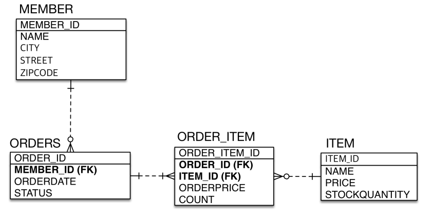
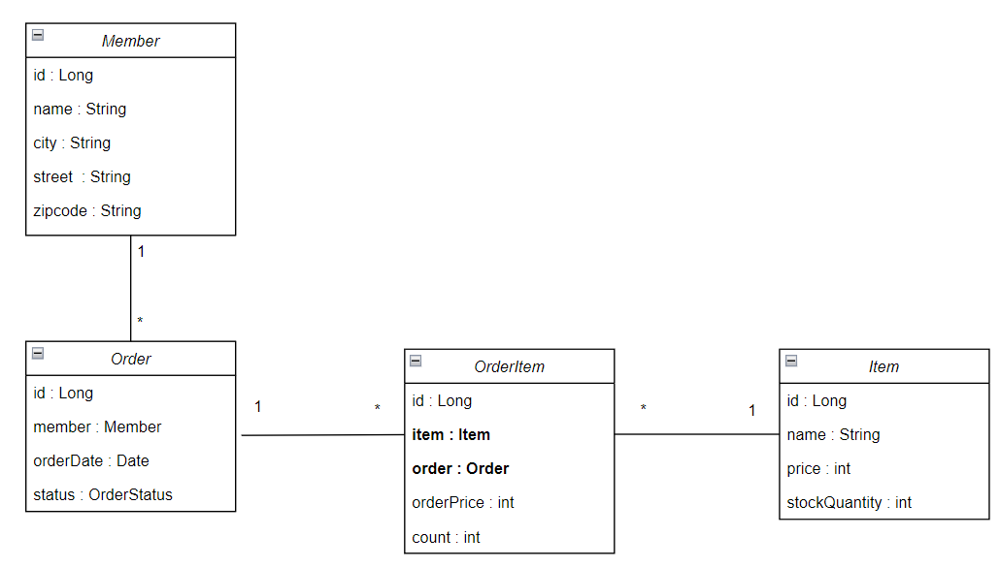
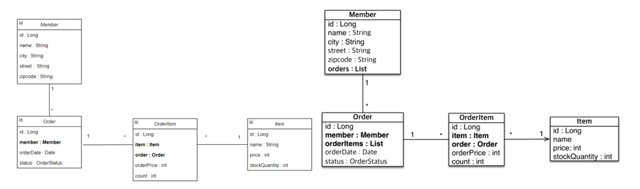

# 객체 중심 설계 예제

**참고자료**

해당 내용은 다음 강의를 참고하여 정리하였습니다. 


[실전! 스프링 부트와 JPA 활용1 - 웹 애플리케이션 개발](https://www.inflearn.com/course/%EC%8A%A4%ED%94%84%EB%A7%81%EB%B6%80%ED%8A%B8-JPA-%ED%99%9C%EC%9A%A9-1/dashboard)


### 테이블 구조



다음의 테이블 구조가 설계되었다.

우리는 애플리케이션을 개발하며 첫 번째로 **단방향 연관관계 매핑**을 수행한 후

두 번째로 **양방향 연관관계 매핑**을 추가로 수행하여 보자.


### 단방향 연관관계 객체 설계



```java
@Entity
public class Member {
    @Id @GeneratedValue
    @Column(name = "MEMBER_ID")
    private Long id;
    private String name;
    private String city;
    private String street;
    private String zipcode;
}


@Entity
@Table(name = "ORDERS")
public class Order {
    @Id @GeneratedValue
    @Column(name = "ORDER_ID")
    private Long id;

    @ManyToOne
    @JoinColumn(name = "MEMBER_ID")
    private Member member;

    private LocalDateTime orderDate; 
    //ORDER_DATE, order_date 스프링 부트에선 자바 카멜케이스를 언더스코어로 자동으로 바꿔줌

    @Enumerated(EnumType.STRING)
    private OrderStatus status;
}

@Entity
public class OrderItem {

    @Id @GeneratedValue
    @Column(name = "ORDER_ITEM_ID")
    private Long id;
    
    @ManyToOne
    @JoinColumn(name = "ORDER_ID")
    private Order order;
    
    @ManyToOne
    @JoinColumn(name = "ITEM_ID")
    
    private int orderPrice;
    private int count;
}

@Entity
public class Item {
    @Id
    @GeneratedValue
    @Column(name = "ITEM_ID")
    private Long id;
    private String  name;
    private int price;
    private int stockQuantity;
}
```


테이블 구조름 참고하여 **단방향 연관관계 매핑**을 사용한 **객체 중심 설계**의 형태이다.

여기까지만 해도 애플리케이션 개발에 아무 문제가 없지만,

실무에서 JPQL을 사용하다보면 객체에서 역방향으로 조회가 많이 일어난다.

이럴때, 편의를 위해 **양방향 연관관계 매핑**을 추가로 설정해준다.


### 양방향 연관관계 매핑



```java
@Entity
public class Member {
    //...
    @OneToMany(mappedBy = "member")
    private List<Order> orders = new ArrayList<>();
}


@Entity
@Table(name = "ORDERS")
public class Order {
    //...
    
    @OneToMany(mappedBy = "order")
    private List<OrderItem> orderItems = new ArrayList<>();

    public void addOrderItem(OrderItem orderItem) {
        orderItems.add(orderItem);
        orderItem.setOrder(this);
    }
}

// 간소화한 비지니스 로직
Order order = new Order();
order.setName("orderA");
    
OrderItem orderItem = new OrderItem();
orderItem.setCount(1000);

order.addOrderItem(orderItem);
```


현재 Member에서 Order을, Order에서 OrderItem을 역방향 조회를 하려고 한다.

이때 **양방향 연관관계를 매핑 할때** 다음과 같이 작업 하면 된다.

1. 역방향 참조를 위한 참조속성을 만든다.

2. **연관관계의 주인**은 테이블에서 **외래키를 가지고 있는 것**을 따른다.
   - 주인이 아닌 객체에 mappedBy를 설정해준다.

3. 순수한 객체상태를 위해 **연관관계 편의메서드**를 생성한다.
   - 객체상태를 변경할 때 이 메서드를 사용하여 변경한다.


이렇게 해주면 **양방향 매핑 작업**을 통해 **역방향 탐색**이 가능해진다.

JPQL 사용시 편의를 위해 해주는 작업이며 필요시에만 설정해준다.


#### 주의할 점

1. toString()

양방향 매핑 작업을 한 객체를 출력하면 무한루프에 빠지게 된다.

toString을 왠만하면 사용하지 말자.


2. JSOM

Controller에서 양방향 매핑 작업을 한 객체를 반환하면 Json으로 변환할때 무한루프에 빠지게 된다.

Controller에서는 엔티티를 절대 반환하지 말고, response dto를 생성해서 반환하자