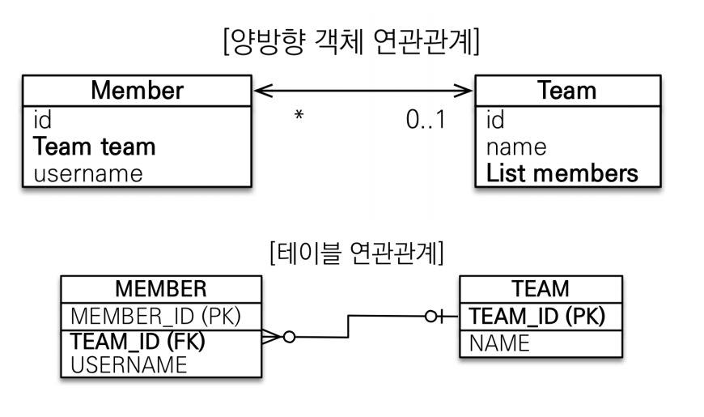

# 다양한 연관관계 매핑 정리
[TOC]
### 고려사항 3가지
1. 다중성
   - @ManyToOne, @OneToMany, @OneToOne, @ManyToMany
   - 참고: @ManyToMany은 실무에서 거의 사용하지 않는다.
2. 단방향, 양방향
3. 연관관계 주인 -> 외래키를 관리하는 객체를 어떤 것으로 정할 것인가
### 다대일 (권장)
#### - 다대일 단방향

테이블에서는 무조건 "다"쪽에 외래키를 설정한다.
-> 그렇지 않으면 MEMBER 데이터 추가 시 TEAM에 중복으로 데이터가 추가됨
다대일에서는 객체에서 "다"쪽에서 "일"쪽의 객체를 필드로 두어 참조한다.
연관관계 주인은 외래키를 관리하는 객체인 Member가 된다.
코드
```java
Team team = new Team():
team.setName("teamA");
em.persist(team);
Member member = new Member():
member.setUsername("member1");
// 연관관계 주인인 member객체에 team객체 주입
member.setTeam(team);
em.persist(member);
```
#### - 다대일 양방향

테이블은 변경이 없으며, 객체에서 "일"쪽에 "다"참조 필드가 추가된다.
이때, 연관관계의 주인(외래키 관리 객체)은 테이블에서 외래키를 가지고 있는 객체로 설정한다.
- 이때 주인이 아닌 객체는 주인 객체의 '조회'만 가능하다. (테이블에서 외래키 변경 불가)
### 일대다 (권장X)
#### - 일대다 단반향

테이블에서는 무조건 "다"쪽에 외래키를 설정한다.
-> 그렇지 않으면 MEMBER 데이터 추가 시 TEAM에 중복으로 데이터가 추가됨
일대다에서는 객체에서 "일"쪽에서 "다"쪽의 객체를 필드로 두어 참조한다.
연관관계 주인은 외래키를 관리하는 객체인 Team가 된다.
코드 문제점
```java
Member member = new Member():
member.setUsername("member1");
em.persist(member);
Team team = new Team():
team.setName("teamA");
//문제코드
team.getMembers().add(member);
em.persist(team);
```
이때, team 객체를 수정했는데, MEMBER테이블에 업데이트 쿼리가 나가게됨.
- 협업환경에서 혼란을 줄 수 있고, 유지보수가 힘듬.
- 연관관계 관리를 위해 추가로 UPDATE SQL 실행된다.
따라서 단방향 매핑보다는 다대일 양방향 매핑을 사용하자.
#### - 일대다 양방향

일대다 양방향에서 "일"을 연관관계 주인으로 설정하려고 할때, 
즉 `@ManyToOne`에서는 `mappedby`를 지원하지 않는다고 한다. (이러한 경우가 잘 없어서 지원하지 않는다고 함)
이때는 `@JoinColumn(insertable=false, updatable=false)`을 사용하여 "다"에서 읽기전용으로만 사용하도록 설정할 수 있다.
### 일대일
#### 일대일 주 테이블에 외래키 단방향

```java
@Entity
public class Member {
    @Id @GeneratedValue
    @Column(name = "MEMBER_ID")
    private Long id;
    private String username;
 	@ManyToOne
    @JoinColumn(name = "LOCKER_ID")
    private Locker locker
}
@Entity
public class Locker {
    @Id @GeneratedValue
    @Column(name = "Locker_ID")
    private Long id;
    private String name;
}
```
하나의 MEMBER가 하나의 LOCKER를 가질 수 있다고 가정한다.
DB에서, 주 테이블(MEMBER)이나 대상 테이블(LOCKER) 중 하나에 외래키를 선택하고, unique 제약조건을 추가해주면 된다. 여기선 MEMBER에 외래키를 설정하였다.
이때 연관관계의 주인은 Member가 된다.
#### 일대일 주 테이블에 외래키 양방향

```java
@Entity
public class Member {
    @Id @GeneratedValue
    @Column(name = "MEMBER_ID")
    private Long id;
    private String username;
 	@ManyToOne
    @JoinColumn(name = "LOCKER_ID")
    private Locker locker
}
@Entity
public class Locker {
    @Id @GeneratedValue
    @Column(name = "Locker_ID")
    private Long id;
    private String name;
    
    @OneToMany(mappedBy = "locker")
    private Member member;
}
```
다대일 양방향 매핑 처럼 외래 키가 있는 곳이 연관관계의 주인으로 설정해주면 된다.
여기에 연관관계 편의메서드를 추가해주면 될거 같다.
#### 일대일 대상 테이블에 외래키 단방향

아예 지원이 안된다. 양방향에선 지원함
이런 설계여야 하지않나..?
#### 일대일 대상 테이블에 외래키 양방향

일대일 주 테이블에 외래 키 양방향과 매핑 방법은 같음
일대일은 객체가 자기 테이블만 관리할 수 있다고 생각하면 될듯하다.
### 일대일 정리
주 테이블에 외래 키
- 주 객체가 대상 객체의 참조를 가지는 것 처럼, 주 테이블에 외래 키를 두고 대상 테이블을 찾음
- 객체지향 개발자 선호
- JPA 매핑 편리
- 장점: 주 테이블만 조회해도 대상 테이블에 데이터가 있는지 확인 가능
- 단점: 값이 없으면 외래 키에 null 허용
대상 테이블에 외래 키
- 대상 테이블에 외래 키가 존재
- 전통적인 데이터베이스 개발자 선호
- 장점: 주 테이블과 대상 테이블을 일대일에서 일대다 관계로 변경할 때 테이블 구조 유지
- 단점: 프록시 기능의 한계로 지연 로딩으로 설정해도 항상 즉시 로딩됨(프록시는 뒤에서 설명)
### 다대다 (권장 X)
관계형 DB에서는 테이블 2개로 다대다 관계를 표현할 수 없어서 연결테이블을 추가하여 다대일 관계로 풀어내야한다.

그러나 객체에서는 컬렉션을 사용해서 객체 2개로 다대다 관계가 가능하다.
```java
@Entity
public class Member {
    @Id @GeneratedValue
    @Column(name = "MEMBER_ID")
    private Long id;
    private String username;
    @ManyTomany
    private List<Product> products = new ArrayList<>();
}
@Entity
public class Product {
    @Id @GeneratedValue
    @Column(name = "PRODUCT_ID")
    private Long id;
    private String name;
    
    @ManyTomany(mappedBy = "products")
    private List<Member> members = new ArrayList<>();
}
```
#### 다대다 매핑의 한계
편리해보이지만 실무에서는 사용하지 않는다.
연결테이블은 단순히 연결만 해주지 않고 추가 속성이 들어갈 일이 많다. ex) 주문시간, 수량 등
쿼리도 직관적이지 않게 나감

### 다대다 매핑의 한계 극복 @ManyToMany -> @OneToMany, @ManyToOne
연결 테이블용 엔티티 추가한다.

```java
@Entity
public class Member {
    @Id @GeneratedValue
    @Column(name = "MEMBER_ID")
    private Long id;
    
    private String username;
    
    @OneTomany(mappedBy="member")
    private List<MemberProduct> memberProducts = new ArrayList<>();
}
@Entity
public class Product {
    @Id @GeneratedValue
    private Long id;
    
    private String name;
    
    @OneTomany(mappedBy = "product")
    private List<MemberProduct> memberProducts = new ArrayList<>();
}
@Entity
public class MemberProduct {
    @Id @GeneratedValue
    private Long id;
    
    @ManyToOne
    @JoinColumn(name = "MEMBER_ID")
    private Member member;
    
    @ManyToOne
    @JoinColumn(name = "PRODUCT_ID")
    private Product product;
    
    private int orderAmount;
    private LocalDateTime orderDate;
}
```
