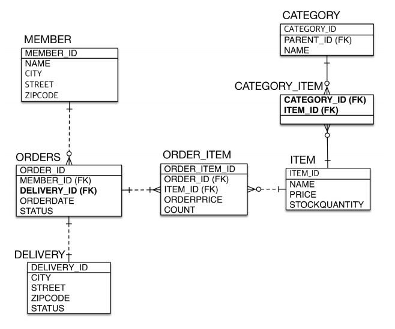
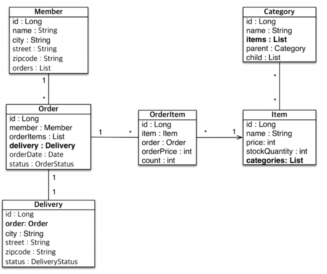

# 다양한 연관관계 매핑 - 실전예지
[TOC]
### ERD 설계

관계도
1. MEMBER와 ORDERS
- 일대다 관계, 한 멤버는 여러 주문을 가지고, 한 주문은 하나의 멤버만 가진다.
- 예약어때문에 주문테이블을 ORDERS라고 설정
2. ORDERS와 DELIVERY
- 일대일 관계, 하나의 주문은 하나의 배송지를 가진다.
- 외래키는 주 테이블인 ORDERS에 넣어주었다. (객체적으로 좋은, DB적으로 안좋은)
3. ORDERS와 ITEM
- 다대다 관계, 하나의 주문은 여러 아이템을 가지고, 하나의 아이템은 여러 주문에 있다.
- 다대다 관계를 표현하기 위해 ORDER_ITEM 테이블을 추가하였다.
- 주문가격, 수량의 추가정보가 컬럼으로 추가되었다.
4. ITEM과 CATAGORY
- 다대다 관계, 하나의 아이템은 여러 카데고리를 가지고, 하나의 카데코리는 여러 아이템에 있다.
- 중계테이블 CATAGORY_ITEM을 추가
### 엔티티 설계

1. Member와 Order (일대다 관계)
- 양방향으로 서로 참조한다.
2. Order와 Delivery (일대일 관계)
- 양방향으로 관계 매핑되어있다.
- 연관관계 주인을 설정해주어야 한다.
3. Order와 OrderItem (일대다 관계)
- 단방향으로 "다"인 OrderItem에 order를 참조한다.
4. Item과 OrderItem (일대다 관계)
- 단방향으로 "다"인 OrderItem에 item을 참조한다.
5. Category와 Item (다대다 관계)
- 일반적으로 다대다로 객체설계는 지향하진 않는다. (추가속성이 생길 가능성이 높기 때문)
- 보통 3,4번의 OrderItem 처럼 일대다 2개로 풀어서 객체를 설계하지만 여기선 공부를 위해 실습해봄
- 양방향으로 관계 매핑되어있다. (연관관계 주인 설정 필요)
### 1. Order와 Member - 다대일 양방향 매핑하기 (나만의 프로토콜)
1. FK를 제외한 테이블의 컬럼에 맞는 엔티티의 속성 모두 적어주기
```java
@Entity
public class Member {
    @Id @GeneratedValue
    @Column("MEMBER_ID")
    private Long id;
    private String name;
    private String city;
    private String street;
    private String zipcode;
}
@Entity
@Table(name = "ORDERS")
public class Order {
    @Id @GeneratedValue
    @Column("ORDER_ID")
    private Long id;
    private LocalDateTime orderDate; 
    @Enumerated(EnumType.STRING)
    private OrderStatus status;
}
```
테이블의 FK값에 관련없는 속성들을 모두 적어준다.
- PK로 사용할 필드를 정해주고, @Column으로 매핑할 PK의 이름을 설정해준다.
- 테이블에 컬럼에 맞는 나머지 필드를 적어준다.
2. 단방향 매핑작업 해주기
```java
@Entity
public class Member {
    //...
    
}
@Entity
@Table(name = "ORDERS")
public class Order {
	//...
    @ManyToOne
    @JoinColumn(name = "MEMBER_ID")
    private Member member;
}
```
- "다"쪽인 Order에 JoinColumn을 두어 Order객체가 외래키 값을 관리하도록 설정한다.
3. 양방향 매핑작업 해주기
```java
@Entity
public class Member {
    //... PK + 나머지 속성
    
    @OneToMany(mappedBy = "member")
    private List<Order> orders = new ArrayList<>();
}
@Entity
@Table(name = "ORDERS")
public class Order {
	//... PK + 나머지 속성
    
    @ManyToOne
    @JoinColumn(name = "MEMBER_ID")
    private Member member;
}
```
- "일"쪽인 Member에 참조속성을 추가해주고, `@OneToMany(mappedBy = "member")`으로 읽기전용으로 만들어준다.
- 여기에 추가로 **연관관계 편의메서드**를 추가해주면 끝
### 2. Order와 Delivery - 일대일 양방향 매핑하기
1. FK를 제외한 테이블의 컬럼에 맞는 엔티티의 속성 모두 적어주기
```java
@Entity
@Table(name = "ORDERS")
public class Order {
	//... PK + 나머지 속성 + Member와 매핑 속성 (위에서 했던)
    
}
@Entity
public class Delivery {
    @Id
    @GeneratedValue
    @Column(name = "DELIVERY_ID")
    private Long id;
    private String city;
    private String street;
    
    private String zipcode;
    @Enumerated(EnumType.STRING)
    private DeliveryStatys status;
}
```
2. 단방향 매핑작업 해주기
```java
@Entity
@Table(name = "ORDERS")
public class Order {
    
	//... PK + 나머지 속성 + Member와 매핑 속성 (위에서 했던)
    
    @OneToOne
    @JoinColumn("DELIVERY_ID")
    private Delivery delivery;
    
}
@Entity
public class Delivery {
	//... PK + 나머지 속성
    
}
```
- 외래키는 주 테이블 ORDERS에 있는 상태
- 외래키가 있는 테이블의 Order객체를 연관관계 주인으로 설정
- Order객체에 Delivery 조인속성 추가
3. 양방향 매핑작업 해주기
```java
@Entity
@Table(name = "ORDERS")
public class Order {
    
	//... PK + 나머지 속성 + Member와 매핑 속성 (위에서 했던)
    
    @OneToOne
    @JoinColumn("DELIVERY_ID")
    private Delivery delivery;
    
}
@Entity
public class Delivery {
	//... PK + 나머지 속성
    
    @OneToOne(mappedBy = "delivery")
    private Order order;
}
```
- 대상테이블 Delivery에 양방향 매핑을 위해 `@OneToOne(mappedBy = "delivery")`로 참조필드를 추가하여준다.
### 3. OrderItem와 Order - 다대일 양방향 매핑하기
1. FK를 제외한 테이블의 컬럼에 맞는 엔티티의 속성 모두 적어주기
```java
@Entity
@Table(name = "ORDERS")
public class Order {
    
	//... PK + 나머지 속성 + Member와 매핑 속성 (위에서 했던) + Delivery와 매핑 속성 (위에서 했던)
      
}
@Entity
public class OrderItem {
    @Id @GeneratedValue
    @Column(name = "ORDER_ITEM_ID")
    private Long id;
    
    private int orderPrice;
    
    private int count;
}
```
2. 단방향 매핑하기
```java
@Entity
@Table(name = "ORDERS")
public class Order {
    
	//... PK + 나머지 속성 + Member와 매핑 속성 (위에서 했던) + Delivery와 매핑 속성 (위에서 했던)
      
}
@Entity
public class OrderItem {
	//... PK + 나머지 속성
    
	@JoinColumn("ORDER_ID")
    @ManyToOne
    private Order order;
}
```
- "다"쪽이며 외래키가 있는 테이블 쪽의 객체인 OrderItem에 조인필드 추가
3. 양방향 매핑하기
```java
@Entity
@Table(name = "ORDERS")
public class Order {
    
	//... PK + 나머지 속성 + Member와 매핑 속성 (위에서 했던) + Delivery와 매핑 속성 (위에서 했던)
      
    @OneToMany(mappedBy = "order")
    private List<OrderItem> orderItems = new OrderItem();
}
@Entity
public class OrderItem {
	//... PK + 나머지 속성
    
	@JoinColumn("ORDER_ID")
    @ManyToOne
    private Order order;
}
```
- "일"쪽인 Order에 OrderItems 참조속성 추가
- 이후에 **연관관계 편의메서드** 추가 해주면 끝
### 4. OrderItem과 Item - 다대일 단방향 매핑하기
1. FK를 제외한 테이블의 컬럼에 맞는 엔티티의 속성 모두 적어주기
```java
@Entity
public class OrderItem {
	//... PK + 나머지 속성 + Order와 매핑 속성 (위에서 했던)
}
@Entity
public class Item {
    @Id
    @GeneratedValue
    @Column(name = "ITEM_ID")
    private Long id;
    
    private String  name;
    
    private int price;
    
    private int stockQuantity;
}
```
2. 단방향 매핑하기
```java
@Entity
public class OrderItem {
	//... PK + 나머지 속성 + Order와 매핑 속성 (위에서 했던)
	
    @JoinColumn("ITEM_ID")
    @ManyToOne
    private Item item;
}
@Entity
public class Item {
	//... PK + 나머지 속성
}
```
- 외래키를 가지고 있는 "다"쪽인 OrderItem에 조인속성 추가
### 5. Category와 Item - 다대다 관계 양방향 매핑하기 (권장 X)
실전에서는 @ManyToMany를 사용하지 않는다.
중간 테이블이 단순하지 않고, 필드 추가 제약과 엔티티 테이블 불일치의 문제가 있다.
중간테이블에 해당하는 중간 엔티티를 추가로 생성해서 @ManyToOne, @OneToMany로 매핑할 것
아래는 스펙상의 학습을 위해 설명한 글.
1. FK를 제외한 테이블의 컬럼에 맞는 엔티티의 속성 모두 적어주기
```java
@Entity
public class Category {
    @Id
    @GeneratedValue
    @Column("CATEGORY_ID")
    private Long id;
    private String name;
}
@Entity
public class Item {
	//... PK + 나머지 속성
}
```
2. 단방향 매핑하기
```java
@Entity
public class Category {
    //... PK + 나머지 속성
    
    @ManyToMany
    @JoinColumn(name = "CATEGORY_ITEM"
               joinColumns = @JoinColumn(name = "CATEGORY_ID")
               inverseJoinColumns = @JoinColumn(name = "ITEM_ID")
               )
    private List<Item> items = new ArrayList<>();
}
@Entity
public class Item {
	//... PK + 나머지 속성
}
```
- 객체에서는 알수 없는 CATEGORY_ITEM 중간테이블이 있는 상태이다.
- joinColumns은 내가 조인하는 키, inverseJoinColumns는 상대가 조인하는 키를 알려줌
3. 양방향 매핑하기
```java
@Entity
public class Category {
    //... PK + 나머지 속성
    
    @ManyToMany
    @JoinColumn(name = "CATEGORY_ITEM"
               joinColumns = @JoinColumn(name = "CATEGORY_ID")
               inverseJoinColumns = @JoinColumn(name = "ITEM_ID")
               )
    private List<Item> items = new ArrayList<>();
}
@Entity
public class Item {
	//... PK + 나머지 속성
    @ManyToMany(mappedBy = "items")
    private List<Category> categoies = new ArrayList<>();
}
```
