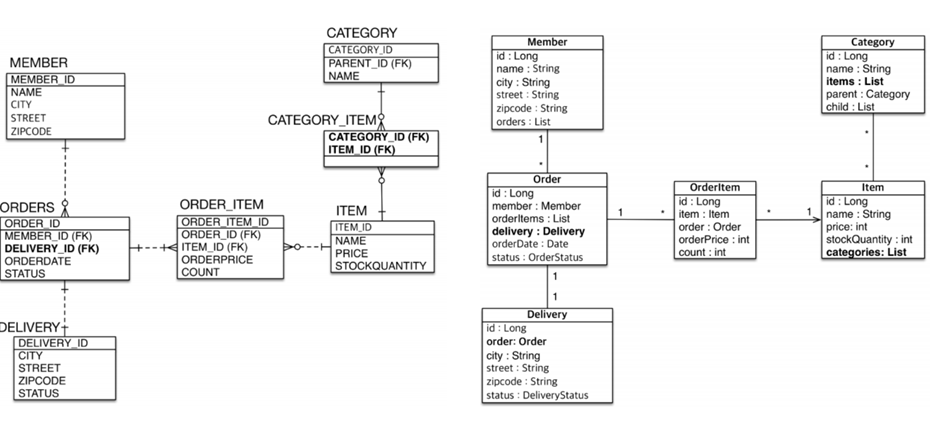
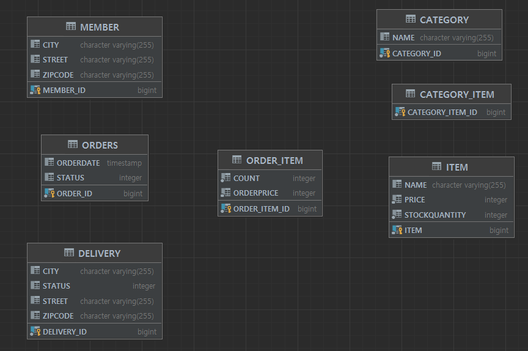
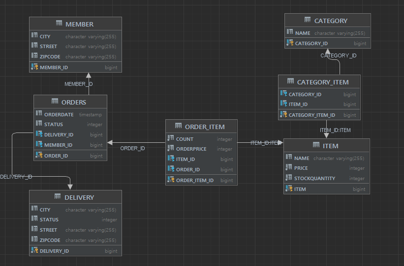

# 연관관계 실습해보기

**참고자료**

해당 내용은 다음 강의를 참고하여 정리하였습니다.


[자바 ORM 표준 JPA 프로그래밍 - 기본편](https://www.inflearn.com/course/ORM-JPA-Basic/dashboard)


### 0. 테이블과 엔티티 설계

다음과 같이 테이블이 설계되었고,
엔티티에서 양방향, 단방향, 연관관계 주인설정이 끝났다고 가정하자 (사실 이 단계는 매우 중요한 단계지만 매핑 연습을 위한 것이므로 생략한다.)
그리고 Category와 Item사이에 CategoryItem 중간객체를 넣어 @ManyToMany를 사용하지 않고, @ManyToOne, @OneToMany로 만들예정
### 1. 일단 관계없이 엔티티 제작
```java
@Entity
public class Member {
    @Id @GeneratedValue
    @Column(name = "MEMBER_ID")
    private Long id;
    private String city;
    private String street;
    private String zipCode;
}
@Entity
@Table(name = "ORDERS")
public class Order {
    @Id @GeneratedValue
    @Column(name = "ORDER_ID")
    private Long id;
    private LocalDateTime orderDate;
    private OrderStatus status;
}
@Entity
public class Delivery {
    @Id @GeneratedValue
    @Column(name = "DELIVERY_ID")
    private Long id;
    private String city;
    private String street;
    private String zipCode;
    private DeliveryStatus status;
}
@Entity
public class Item {
    @Id @GeneratedValue
    @Column(name = "ITEM")
    private Long id;
    private String name;
    private int price;
    private int stockQuantity;
}
@Entity
@Table(name = "ORDER_ITEM")
public class OrderItem {
    @Id @GeneratedValue
    @Column(name = "ORDER_ITEM_ID")
    private Long id;
    private int orderPrice;
    
    private int count;
}
@Entity
public class Category {
    @Id @GeneratedValue
    @Column(name = "CATEGORY_ID")
    private Long id;
    private String name;
}
@Entity
@Table(name = "CATEGORY_ITEM")
public class CategoryItem {
    @Id @GeneratedValue
    @Column(name = "CATEGORY_ITEM_ID")
    private Long id;
}
```

### 단방향 연관관계 매핑
1. ORDER와 MEMBER는 다대일 관계, Order(다)에 참조속성 부여하기
```java
@Entity
@Table(name = "ORDERS")
public class Order {
    @Id @GeneratedValue
    @Column(name = "ORDER_ID")
    private Long id;
    private LocalDateTime orderDate;
    private OrderStatus status;
    @JoinColumn("MEMBER_ID")
    @ManyToOne
    private Member member;
}
```
2. ORDERS와 DELIVERY는 일대일 관계, 주 테이블인 Order에 참조속성 부여하기
```java
@Entity
@Table(name = "ORDERS")
public class Order {
    @Id @GeneratedValue
    @Column(name = "ORDER_ID")
    private Long id;
    private LocalDateTime orderDate;
    private OrderStatus status;
    @JoinColumn(name = "MEMBER_ID")
    @ManyToOne
    private Member member;
    @JoinColumn(name = "DELIVERY_ID")
    @OneToOne
    private Delivery delivery;
}
```
3. ORDER_ITEM과 ORDERS는 다대일 관계, OrderItem(다)에 참조속성 부여하기
```java
@Entity
public class OrderItem {
    @Id @GeneratedValue
    @Column(name = "ORDER_ITEM_ID")
    private Long id;
    private int orderPrice;
    private int count;
    @JoinColumn(name = "ORDER_ID")
    @ManyToOne
    private Order order;
}
```
4. ORDER_ITEM과 ITEM은 다대일 관계, OrderItem(다)에 참조속성 부여하기
```java
@Entity
public class OrderItem {
    @Id @GeneratedValue
    @Column(name = "ORDER_ITEM_ID")
    private Long id;
    private int orderPrice;
    private int count;
    @JoinColumn(name = "ORDER_ID")
    @ManyToOne
    private Order order;
    @JoinColumn(name = "ITEM_ID")
    @ManyToOne
    private Item item;
}
```
5. CATEGORY_ITEM와 CATEGORY은 다대일 관계, CategoryItem(다)에 참조속성 부여하기
```java
@Entity
@Table(name = "CATEGORY_ITEM")
public class CategoryItem {
    @Id @GeneratedValue
    @Column(name = "CATEGORY_ITEM_ID")
    private Long id;
    @JoinColumn(name = "CATEGORY_ID")
    @ManyToOne
    private Category category;
}
```
6. CATEGORY_ITEM와 ITEM은 다대일 관계, CategoryItem(다)에 참조속성 부여하기
```java
@Entity
@Table(name = "CATEGORY_ITEM")
@Getter @Setter
public class CategoryItem {
    @Id @GeneratedValue
    @Column(name = "CATEGORY_ITEM_ID")
    private Long id;
    @JoinColumn(name = "CATEGORY_ID")
    @ManyToOne
    private Category category;
    @JoinColumn(name = "ITEM_ID")
    @ManyToOne
    private Item item;
}
```

### 양방향 연관관계 매핑 (선택적)
테이블에는 영향이 가지않고, 단지 객체에서 역방향 조회가 필요할 시에만 작업해주면 된다.
객체의 순수한 상태를 위해 연관관계 편의매서드를 만들어주면 좋다.
참고로 무한루프에 주의하자 (toString, json변환)
1. Member에서 Order (일 -> 다) 역방향 조회
```java
@Entity
@Getter @Setter
public class Member {
    @Id @GeneratedValue
    @Column(name = "MEMBER_ID")
    private Long id;
    private String city;
    private String street;
    private String zipCode;
    @OneToMany(mappedBy = "member")
    List<Order> orders = new ArrayList<>();
    
    public void setOrderToMember (Member member){
        this.member = member;
        member.getOrders().add(this);
    }
}
```
2. Delivery에서 Order (일 -> 일) 역방향 조회
```java
@Entity
public class Delivery {
    @Id @GeneratedValue
    @Column(name = "DELIVERY_ID")
    private Long id;
    private String city;
    private String street;
    private String zipCode;
    private DeliveryStatus status;
    @OneToOne(mappedBy = "delivery")
    private Order order;
    
    public void setOrderToDelivery (Order order){
        this.order = order;
        order.setDelivery(this);
    }
}
```
