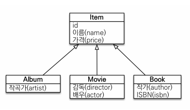
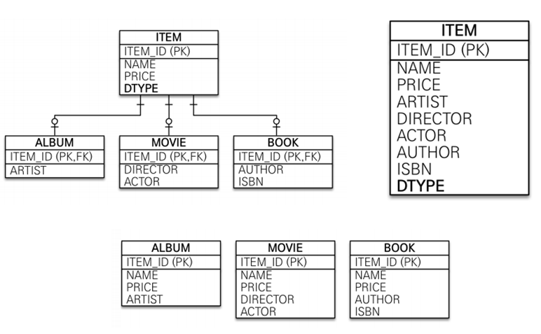
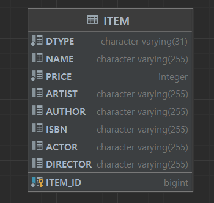
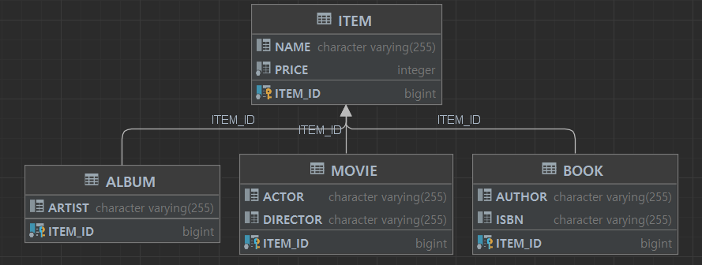
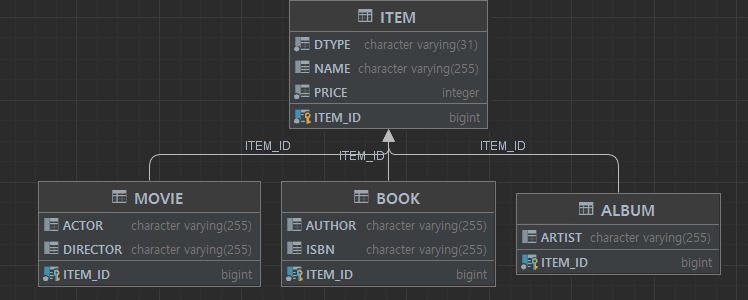
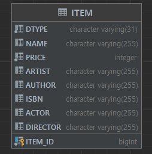
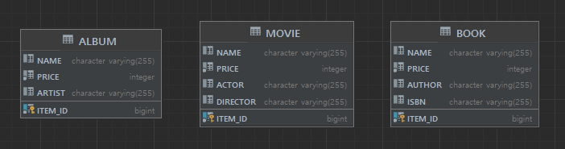

# 객체의 상속관계 매핑

[TOC]

### 상속관계



객체에서는 상속관계는 다음과 같이 표현이 될 수 있다.

하지만 DB에서는 상속관계란 표현이 없다. 그러면 어떻게 표현이 될까?


### 테이블에서 상속관계 매핑방법 개요



1. 슈퍼타입 서브타입
2. 통합 테이블
3. 각각 테이블


### 상속관계 객체를 테이블 매핑

```java
@Entity
public class Item {

    @Id @GeneratedValue
    @Column(name = "ITEM_ID")
    private Long id;
    private String name;
    private int price;
}

@Entity
public class Album extends Item {
    
    private String artist;
}

@Entity
public class Movie extends Item {
    
    private String director;
    private String actor;
}


@Entity
public class Book extends Item {
    
    private String author;
    private String isbn;
}
```


다음과 같이 엔티티를 생성한 후, 자동테이블 생성을 하면



단일테이블이 나온다. -> 상속관계 객체의 기본값이 단일테이블로 매핑된다는 것을 알 수 있다.


### 1. 슈퍼타입 서브타입 (조인 전략)

#### 구현 코드

```java
@Entity
@DiscriminatorColumn
@Inheritance(strategy = InheritanceType.JOINED)
public class Item {

    @Id @GeneratedValue
    @Column(name = "ITEM_ID")
    private Long id;
    private String name;
    private int price;
}

@Entity
@DiscriminatorValue("A")
public class Album extends Item {
    
    private String artist;
}

@Entity
@DiscriminatorValue("M")
public class Movie extends Item {
    
    private String director;
    private String actor;
}


@Entity
@DiscriminatorValue("B")
public class Book extends Item {
    
    private String author;
    private String isbn;
}
```





부모 객체에 `@Inheritance(strategy = InheritanceType.JOINED)` 붙이면 서브타입으로 테이블이 생성된다.

여기에 추가로 @DiscriminatorColumn를 사용하면 부모테이블에 DTYPE속성이 추가되어 어떤 종류의 데이터가 삽입되었는지 확인하기 쉽다.

@DiscriminatorValue를 사용하여 자식테이블의 DTYPE name을 지정할 수 있다.


#### SQL

- creat: ITEM, ALBUM 두 테이블로 2개의 insert query가 나간다.

- read: ITEM과 ALBUM 두 테이블을 join 하여 가져오는 select query가 나간다.


(JPA가 알아서 query를 계산해서 날려준다.)


#### 장점

- 정규화가 되있음
- 외래키 참조 무결성 제약조건 활용가능
- 저장공간 효율화


#### 단점

- 조회시 join이 많음
- 조회 query가 복잡
- 저장 시 insert query가 2번 나감


### 2. 단일테이블 전략

#### 구현 코드

```java
@Entity
@Inheritance(strategy = InheritanceType.SINGLE_TABLE)
@DiscriminatorColumn
public class Item {

    @Id @GeneratedValue
    @Column(name = "ITEM_ID")
    private Long id;
    private String name;
    private int price;
}

@Entity
@DiscriminatorValue("A")
public class Album extends Item {
    
    private String artist;
}

@Entity
@DiscriminatorValue("M")
public class Movie extends Item {
    
    private String director;
    private String actor;
}


@Entity
@DiscriminatorValue("B")
public class Book extends Item {
    
    private String author;
    private String isbn;
}
```



부모 자식 데이터중 상관없는 데이터들은 null로 표기된다.

성능이 가장 좋다.


단일테이블에선 @DiscriminatorColumn이 없어도 DTYPE이 필수라서 생성됨


#### SQL

- creat: ITEM 테이블로 1개의 insert query가 나간다.

- read: join없이 ITEM으로 select query가 나간다.


(JPA가 알아서 query를 계산해서 날려준다.)


#### 장점

- 조인이 없어서 조회성능이 빠름
- 조회 query가 단순


#### 단점

- 자식엔티티가 매핑한 컬럼은 모두 null 허용
- 테이블이 커질 수 있고, 상황에 따라 조회성능이 오히려 느려질 수 있음


### 3. 구현 클래스마다 테이블 전략 (권장 X)

이건 그냥 쓰면 안된다. 참고만 할 것.

#### 구현

```java
@Entity
@Inheritance(strategy = InheritanceType.TABLE_PER_CLASS)
public abstract class Item {

    @Id @GeneratedValue
    @Column(name = "ITEM_ID")
    private Long id;
    private String name;
    private int price;
}

@Entity
public class Album extends Item {
    
    private String artist;
}

@Entity
public class Movie extends Item {
    
    private String director;
    private String actor;
}


@Entity
public class Book extends Item {
    
    private String author;
    private String isbn;
}
```




Item을 추상클래스로 만든다.

자식 클래스에서 이를 상속받는다.


#### SQL

- creat: 자식테이블로 1개의 insert query가 나간다.

- read: 자식테이블로 select query가 나간다.

  - 만약 Item 부모형된 객체를 조회한다면, 자식테이블들을 모두 union해서 해당 자식을 찾게된다.

    단일테이블은 부모만, 서브타입은 DTYPE으로 자식을 특정지어서 찾을 수 있음.


(JPA가 알아서 query를 계산해서 날려준다.)


#### 장점

- 서브타입을 명확하게 구분해서 처리할 때 효과적
- not null 제약조건 사용 가능


#### 단점 

- 여러 자식테이블을 함께 조회하게 되면 성능이 느림 (UNION SQL)
- 자식테이블을 통합해서 쿼리하기 어려움
- 변경이라는 관점에서 매우 불리

