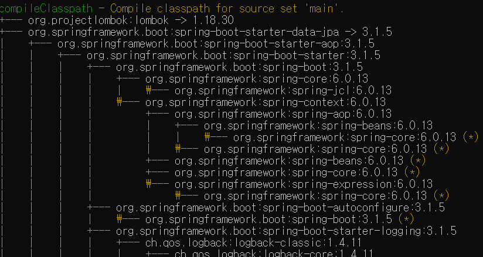

# 라이브러리 살펴보기

### cmd에서 명령어로 확인

프로젝트 경로에서 cmd로 `gradlew dependencies`를 입력하면 라이브러리 의존관계를 볼 수 있다.

### 스프링 부트 라이브러리 대략 살펴보기

- spring-boot-starter-web
  - spring-boot-starter-tomcat: 톰캣 (웹서버)
  - spring-webmvc: 스프링 웹 MVC
- spring-boot-starter-thymeleaf: 타임리프 템플릿 엔진(View)
- spring-boot-starter-data-jpa
  - spring-boot-starter-aop
  - spring-boot-starter-jdbc
    - HikariCP 커넥션 풀 (부트 2.0 부터 기본)
  - hibernate + JPA: 하이버네이트 + JPA
  - spring-data-jpa: 스프링 데이터 JPA
- spring-boot-starter(공통): 스프링 부트 + 스프링 코어 + 로깅
  - spring-boot
    - spring-core
  - spring-boot-starter-logging
    - logback, slf4

더 자세히는 intelliJ 오른쪽의 Gradle탭에서 확인할 수 있다.

### 테스트 라이브러리 대략 살펴보기

- spring-boot-starter-test
  - junit: 테스트 프레임워크
  - mockito: 목 라이브러리
  - assertj: 테스트 코드를 좀 더 편하게 작성하게 도와주는 라이브러리
  - spring-test: 스프링 통합 테스트 지원

### 핵심 라이브러리

- 스프링 MVC

- 스프링 ORM

- JPA, 하이버네이트

- 스프링 데이터 JPA

### 기타 라이브러리

- H2 데이터베이스 클라이언트

- 커넥션 풀: 부트 기본은 HikariCPWEB(thymeleaf)

- 로깅 SLF4J & LogBack

- 테스트

