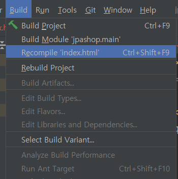

# View 환경설정

**참고자료**

해당 내용은 다음 강의를 참고하여 정리하였습니다.


[실전! 스프링 부트와 JPA 활용1 - 웹 애플리케이션 개발](https://www.inflearn.com/course/%EC%8A%A4%ED%94%84%EB%A7%81%EB%B6%80%ED%8A%B8-JPA-%ED%99%9C%EC%9A%A9-1/dashboard)


### thymeleaf 템플릿 엔진

View환경으로는 jsp, thymeleaf 등 많은 것들이 있지만,

스프링에선 성능상의 이유로 thymeleaf를 권장한다. 또한 thymeleaf는 natural언어이다.


thymeleaf 공식 사이트 

- https://www.thymeleaf.org/

스프링 공식 튜토리얼

- https://spring.io/guides/gs/serving-web-content/

스프링부트 메뉴얼

- https://docs.spring.io/spring-boot/docs/2.1.6.RELEASE/reference/html/boot-features-developing-web-applications.html#boot-features-spring-mvc-templateengines


### 스프링 부트 thymeleaf viewName 매핑

`resources:templates/ + {ViewName}+ .html` - 기본값

```java
@Controller
public class HelloController {

    @GetMapping("hello")
    private String hello(Model model) {
        model.addAttribute("data", "hello!!!");
        return "hello";
    }
}
```

메서드의 문자열 반환값 "hello"로 tomcat이 html파일 경로를 찾을 수 있는 이유이다.

이는 스프링부트에서 지원해주는 기능이며, 이 경로를 수정하고 싶으면 설정을 변경해주면 된다.


### 스프링 웹 개발 꿀팁

웹애플리케이션을 개발하다가 파일을 변경했을때는 매번 재시작해주어야 한다.

그러나 라이브러리 하나를 추가하면 간편하게 변경사항을 적용할 수 있다.

1. build.gradle에 devtools 라이브러리를 추가한다.

```java
implementation 'org.springframework.boot:spring-boot-devtools'
```

2. 변경된 파일에서 build -> recompile을 해주면 적용된다.



확인결과 java, html파일 모두 변경사항이 적용되었다.