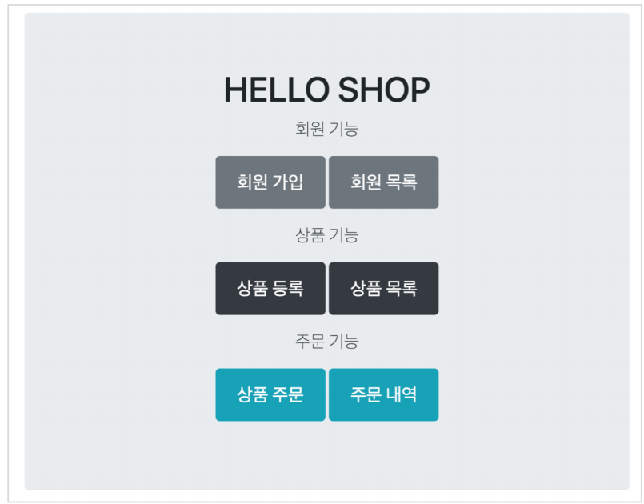

# 요구사항 분석

**참고자료**

해당 내용은 다음 강의를 참고하여 정리하였습니다.

[실전! 스프링 부트와 JPA 활용1 - 웹 애플리케이션 개발](https://www.inflearn.com/course/%EC%8A%A4%ED%94%84%EB%A7%81%EB%B6%80%ED%8A%B8-JPA-%ED%99%9C%EC%9A%A9-1/dashboard)

서비스를 개발하며 가장 먼저 수행해야할 것은 요구사항을 정리하는 것이다.

프로토타입을 분석하며 기능들을 정리할 수 있다.

### 회원 기능

- 회원 등록회원 조회

### 상품 기능

- 상품 등록
- 상품 수정
- 상품 조회

### 주문 기능

- 상품 주문
- 주문 내역 조회
- 주문 취소

### 기타 요구사항

- 상품은 재고 관리가 필요하다.
- 상품의 종류는 도서, 음반, 영화가 있다.
- 상품을 카테고리로 구분할 수 있다.
- 상품 주문시 배송 정보를 입력할 수 있다.