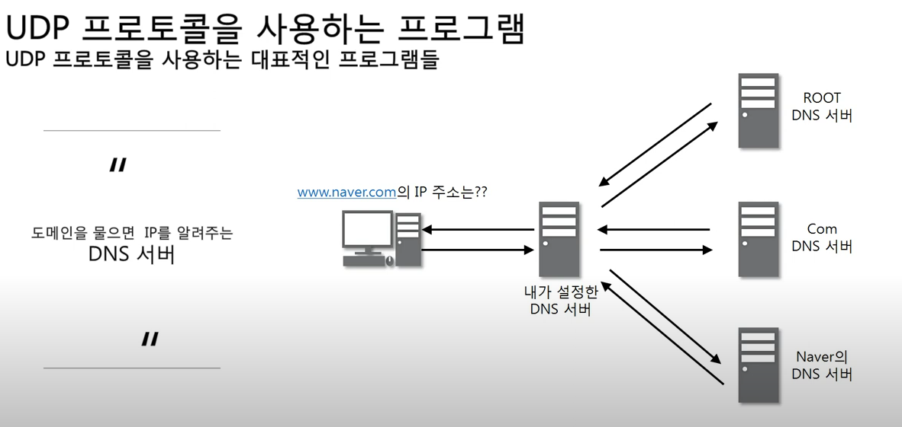

### UDP란?

#### 들어가기 전

- UDP 통신이란?

  - User Datagram Protocol의 약자로 데이터를 데이터그램 단위로 처리하는 프로토콜이다.
  - 비연결형, 신뢰성 없는 전송 프로토콜이다.
  - 데이터그램 단위로 쪼개면서 전송을 해야하기 때문에 전송 계층이다.
  - Transport layer에서 사용하는 프로토콜.

- TCP와 UDP는 왜 나오게 됐는가?

  1. IP의 역할은 Host to Host (장치 to 장치)만을 지원한다. 장치에서 장치로 이동은 IP로 해결되지만, 하나의 장비안에서 수많은 프로그램들이 통신을 할 경우에는 IP만으로는 한계가 있다.
  2. 또한, IP에서 오류가 발생한다면 ICMP에서 알려준다. 하지만 ICMP는 알려주기만 할 뿐 대처를 못하기 때문에 IP보다 위에서 처리를 해줘야 한다.

  - 1번을 해결하기 위하여 포트 번호가 나오게 됐고, 2번을 해결하기 위해 상위 프로토콜인 TCP와 UDP가 나오게 되었다.

  - *ICMP : 인터넷 제어 메시지 프로토콜로 네트워크 컴퓨터 위에서 돌아가는 운영체제에서 오류 메시지를 전송받는데 주로 쓰임

- 그렇다면 TCP와 UDP가 어떻게 오류를 해결하는가?

  - TCP : 데이터의 분실, 중복, 순서가 뒤바뀜 등을 자동으로 보정해줘서 송수신 데이터의 정확한 전달을 할 수 있도록 해준다.
  - UDP : IP가 제공하는 정도의 수준만을 제공하는 간단한 IP 상위 계층의 프로토콜이다. TCP와는 다르게 에러가 날 수도 있고, 재전송이나 순서가 뒤바뀔 수도 있어서 이 경우, 어플리케이션에서 처리하는 번거로움이 존재한다.

- UDP는 왜 사용할까?

  - UDP의 결정적인 장점은 데이터의 신속성이다. 데이터의 처리가 TCP보다 빠르다.
  - 주로 실시간 방송과 온라인 게임에서 사용된다. 네트워크 환경이 안 좋을때, 끊기는 현상을 생각하면 된다.

- DNS(Domain Name System)에서 UDP를 사용하는 이유

  - Request의 양이 작음 -> UDP Request에 담길 수 있다.
  - 3 way handshaking으로 연결을 유지할 필요가 없다. (오버헤드 발생)
  - Request에 대한 손실은 Application Layer에서 제어가 가능하다.
  - DNS : port 53번
  - But, TCP를 사용할 때가 있다! 크기가 512(UDP 제한)이 넘을 때, TCP를 사용해야한다.

#### UDP 헤더

- 포트 - Destination port : 도착지 포트 - Length : 길이 - _Checksum_ : 오류 검출 - 중복 검사의 한 형태로, 오류 정정을 통해 공간이나 시간 속에서 송신된 자료의 무결성을 보호하는 단순한 방법이다.

- 이렇게 간단하므로, TCP 보다 용량이 가볍고 송신 속도가 빠르게 작동됨.
- 그러나 확인 응답을 못하므로, TCP보다 신뢰도가 떨어짐.
- UDP는 비연결성, TCP는 연결성으로 정의할 수 있음.

#### DNS는 UDP 통신 프로토콜을 사용함.

DNS는 데이터를 교환하는 경우임

이때, TCP를 사용하게 되면, 데이터를 송신할 때까지 세션 확립을 위한 처리를 하고, 송신한 데이터가 수신되었는지 점검하는 과정이 필요하므로, Protocol overhead가 UDP에 비해서 큼.

------

DNS는 Application layer protocol임.

모든 Application layer protocol은 TCP, UDP 중 하나의 Transport layer protocol을 사용해야 함.

(TCP는 reliable, UDP는 not reliable임) / DNS는 reliable해야할 것 같은데 왜 UDP를 사용할까?

사용하는 이유

1. TCP가 3-way handshake를 사용하는 반면, UDP는 connection 을 유지할 필요가 없음.

2. DNS request는 UDP segment에 꼭 들어갈 정도로 작음.

   DNS query는 single UDP request와 server로부터의 single UDP reply로 구성되어 있음.

3. UDP는 not reliable이나, reliability는 application layer에 추가될 수 있음. (Timeout 추가나, resend 작업을 통해)

DNS는 UDP를 53번 port에서 사용함.

------

그러나 TCP를 사용하는 경우가 있음.

Zone transfer 을 사용해야하는 경우에는 TCP를 사용해야 함.

(Zone Transfer : DNS 서버 간의 요청을 주고 받을 떄 사용하는 transfer)

만약에 데이터가 512 bytes를 넘거나, 응답을 못받은 경우 TCP로 함.

#### 요약

IP는 장치에서 장치의 통신, Transport layer에서 프로그램 간의 특별한 통신 식별

Transport layer에서는 TCP, UDP 프로토콜이 있다

UDP는 

- 비연결성, 신뢰성이 없어서 데이터 전송에 오류가 생길 수 있다

- 빠른 데이터 전송이 장점

대표적인 UDP 프로토콜의 예 DNS

- 도메인 주소를 IP주소로 변환

- Application layer protocol
- 전송계층에서 UDP protocol을 사용

사용하는 이유

- 3-way handshake로 connection을 유지할 필요가 없음.
- DNS request는 UDP segment에 꼭 들어갈 정도로 작음.

- reliability는 application layer에 추가될 수 있음. (Timeout 추가나, resend 작업을 통해)

