# 프로세스 동기화

### 1️⃣ 동기화란

#### 동기화의 의미

- 하나의 공통된 목표를 위해 여러 프로세스가 동시에 수행되는 상황에서

- 프로세스들의 수행 시기를 맞추는 것

  - 실행순서제어: 프로세서를 올바른 순서대로 실행하기

  - 상호배제: 동시에 접근해서는 안되는 자원에 하나의 프로세스만 접근하게 하기

- 실행의 문맥을 갖는 모든 대상은 동기화 대상 (EX: 스레드)

#### 실행순서 제어를 위한 동기화 (reader writer problem)

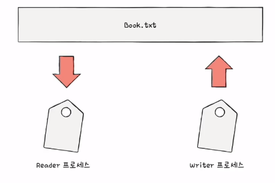

- Reader는 Writer 이후에 수행할 수 있다
- 동시다발적으로 실행되는 프로세스들이 있을때 실행 순어를 제어해주는 것

#### 상호배제를 위한 동기화 (Bank account problem)

- 한번에 하나의 프로세스만 접근해야 하는 자원에 동시접근을 피하기 위함
- 예시 1
  - 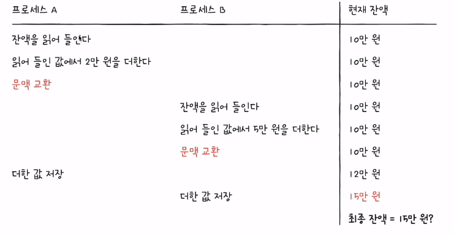
  - 프로세스 A는 계좌에 2만원 추가, 프로세스 B는 계좌에 5만원 추가
  - 상호배제를 위한 동기화를 하지 않으면 최종잔액이 15만원이 되버림

- 예제 2 (Produver & Consumer problem)

  - 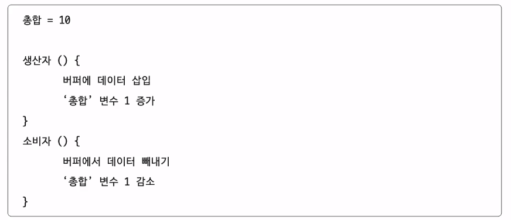

  - 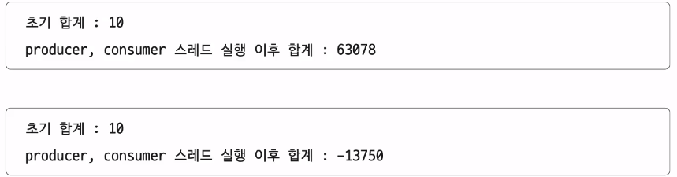

  - '총합'이라는 동시에 접근해서 안되는 자원에 접근하여 발생한 문제

#### 공유자원과 임계 구역

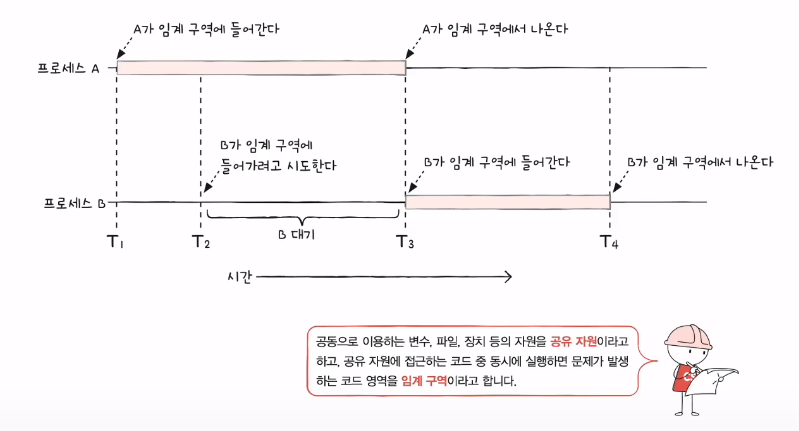

- `공유자원`
  - 여러 프로세스 혹은 스레드가 공유하는 자원
  
  - 전역변수, 파일, 입출력장치, 보조기억장치....
  
- `임계 구역`
  - 동시에 실행하면 문제가 발생하는 공유자원에 접근하는 코드 영역
  
  - 앞선 예시의 '총합' 변수, '잔액' 변수
  
- `임계구역`에 `동시에 접근`하면 `자원의 일관성`이 깨질 수 있다
  - 이를 `레이스 컨디션(race condition)`이라고 한다

#### 운영체제가 임계구역 문제를 해결하는 세 가지 원칙

- `상호배제 동기화`를 위한 세 가지 원칙

1. `상호배제`
   - 한 프로세스가 임계구역에 진입했다면 다른 프로세스는 들어올 수 없다.

2. `진행`
   - 임계 구역에 어떤 프로세스도 진입하지 않았다면 진입하고자 하는 프로세스는 들어갈 수 있어야한다

3. `유한대기`
   - 한 프로세스가 임계 구역에 진입하고 싶다면 언젠가는 임계 구역에 들어올 수 있어야 한다

### 2️⃣ 프로세스 간의 동기화

#### 뮤텍스 락

- 상호 배제를 위한 동기화 도구 (자물쇠)

- 뮤텍스 락의 단순한 형태

  - 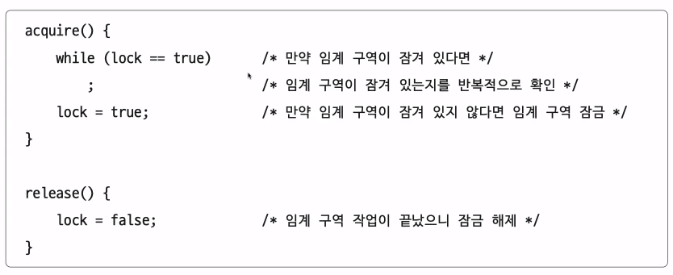
  - 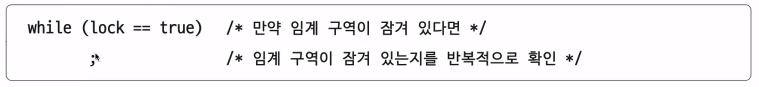
  - 전역 변수 1, 함수 2
    - 자물쇠 역할: 프로세스들이 공유하는 전역변수 lock
    - acpuire 함수: 임계구역을 `잠그는 역할`
    - release 함수: 임계구역을 `해제하는 역할`
  - 바쁜대기 (busy waiting)
    - 반복적으로 확인하는 방법
    - 별로 좋진 않음

  - 가장 간단한 형태로 실제론 더 복잡하며 여러 프로그래밍 언어에서 지원함

### 세마포

- 공유자원이 여러개일 때 사용

- 임계구역 잎에서 stop 신호, go신호를 받으며 진행

- 전역 변수 1, 함수 2

  - 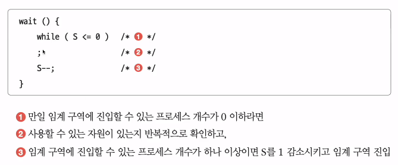
  - 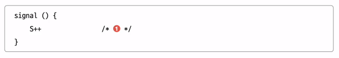
  - 전역변수 S: 임계구역에 진입할 수 있는 프로세스 개수
  - wait 함수, signal 함수
  - busy waiting

- 프로세스 P1, P2, P3가 2개의 공유자원에 진입할 때 가정

  - 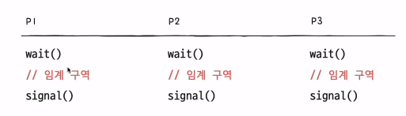

  - 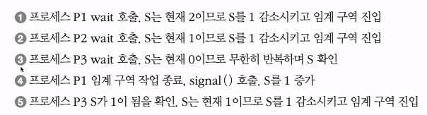

- busy waiting 해결 방법

  - 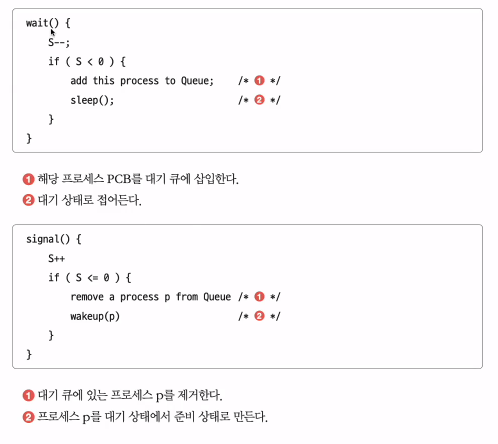

  - 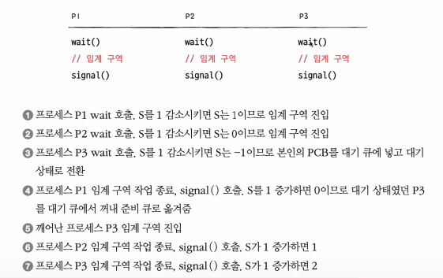
  - 사용할 수 있는 자원이 없을 경우 대기상태로 만듬
  - 사용할 수 있는 자원이 생겼을 경우 대기 큐의 프로세스를 준비상태로 만듬

- 세마포를 활용한 `실행 순서 동기화`

  - 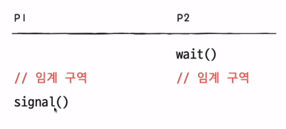

  - 세마포의 변수 S를 0
  - 먼저 실행할 프로세스 뒤에 signal함수
  - 다음 실행할 프로세스 앞에 wait

- 세마포의 문제점
  - 사용자 입장에서 사용하기 어렵다

#### 모니터

- 개발자가 다루기 좋은 도구

- `상호배제`를 위한 동기화
  - 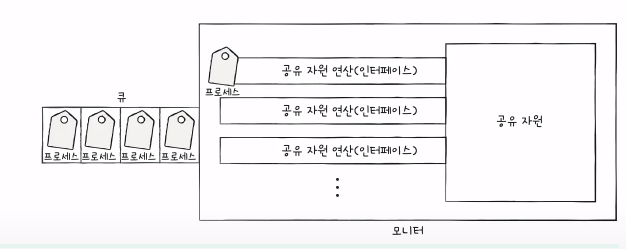
  - 인터페이스를 위한 큐
  - 공유자원에 접근하고자 하는 프로세스를 큐에 삽입
  - 큐에 삽입된 순서대로 공유자원을 이용

- `실행순서제어`를 위한 동기화
  - 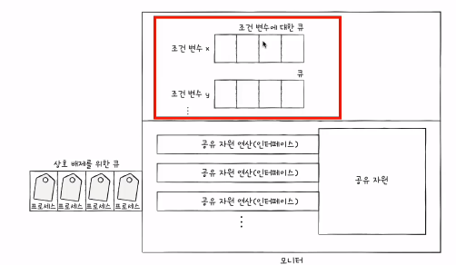
  - 조건변수를 이용
  - 프로세스나 스레드의 실행 순서를 제어하기 위해 사용하는 특별한 변수
  
  - 특정 프로세스가 실행조건을 미충족시 wait를 통해 실행을 중단
  - 조건 충족시 signal을 통해 실행 재개

#### 뮤텍스 락, 세마포, 모니터

- 언어로 이해하기 어려운 걔념
- 코드로 한번씩 쳐보며 이해하면 좋을 것 같다
