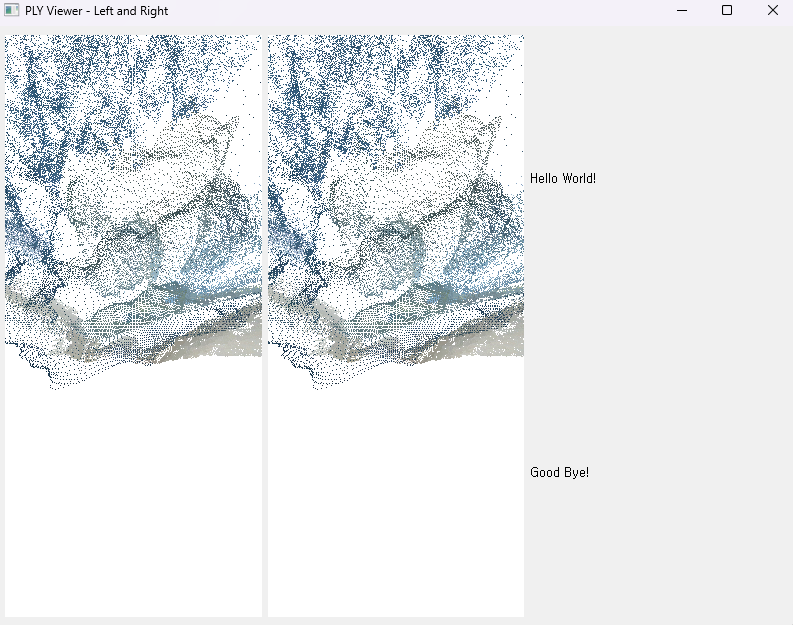

# 프로토타입 화면 구현 코드

[TOC]

### **요약설명**

#### **구현화면**




#### **코드 요소 설명**

| 클래스/함수           | 설명                                                         |
| --------------------- | ------------------------------------------------------------ |
| **MainWindow**        | 두 개의 OpenGL 위젯과 텍스트 라벨을 배치해 두 PLY 파일을 동시에 시각화하는 메인 윈도우 |
| **GLWidget**          | OpenGL을 사용해 PLY 파일(포인트 클라우드)을 렌더링하는 위젯으로, Open3D로 데이터를 읽고, 마우스 이벤트로 모델을 회전시킴 |
| **if name == "main"** | PyQt 애플리케이션 진입점으로, 두 PLY 파일을 시각화하는 메인 윈도우를 생성해 화면에 표시 |


### **상세설명**

---

#### **사용 라이브러리 설명**

| 라이브러리          | 설명                                                         |
| ------------------- | ------------------------------------------------------------ |
| **PyQt5.QtWidgets** | GUI 요소와 레이아웃 관리, 애플리케이션의 주 창 구성          |
| **PyQt5.QtCore.Qt** | 마우스 클릭 및 드래그 이벤트 처리하여 3D 모델 회전           |
| **open3d**          | PLY 파일에 저장된 3D 좌표와 색상을 가져와서 <br/>OpenGL이 화면에 포인트 클라우드 형식으로 렌더링할 수 있도록 데이터를 준비 |
| **OpenGL.GL**       | GPU와 직접 상호작용하여 3D 포인트 클라우드를 그리기 위한 저수준 OpenGL 함수 (예: 점, 색상 설정 및 회전 등) 제공 |
| **OpenGL.GLU**      | 카메라의 시야각과 투영과 3D 장면을 보기 위한 카메라 위치와 방향 설정 |
| **sys**             | 애플리케이션 실행 및 종료 처리                               |


#### **구현코드**

```python
from PyQt5.QtWidgets import (
    QApplication, QMainWindow, QOpenGLWidget, QHBoxLayout, QWidget, QLabel, QVBoxLayout
)
from OpenGL.GL import *
from OpenGL.GLU import *
import sys
from PyQt5.QtCore import Qt
import open3d as o3d

class GLWidget(QOpenGLWidget):

    # GL객체의 기본 변수와 설정 초기화
    def __init__(self, ply_file):
        # PLY 파일 관련 변수
        self.ply_file, self.pcd = ply_file, None

        # 마우스 위치 및 회전 관련 변수
        self.lastPos, self.xRot, self.yRot = None, 0, 0

        # 회전 민감도 설정
        self.sensitivity = 0.2

    # GL위젯의 그래픽 초기화, 3D 데이터를 렌더링할 준비
    def initializeGL(self):
        # OpenGL 설정 (깊이 테스트, 배경색, 스케일 설정)
        glEnable(GL_DEPTH_TEST)
        glClearColor(1.0, 1.0, 1.0, 1.0)
        glScalef(100.0, 100.0, 100.0)

        # PLY 파일 읽기 및 데이터 준비
        self.pcd = o3d.io.read_point_cloud(self.ply_file)
        self.points, self.colors = self.pcd.points, self.pcd.colors

    # GL위젯의 뷰포트와 원근 투영을 설정하여 3D 모델 랜더링 준비
    def resizeGL(self, w, h):
        # 뷰포트 설정
        glViewport(0, 0, w, h)

        # 투영 행렬 설정
        glMatrixMode(GL_PROJECTION)
        glLoadIdentity()
        gluPerspective(45.0, w / h, 0.1, 1000.0)
        glMatrixMode(GL_MODELVIEW)

    # GL위젯에 3D 모델을 그리는 함수
    def paintGL(self):
        # 화면 초기화 및 카메라 설정
        glClear(GL_COLOR_BUFFER_BIT | GL_DEPTH_BUFFER_BIT)
        glLoadIdentity()
        gluLookAt(0, 0, 3, 0, 0, 0, 0, 1, 0)
        glRotatef(self.xRot, 1, 0, 0), glRotatef(self.yRot, 0, 1, 0)

        # 포인트 클라우드 그리기
        glBegin(GL_POINTS)
        [glColor3f(*color) or glVertex3f(*point) for point, color in zip(self.points, self.colors)]
        glEnd()

    # 마우스 클릭 시 3D 모델의 회전 기준을 업데이트
    def mousePressEvent(self, event):
        self.lastPos = event.pos()

    # 마우스 언클릭 시 3D 모델의 회전 각도를 업데이트
    def mouseMoveEvent(self, event):
        dx, dy = event.x() - self.lastPos.x(), event.y() - self.lastPos.y()

        if event.buttons() & Qt.LeftButton:
            self.xRot += dy * 0.5
            self.yRot += dx * 0.5

        self.lastPos = event.pos()
        self.update()

class MainWindow(QMainWindow):
    def __init__(self, ply_file1, ply_file2):
        super().__init__()

        # 윈도우 초기 설정
        self.setWindowTitle('PLY Viewer - Left and Right')
        self.setGeometry(100, 100, 800, 600)

        # 중앙 위젯과 레이아웃 설정
        central_widget, layout = QWidget(), QHBoxLayout()
        central_widget.setLayout(layout)

        # GLWidget 2개 추가
        layout.addWidget(GLWidget(ply_file1)), layout.addWidget(GLWidget(ply_file2))

        # 텍스트 라벨 추가
        text_layout = QVBoxLayout()
        layout.addLayout(text_layout)
        [text_layout.addWidget(QLabel(text)) for text in ["Hello World!", "Good Bye!"]]

        # 중앙 위젯 설정
        self.setCentralWidget(central_widget)


if __name__ == "__main__":
    # 애플리케이션 초기화
    app = QApplication(sys.argv)

    # MainWindow 생성, PLY 파일 경로를 인자로 전달
    window = MainWindow('point_cloud_with_hole_filled_1.ply', 'point_cloud_with_hole_filled_2.ply')
    window.show()  # 메인 윈도우 표시

    # 애플리케이션 이벤트 루프 실행 및 종료
    sys.exit(app.exec_())
```

